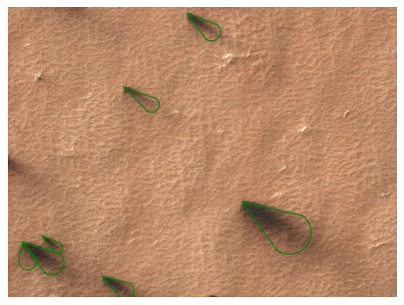

# Examples


<!-- WARNING: THIS FILE WAS AUTOGENERATED! DO NOT EDIT! -->

``` python
import numpy as np

import pandas as pd
from p4tools.io import (
    get_blotch_catalog,
    get_blotches_for_tile,
    get_fan_catalog,
    get_fans_for_tile,
    get_region_names,
)
```

``` python
rois = get_region_names()
```

``` python
rois.roi_name.unique()
```

    array(['Macclesfield', 'unknown', 'Starburst', 'Manhattan_Classic',
           'Wellington', 'Albany', 'Bilbao', 'Ithaca', 'Portsmouth', 'Pisaq',
           'Manhattan_Frontinella', 'BuenosAires', 'Inca_City_Ridges',
           'Inca_City', 'Giza', 'Potsdam', 'Troy', 'Oswego_Edge', 'Halifax',
           'Caterpillar', 'Rochester', 'Manhattan_Cracks', 'Schenectady',
           'Binghamton', 'Atka', 'Cortland', 'Geneseo', 'Manhattan2'],
          dtype=object)

``` python
rois.query("roi_name=='Giza'").describe()
```

<div>
<style scoped>
    .dataframe tbody tr th:only-of-type {
        vertical-align: middle;
    }
&#10;    .dataframe tbody tr th {
        vertical-align: top;
    }
&#10;    .dataframe thead th {
        text-align: right;
    }
</style>

<table class="dataframe" data-quarto-postprocess="true" data-border="1">
<thead>
<tr style="text-align: right;">
<th data-quarto-table-cell-role="th"></th>
<th data-quarto-table-cell-role="th">lat_IND</th>
<th data-quarto-table-cell-role="th">lon_IND</th>
<th data-quarto-table-cell-role="th">minimal_distance</th>
<th data-quarto-table-cell-role="th">lat_WORD</th>
<th data-quarto-table-cell-role="th">lon_WORD</th>
<th data-quarto-table-cell-role="th">MY</th>
</tr>
</thead>
<tbody>
<tr>
<td data-quarto-table-cell-role="th">count</td>
<td>35.000000</td>
<td>35.000000</td>
<td>35.000000</td>
<td>3.500000e+01</td>
<td>3.500000e+01</td>
<td>35.000000</td>
</tr>
<tr>
<td data-quarto-table-cell-role="th">mean</td>
<td>-84.829069</td>
<td>66.071666</td>
<td>6.318094</td>
<td>-8.482000e+01</td>
<td>6.570000e+01</td>
<td>29.057143</td>
</tr>
<tr>
<td data-quarto-table-cell-role="th">std</td>
<td>0.066423</td>
<td>0.991527</td>
<td>11.242504</td>
<td>2.883665e-14</td>
<td>1.441832e-14</td>
<td>1.027357</td>
</tr>
<tr>
<td data-quarto-table-cell-role="th">min</td>
<td>-84.979100</td>
<td>65.637800</td>
<td>0.720371</td>
<td>-8.482000e+01</td>
<td>6.570000e+01</td>
<td>28.000000</td>
</tr>
<tr>
<td data-quarto-table-cell-role="th">25%</td>
<td>-84.834950</td>
<td>65.736450</td>
<td>1.254355</td>
<td>-8.482000e+01</td>
<td>6.570000e+01</td>
<td>28.000000</td>
</tr>
<tr>
<td data-quarto-table-cell-role="th">50%</td>
<td>-84.812200</td>
<td>65.774200</td>
<td>1.487853</td>
<td>-8.482000e+01</td>
<td>6.570000e+01</td>
<td>29.000000</td>
</tr>
<tr>
<td data-quarto-table-cell-role="th">75%</td>
<td>-84.809350</td>
<td>65.799750</td>
<td>4.005964</td>
<td>-8.482000e+01</td>
<td>6.570000e+01</td>
<td>30.000000</td>
</tr>
<tr>
<td data-quarto-table-cell-role="th">max</td>
<td>-84.581900</td>
<td>69.890400</td>
<td>44.631912</td>
<td>-8.482000e+01</td>
<td>6.570000e+01</td>
<td>31.000000</td>
</tr>
</tbody>
</table>

</div>

``` python
fans = get_fan_catalog()
blotches = get_blotch_catalog()
```

``` python
fansperobsid = fans.groupby("obsid").size()
```

``` python
fansperobsid.head()
```

    obsid
    ESP_011296_0975    4472
    ESP_011341_0980     455
    ESP_011348_0950       4
    ESP_011350_0945    1107
    ESP_011351_0945    1636
    dtype: int64

``` python
blotchesperobsid = blotches.groupby("obsid").size()
blotchesperobsid.head()
```

    obsid
    ESP_011296_0975    1014
    ESP_011341_0980     283
    ESP_011348_0950     195
    ESP_011350_0945     625
    ESP_011351_0945    1167
    dtype: int64

``` python
df = fansperobsid.to_frame()
```

``` python
df["blotches counts"] = blotchesperobsid
```

``` python
df.columns = ["fan_count_per_obsid", "blotch_count_per_obsid"]
df.head()
```

<div>
<style scoped>
    .dataframe tbody tr th:only-of-type {
        vertical-align: middle;
    }
&#10;    .dataframe tbody tr th {
        vertical-align: top;
    }
&#10;    .dataframe thead th {
        text-align: right;
    }
</style>

<table class="dataframe" data-quarto-postprocess="true" data-border="1">
<thead>
<tr style="text-align: right;">
<th data-quarto-table-cell-role="th"></th>
<th data-quarto-table-cell-role="th">fan_count_per_obsid</th>
<th data-quarto-table-cell-role="th">blotch_count_per_obsid</th>
</tr>
<tr>
<th data-quarto-table-cell-role="th">obsid</th>
<th data-quarto-table-cell-role="th"></th>
<th data-quarto-table-cell-role="th"></th>
</tr>
</thead>
<tbody>
<tr>
<td data-quarto-table-cell-role="th">ESP_011296_0975</td>
<td>4472</td>
<td>1014</td>
</tr>
<tr>
<td data-quarto-table-cell-role="th">ESP_011341_0980</td>
<td>455</td>
<td>283</td>
</tr>
<tr>
<td data-quarto-table-cell-role="th">ESP_011348_0950</td>
<td>4</td>
<td>195</td>
</tr>
<tr>
<td data-quarto-table-cell-role="th">ESP_011350_0945</td>
<td>1107</td>
<td>625</td>
</tr>
<tr>
<td data-quarto-table-cell-role="th">ESP_011351_0945</td>
<td>1636</td>
<td>1167</td>
</tr>
</tbody>
</table>

</div>

``` python
fan_counts_per_tile = fans.groupby("tile_id").size()
fan_counts_per_tile.head()
```

    tile_id
    APF0000001    3
    APF0000006    4
    APF0000009    1
    APF000000b    1
    APF000000c    4
    dtype: int64

``` python
blotch_counts_per_tile = blotches.groupby("tile_id").size()
blotch_counts_per_tile.head()
```

    tile_id
    APF0000001    1
    APF0000002    2
    APF0000004    4
    APF0000005    5
    APF0000006    7
    dtype: int64

``` python
fan_counts_per_tile.name = "fans"
```

``` python
blotch_counts_per_tile.name = "blotches"
```

``` python
df = pd.DataFrame(fan_counts_per_tile)
```

``` python
df["blotches"] = blotch_counts_per_tile
df.head()
```

<div>
<style scoped>
    .dataframe tbody tr th:only-of-type {
        vertical-align: middle;
    }
&#10;    .dataframe tbody tr th {
        vertical-align: top;
    }
&#10;    .dataframe thead th {
        text-align: right;
    }
</style>

<table class="dataframe" data-quarto-postprocess="true" data-border="1">
<thead>
<tr style="text-align: right;">
<th data-quarto-table-cell-role="th"></th>
<th data-quarto-table-cell-role="th">fans</th>
<th data-quarto-table-cell-role="th">blotches</th>
</tr>
<tr>
<th data-quarto-table-cell-role="th">tile_id</th>
<th data-quarto-table-cell-role="th"></th>
<th data-quarto-table-cell-role="th"></th>
</tr>
</thead>
<tbody>
<tr>
<td data-quarto-table-cell-role="th">APF0000001</td>
<td>3</td>
<td>1.0</td>
</tr>
<tr>
<td data-quarto-table-cell-role="th">APF0000006</td>
<td>4</td>
<td>7.0</td>
</tr>
<tr>
<td data-quarto-table-cell-role="th">APF0000009</td>
<td>1</td>
<td>26.0</td>
</tr>
<tr>
<td data-quarto-table-cell-role="th">APF000000b</td>
<td>1</td>
<td>3.0</td>
</tr>
<tr>
<td data-quarto-table-cell-role="th">APF000000c</td>
<td>4</td>
<td>3.0</td>
</tr>
</tbody>
</table>

</div>

``` python
df[(df.fans + df.blotches) > 100].head()
```

<div>
<style scoped>
    .dataframe tbody tr th:only-of-type {
        vertical-align: middle;
    }
&#10;    .dataframe tbody tr th {
        vertical-align: top;
    }
&#10;    .dataframe thead th {
        text-align: right;
    }
</style>

<table class="dataframe" data-quarto-postprocess="true" data-border="1">
<thead>
<tr style="text-align: right;">
<th data-quarto-table-cell-role="th"></th>
<th data-quarto-table-cell-role="th">fans</th>
<th data-quarto-table-cell-role="th">blotches</th>
</tr>
<tr>
<th data-quarto-table-cell-role="th">tile_id</th>
<th data-quarto-table-cell-role="th"></th>
<th data-quarto-table-cell-role="th"></th>
</tr>
</thead>
<tbody>
<tr>
<td data-quarto-table-cell-role="th">APF00002zj</td>
<td>99</td>
<td>4.0</td>
</tr>
<tr>
<td data-quarto-table-cell-role="th">APF00006mg</td>
<td>98</td>
<td>7.0</td>
</tr>
<tr>
<td data-quarto-table-cell-role="th">APF00006mt</td>
<td>118</td>
<td>2.0</td>
</tr>
<tr>
<td data-quarto-table-cell-role="th">APF00006mv</td>
<td>95</td>
<td>19.0</td>
</tr>
<tr>
<td data-quarto-table-cell-role="th">APF00006n0</td>
<td>43</td>
<td>58.0</td>
</tr>
</tbody>
</table>

</div>

### The input data products for the P4 project are the \`*COLOR* products one can find on the uahirise.org website!

``` python
buffalo = "ESP_011486_0980_COLOR ESP_011987_0975_COLOR ESP_012198_0975_COLOR ESP_012277_0975_COLOR ESP_012620_0975_COLOR".split()
```

``` python
buffalo = [i.rstrip("_COLOR") for i in buffalo]
```

``` python
p4_buffalo = fans[fans.obsid.isin(buffalo)].obsid.unique()
```

``` python
fans[fans.obsid.isin(p4_buffalo)].groupby("obsid").size()
```

    obsid
    ESP_011486_0980    242
    ESP_012277_0975     19
    ESP_012620_0975     30
    dtype: int64

``` python
fans[fans.obsid.isin(p4_buffalo)][["l_s", "obsid"]].drop_duplicates()
```

<div>
<style scoped>
    .dataframe tbody tr th:only-of-type {
        vertical-align: middle;
    }
&#10;    .dataframe tbody tr th {
        vertical-align: top;
    }
&#10;    .dataframe thead th {
        text-align: right;
    }
</style>

<table class="dataframe" data-quarto-postprocess="true" data-border="1">
<thead>
<tr style="text-align: right;">
<th data-quarto-table-cell-role="th"></th>
<th data-quarto-table-cell-role="th">l_s</th>
<th data-quarto-table-cell-role="th">obsid</th>
</tr>
</thead>
<tbody>
<tr>
<td data-quarto-table-cell-role="th">124564</td>
<td>241.144</td>
<td>ESP_012620_0975</td>
</tr>
<tr>
<td data-quarto-table-cell-role="th">136301</td>
<td>187.254</td>
<td>ESP_011486_0980</td>
</tr>
<tr>
<td data-quarto-table-cell-role="th">139964</td>
<td>224.333</td>
<td>ESP_012277_0975</td>
</tr>
</tbody>
</table>

</div>

``` python
fans[fans.tile_id.str.contains("r8y")]
```

<div>
<style scoped>
    .dataframe tbody tr th:only-of-type {
        vertical-align: middle;
    }
&#10;    .dataframe tbody tr th {
        vertical-align: top;
    }
&#10;    .dataframe thead th {
        text-align: right;
    }
</style>

<table class="dataframe" data-quarto-postprocess="true" data-border="1">
<thead>
<tr style="text-align: right;">
<th data-quarto-table-cell-role="th"></th>
<th data-quarto-table-cell-role="th">marking_id</th>
<th data-quarto-table-cell-role="th">angle</th>
<th data-quarto-table-cell-role="th">distance</th>
<th data-quarto-table-cell-role="th">tile_id</th>
<th data-quarto-table-cell-role="th">image_x</th>
<th data-quarto-table-cell-role="th">image_y</th>
<th data-quarto-table-cell-role="th">n_votes</th>
<th data-quarto-table-cell-role="th">obsid</th>
<th data-quarto-table-cell-role="th">spread</th>
<th data-quarto-table-cell-role="th">version</th>
<th data-quarto-table-cell-role="th">...</th>
<th data-quarto-table-cell-role="th">y_angle</th>
<th data-quarto-table-cell-role="th">l_s</th>
<th data-quarto-table-cell-role="th">map_scale</th>
<th data-quarto-table-cell-role="th">north_azimuth</th>
<th data-quarto-table-cell-role="th">BodyFixedCoordinateX</th>
<th data-quarto-table-cell-role="th">BodyFixedCoordinateY</th>
<th data-quarto-table-cell-role="th">BodyFixedCoordinateZ</th>
<th data-quarto-table-cell-role="th">PlanetocentricLatitude</th>
<th data-quarto-table-cell-role="th">PlanetographicLatitude</th>
<th data-quarto-table-cell-role="th">Longitude</th>
</tr>
</thead>
<tbody>
<tr>
<td data-quarto-table-cell-role="th">154795</td>
<td>F02a9f2</td>
<td>34.16</td>
<td>171.27</td>
<td>APF0000r8y</td>
<td>505.45</td>
<td>13038.68</td>
<td>19</td>
<td>ESP_020242_0945</td>
<td>41.85</td>
<td>1</td>
<td>...</td>
<td>0.56</td>
<td>184.557</td>
<td>1.0</td>
<td>143.674895</td>
<td>-63.560715</td>
<td>265.134952</td>
<td>-3370.241784</td>
<td>-85.374934</td>
<td>-85.428989</td>
<td>103.481087</td>
</tr>
<tr>
<td data-quarto-table-cell-role="th">154796</td>
<td>F02a9f3</td>
<td>38.19</td>
<td>86.92</td>
<td>APF0000r8y</td>
<td>387.19</td>
<td>12617.75</td>
<td>16</td>
<td>ESP_020242_0945</td>
<td>33.44</td>
<td>1</td>
<td>...</td>
<td>0.62</td>
<td>184.557</td>
<td>1.0</td>
<td>143.674895</td>
<td>-63.930749</td>
<td>264.887663</td>
<td>-3370.271982</td>
<td>-85.377575</td>
<td>-85.431599</td>
<td>103.568870</td>
</tr>
<tr>
<td data-quarto-table-cell-role="th">154797</td>
<td>F02a9f4</td>
<td>36.11</td>
<td>106.09</td>
<td>APF0000r8y</td>
<td>30.86</td>
<td>13128.72</td>
<td>18</td>
<td>ESP_020242_0945</td>
<td>36.90</td>
<td>1</td>
<td>...</td>
<td>0.59</td>
<td>184.557</td>
<td>1.0</td>
<td>143.674895</td>
<td>-63.883825</td>
<td>265.528290</td>
<td>-3370.208031</td>
<td>-85.367154</td>
<td>-85.421299</td>
<td>103.527769</td>
</tr>
<tr>
<td data-quarto-table-cell-role="th">154798</td>
<td>F02a9f5</td>
<td>76.52</td>
<td>63.91</td>
<td>APF0000r8y</td>
<td>32.33</td>
<td>13128.33</td>
<td>3</td>
<td>ESP_020242_0945</td>
<td>46.96</td>
<td>1</td>
<td>...</td>
<td>0.96</td>
<td>184.557</td>
<td>1.0</td>
<td>143.674895</td>
<td>-63.882893</td>
<td>265.526982</td>
<td>-3370.208168</td>
<td>-85.367179</td>
<td>-85.421324</td>
<td>103.527643</td>
</tr>
<tr>
<td data-quarto-table-cell-role="th">154799</td>
<td>F02a9f6</td>
<td>33.30</td>
<td>90.38</td>
<td>APF0000r8y</td>
<td>249.21</td>
<td>12781.71</td>
<td>14</td>
<td>ESP_020242_0945</td>
<td>25.57</td>
<td>1</td>
<td>...</td>
<td>0.55</td>
<td>184.557</td>
<td>1.0</td>
<td>143.674895</td>
<td>-63.935125</td>
<td>265.109183</td>
<td>-3370.249450</td>
<td>-85.373890</td>
<td>-85.427956</td>
<td>103.558845</td>
</tr>
<tr>
<td data-quarto-table-cell-role="th">154800</td>
<td>F02a9f7</td>
<td>32.72</td>
<td>77.35</td>
<td>APF0000r8y</td>
<td>204.00</td>
<td>13205.53</td>
<td>15</td>
<td>ESP_020242_0945</td>
<td>36.85</td>
<td>1</td>
<td>...</td>
<td>0.54</td>
<td>184.557</td>
<td>1.0</td>
<td>143.674895</td>
<td>-63.694249</td>
<td>265.469837</td>
<td>-3370.212149</td>
<td>-85.368868</td>
<td>-85.422993</td>
<td>103.491955</td>
</tr>
<tr>
<td data-quarto-table-cell-role="th">154801</td>
<td>F02a9f8</td>
<td>39.19</td>
<td>54.32</td>
<td>APF0000r8y</td>
<td>73.62</td>
<td>13114.42</td>
<td>12</td>
<td>ESP_020242_0945</td>
<td>30.04</td>
<td>1</td>
<td>...</td>
<td>0.63</td>
<td>184.557</td>
<td>1.0</td>
<td>143.674895</td>
<td>-63.858677</td>
<td>265.487992</td>
<td>-3370.211967</td>
<td>-85.367920</td>
<td>-85.422056</td>
<td>103.524616</td>
</tr>
</tbody>
</table>

<p>7 rows × 24 columns</p>
</div>

``` python
from p4tools.plotting import plot_blotches_for_tile, plot_fans_for_tile
```

``` python
plot_fans_for_tile("r8y")
```



``` python
get_blotches_for_tile("r8y")  # no blotches, that's why below plot is empty
```

<div>
<style scoped>
    .dataframe tbody tr th:only-of-type {
        vertical-align: middle;
    }
&#10;    .dataframe tbody tr th {
        vertical-align: top;
    }
&#10;    .dataframe thead th {
        text-align: right;
    }
</style>

<table class="dataframe" data-quarto-postprocess="true" data-border="1">
<thead>
<tr style="text-align: right;">
<th data-quarto-table-cell-role="th"></th>
<th data-quarto-table-cell-role="th">marking_id</th>
<th data-quarto-table-cell-role="th">angle</th>
<th data-quarto-table-cell-role="th">tile_id</th>
<th data-quarto-table-cell-role="th">image_x</th>
<th data-quarto-table-cell-role="th">image_y</th>
<th data-quarto-table-cell-role="th">n_votes</th>
<th data-quarto-table-cell-role="th">obsid</th>
<th data-quarto-table-cell-role="th">radius_1</th>
<th data-quarto-table-cell-role="th">radius_2</th>
<th data-quarto-table-cell-role="th">vote_ratio</th>
<th data-quarto-table-cell-role="th">...</th>
<th data-quarto-table-cell-role="th">y_angle</th>
<th data-quarto-table-cell-role="th">l_s</th>
<th data-quarto-table-cell-role="th">map_scale</th>
<th data-quarto-table-cell-role="th">north_azimuth</th>
<th data-quarto-table-cell-role="th">BodyFixedCoordinateX</th>
<th data-quarto-table-cell-role="th">BodyFixedCoordinateY</th>
<th data-quarto-table-cell-role="th">BodyFixedCoordinateZ</th>
<th data-quarto-table-cell-role="th">PlanetocentricLatitude</th>
<th data-quarto-table-cell-role="th">PlanetographicLatitude</th>
<th data-quarto-table-cell-role="th">Longitude</th>
</tr>
</thead>
<tbody>
</tbody>
</table>

<p>0 rows × 23 columns</p>
</div>

``` python
plot_blotches_for_tile("APF0000r8y")
```

    Warning: No blotches found.


``` python
get_fans_for_tile("APF0000r8y")
```

<div>
<style scoped>
    .dataframe tbody tr th:only-of-type {
        vertical-align: middle;
    }
&#10;    .dataframe tbody tr th {
        vertical-align: top;
    }
&#10;    .dataframe thead th {
        text-align: right;
    }
</style>

<table class="dataframe" data-quarto-postprocess="true" data-border="1">
<thead>
<tr style="text-align: right;">
<th data-quarto-table-cell-role="th"></th>
<th data-quarto-table-cell-role="th">marking_id</th>
<th data-quarto-table-cell-role="th">angle</th>
<th data-quarto-table-cell-role="th">distance</th>
<th data-quarto-table-cell-role="th">tile_id</th>
<th data-quarto-table-cell-role="th">image_x</th>
<th data-quarto-table-cell-role="th">image_y</th>
<th data-quarto-table-cell-role="th">n_votes</th>
<th data-quarto-table-cell-role="th">obsid</th>
<th data-quarto-table-cell-role="th">spread</th>
<th data-quarto-table-cell-role="th">version</th>
<th data-quarto-table-cell-role="th">...</th>
<th data-quarto-table-cell-role="th">y_angle</th>
<th data-quarto-table-cell-role="th">l_s</th>
<th data-quarto-table-cell-role="th">map_scale</th>
<th data-quarto-table-cell-role="th">north_azimuth</th>
<th data-quarto-table-cell-role="th">BodyFixedCoordinateX</th>
<th data-quarto-table-cell-role="th">BodyFixedCoordinateY</th>
<th data-quarto-table-cell-role="th">BodyFixedCoordinateZ</th>
<th data-quarto-table-cell-role="th">PlanetocentricLatitude</th>
<th data-quarto-table-cell-role="th">PlanetographicLatitude</th>
<th data-quarto-table-cell-role="th">Longitude</th>
</tr>
</thead>
<tbody>
<tr>
<td data-quarto-table-cell-role="th">154795</td>
<td>F02a9f2</td>
<td>34.16</td>
<td>171.27</td>
<td>APF0000r8y</td>
<td>505.45</td>
<td>13038.68</td>
<td>19</td>
<td>ESP_020242_0945</td>
<td>41.85</td>
<td>1</td>
<td>...</td>
<td>0.56</td>
<td>184.557</td>
<td>1.0</td>
<td>143.674895</td>
<td>-63.560715</td>
<td>265.134952</td>
<td>-3370.241784</td>
<td>-85.374934</td>
<td>-85.428989</td>
<td>103.481087</td>
</tr>
<tr>
<td data-quarto-table-cell-role="th">154796</td>
<td>F02a9f3</td>
<td>38.19</td>
<td>86.92</td>
<td>APF0000r8y</td>
<td>387.19</td>
<td>12617.75</td>
<td>16</td>
<td>ESP_020242_0945</td>
<td>33.44</td>
<td>1</td>
<td>...</td>
<td>0.62</td>
<td>184.557</td>
<td>1.0</td>
<td>143.674895</td>
<td>-63.930749</td>
<td>264.887663</td>
<td>-3370.271982</td>
<td>-85.377575</td>
<td>-85.431599</td>
<td>103.568870</td>
</tr>
<tr>
<td data-quarto-table-cell-role="th">154797</td>
<td>F02a9f4</td>
<td>36.11</td>
<td>106.09</td>
<td>APF0000r8y</td>
<td>30.86</td>
<td>13128.72</td>
<td>18</td>
<td>ESP_020242_0945</td>
<td>36.90</td>
<td>1</td>
<td>...</td>
<td>0.59</td>
<td>184.557</td>
<td>1.0</td>
<td>143.674895</td>
<td>-63.883825</td>
<td>265.528290</td>
<td>-3370.208031</td>
<td>-85.367154</td>
<td>-85.421299</td>
<td>103.527769</td>
</tr>
<tr>
<td data-quarto-table-cell-role="th">154798</td>
<td>F02a9f5</td>
<td>76.52</td>
<td>63.91</td>
<td>APF0000r8y</td>
<td>32.33</td>
<td>13128.33</td>
<td>3</td>
<td>ESP_020242_0945</td>
<td>46.96</td>
<td>1</td>
<td>...</td>
<td>0.96</td>
<td>184.557</td>
<td>1.0</td>
<td>143.674895</td>
<td>-63.882893</td>
<td>265.526982</td>
<td>-3370.208168</td>
<td>-85.367179</td>
<td>-85.421324</td>
<td>103.527643</td>
</tr>
<tr>
<td data-quarto-table-cell-role="th">154799</td>
<td>F02a9f6</td>
<td>33.30</td>
<td>90.38</td>
<td>APF0000r8y</td>
<td>249.21</td>
<td>12781.71</td>
<td>14</td>
<td>ESP_020242_0945</td>
<td>25.57</td>
<td>1</td>
<td>...</td>
<td>0.55</td>
<td>184.557</td>
<td>1.0</td>
<td>143.674895</td>
<td>-63.935125</td>
<td>265.109183</td>
<td>-3370.249450</td>
<td>-85.373890</td>
<td>-85.427956</td>
<td>103.558845</td>
</tr>
<tr>
<td data-quarto-table-cell-role="th">154800</td>
<td>F02a9f7</td>
<td>32.72</td>
<td>77.35</td>
<td>APF0000r8y</td>
<td>204.00</td>
<td>13205.53</td>
<td>15</td>
<td>ESP_020242_0945</td>
<td>36.85</td>
<td>1</td>
<td>...</td>
<td>0.54</td>
<td>184.557</td>
<td>1.0</td>
<td>143.674895</td>
<td>-63.694249</td>
<td>265.469837</td>
<td>-3370.212149</td>
<td>-85.368868</td>
<td>-85.422993</td>
<td>103.491955</td>
</tr>
<tr>
<td data-quarto-table-cell-role="th">154801</td>
<td>F02a9f8</td>
<td>39.19</td>
<td>54.32</td>
<td>APF0000r8y</td>
<td>73.62</td>
<td>13114.42</td>
<td>12</td>
<td>ESP_020242_0945</td>
<td>30.04</td>
<td>1</td>
<td>...</td>
<td>0.63</td>
<td>184.557</td>
<td>1.0</td>
<td>143.674895</td>
<td>-63.858677</td>
<td>265.487992</td>
<td>-3370.211967</td>
<td>-85.367920</td>
<td>-85.422056</td>
<td>103.524616</td>
</tr>
</tbody>
</table>

<p>7 rows × 24 columns</p>
</div>

``` python
get_blotches_for_tile("5g")
```

<div>
<style scoped>
    .dataframe tbody tr th:only-of-type {
        vertical-align: middle;
    }
&#10;    .dataframe tbody tr th {
        vertical-align: top;
    }
&#10;    .dataframe thead th {
        text-align: right;
    }
</style>

<table class="dataframe" data-quarto-postprocess="true" data-border="1">
<thead>
<tr style="text-align: right;">
<th data-quarto-table-cell-role="th"></th>
<th data-quarto-table-cell-role="th">marking_id</th>
<th data-quarto-table-cell-role="th">angle</th>
<th data-quarto-table-cell-role="th">tile_id</th>
<th data-quarto-table-cell-role="th">image_x</th>
<th data-quarto-table-cell-role="th">image_y</th>
<th data-quarto-table-cell-role="th">n_votes</th>
<th data-quarto-table-cell-role="th">obsid</th>
<th data-quarto-table-cell-role="th">radius_1</th>
<th data-quarto-table-cell-role="th">radius_2</th>
<th data-quarto-table-cell-role="th">vote_ratio</th>
<th data-quarto-table-cell-role="th">...</th>
<th data-quarto-table-cell-role="th">y_angle</th>
<th data-quarto-table-cell-role="th">l_s</th>
<th data-quarto-table-cell-role="th">map_scale</th>
<th data-quarto-table-cell-role="th">north_azimuth</th>
<th data-quarto-table-cell-role="th">BodyFixedCoordinateX</th>
<th data-quarto-table-cell-role="th">BodyFixedCoordinateY</th>
<th data-quarto-table-cell-role="th">BodyFixedCoordinateZ</th>
<th data-quarto-table-cell-role="th">PlanetocentricLatitude</th>
<th data-quarto-table-cell-role="th">PlanetographicLatitude</th>
<th data-quarto-table-cell-role="th">Longitude</th>
</tr>
</thead>
<tbody>
<tr>
<td data-quarto-table-cell-role="th">176515</td>
<td>B0319e4</td>
<td>37.52</td>
<td>APF000005g</td>
<td>542.44</td>
<td>26364.59</td>
<td>56</td>
<td>ESP_012254_1065</td>
<td>19.55</td>
<td>15.01</td>
<td>1.00</td>
<td>...</td>
<td>0.57</td>
<td>223.218</td>
<td>0.25</td>
<td>100.857869</td>
<td>900.726050</td>
<td>-336.053862</td>
<td>-3241.541739</td>
<td>-73.480739</td>
<td>-73.664238</td>
<td>339.539847</td>
</tr>
<tr>
<td data-quarto-table-cell-role="th">176516</td>
<td>B0319e5</td>
<td>38.16</td>
<td>APF000005g</td>
<td>462.73</td>
<td>26382.80</td>
<td>51</td>
<td>ESP_012254_1065</td>
<td>21.88</td>
<td>15.47</td>
<td>0.84</td>
<td>...</td>
<td>0.58</td>
<td>223.218</td>
<td>0.25</td>
<td>100.857869</td>
<td>900.739915</td>
<td>-336.038989</td>
<td>-3241.539335</td>
<td>-73.480601</td>
<td>-73.664101</td>
<td>339.540967</td>
</tr>
<tr>
<td data-quarto-table-cell-role="th">176517</td>
<td>B0319e6</td>
<td>38.65</td>
<td>APF000005g</td>
<td>407.45</td>
<td>26519.19</td>
<td>58</td>
<td>ESP_012254_1065</td>
<td>22.04</td>
<td>16.82</td>
<td>1.00</td>
<td>...</td>
<td>0.60</td>
<td>223.218</td>
<td>0.25</td>
<td>100.857869</td>
<td>900.774887</td>
<td>-336.044180</td>
<td>-3241.529264</td>
<td>-73.479991</td>
<td>-73.663497</td>
<td>339.541405</td>
</tr>
<tr>
<td data-quarto-table-cell-role="th">176518</td>
<td>B0319e7</td>
<td>21.95</td>
<td>APF000005g</td>
<td>755.74</td>
<td>26755.94</td>
<td>53</td>
<td>ESP_012254_1065</td>
<td>15.90</td>
<td>12.94</td>
<td>1.00</td>
<td>...</td>
<td>0.39</td>
<td>223.218</td>
<td>0.25</td>
<td>100.857869</td>
<td>900.779119</td>
<td>-336.148800</td>
<td>-3241.518294</td>
<td>-73.479279</td>
<td>-73.662792</td>
<td>339.535652</td>
</tr>
<tr>
<td data-quarto-table-cell-role="th">176519</td>
<td>B0319e8</td>
<td>15.11</td>
<td>APF000005g</td>
<td>424.85</td>
<td>26942.25</td>
<td>35</td>
<td>ESP_012254_1065</td>
<td>14.20</td>
<td>11.73</td>
<td>1.00</td>
<td>...</td>
<td>0.31</td>
<td>223.218</td>
<td>0.25</td>
<td>100.857869</td>
<td>900.859355</td>
<td>-336.100928</td>
<td>-3241.500795</td>
<td>-73.478246</td>
<td>-73.661769</td>
<td>339.539996</td>
</tr>
<tr>
<td data-quarto-table-cell-role="th">176520</td>
<td>B0319e9</td>
<td>40.97</td>
<td>APF000005g</td>
<td>134.64</td>
<td>26914.32</td>
<td>52</td>
<td>ESP_012254_1065</td>
<td>22.44</td>
<td>15.85</td>
<td>1.00</td>
<td>...</td>
<td>0.61</td>
<td>223.218</td>
<td>0.25</td>
<td>100.857869</td>
<td>900.890531</td>
<td>-336.034981</td>
<td>-3241.498434</td>
<td>-73.478134</td>
<td>-73.661658</td>
<td>339.544328</td>
</tr>
<tr>
<td data-quarto-table-cell-role="th">176521</td>
<td>B0319ea</td>
<td>4.13</td>
<td>APF000005g</td>
<td>313.37</td>
<td>26945.62</td>
<td>26</td>
<td>ESP_012254_1065</td>
<td>14.23</td>
<td>12.12</td>
<td>1.00</td>
<td>...</td>
<td>0.23</td>
<td>223.218</td>
<td>0.25</td>
<td>100.857869</td>
<td>900.874218</td>
<td>-336.077360</td>
<td>-3241.498931</td>
<td>-73.478144</td>
<td>-73.661668</td>
<td>339.541622</td>
</tr>
</tbody>
</table>

<p>7 rows × 23 columns</p>
</div>
