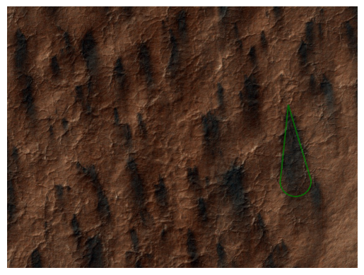
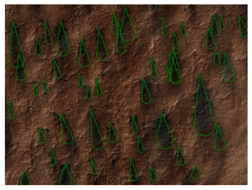
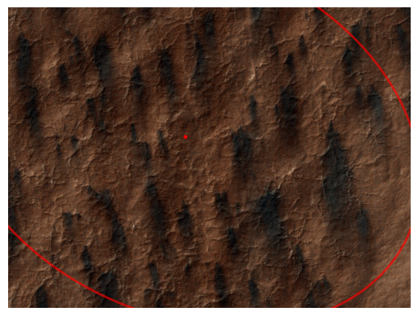
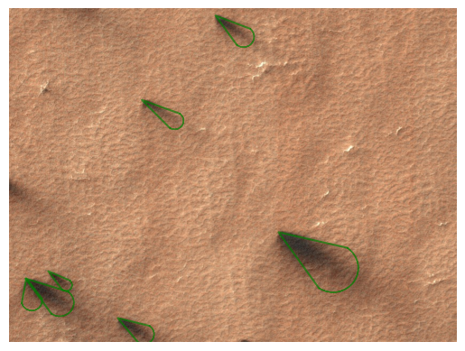
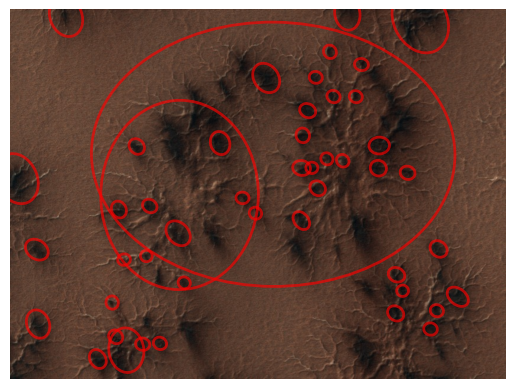

# Examples


<!-- WARNING: THIS FILE WAS AUTOGENERATED! DO NOT EDIT! -->

``` python
import pandas as pd
from p4tools.io import (
    get_blotch_catalog,
    get_blotches_for_tile,
    get_fan_catalog,
    get_fans_for_tile,
    get_region_names,
)
from p4tools.plotting import plot_blotches_for_tile, plot_fans_for_tile
from p4tools.markings import Fan, Blotch
```

``` python
blotches = get_blotch_catalog('v1')
fans = get_fans_for_tile('80s', 'v1')  # v3 for this
```

``` python
get_blotches_for_tile('80s', 'v3')
```

<div>
<style scoped>
    .dataframe tbody tr th:only-of-type {
        vertical-align: middle;
    }
&#10;    .dataframe tbody tr th {
        vertical-align: top;
    }
&#10;    .dataframe thead th {
        text-align: right;
    }
</style>

<table class="dataframe" data-quarto-postprocess="true" data-border="1">
<thead>
<tr style="text-align: right;">
<th data-quarto-table-cell-role="th"></th>
<th data-quarto-table-cell-role="th">obsid</th>
<th data-quarto-table-cell-role="th">marking_id</th>
<th data-quarto-table-cell-role="th">angle</th>
<th data-quarto-table-cell-role="th">tile_id</th>
<th data-quarto-table-cell-role="th">image_x</th>
<th data-quarto-table-cell-role="th">image_y</th>
<th data-quarto-table-cell-role="th">n_votes</th>
<th data-quarto-table-cell-role="th">radius_1</th>
<th data-quarto-table-cell-role="th">radius_2</th>
<th data-quarto-table-cell-role="th">vote_ratio</th>
<th data-quarto-table-cell-role="th">...</th>
<th data-quarto-table-cell-role="th">l_s</th>
<th data-quarto-table-cell-role="th">map_scale</th>
<th data-quarto-table-cell-role="th">north_azimuth</th>
<th data-quarto-table-cell-role="th">BodyFixedCoordinateX</th>
<th data-quarto-table-cell-role="th">BodyFixedCoordinateY</th>
<th data-quarto-table-cell-role="th">BodyFixedCoordinateZ</th>
<th data-quarto-table-cell-role="th">PlanetocentricLatitude</th>
<th data-quarto-table-cell-role="th">PlanetographicLatitude</th>
<th data-quarto-table-cell-role="th">Longitude</th>
<th data-quarto-table-cell-role="th">MY</th>
</tr>
</thead>
<tbody>
<tr>
<td data-quarto-table-cell-role="th">9380</td>
<td>ESP_011448_0950</td>
<td>B0024a4</td>
<td>26.06</td>
<td>APF000080s</td>
<td>369.5</td>
<td>18362.0</td>
<td>4.0</td>
<td>512.08</td>
<td>384.06</td>
<td>1.0</td>
<td>...</td>
<td>185.552</td>
<td>1.0</td>
<td>138.82556</td>
<td>127.680593</td>
<td>279.889716</td>
<td>-3367.51901</td>
<td>-84.780277</td>
<td>-84.84121</td>
<td>65.478392</td>
<td>29</td>
</tr>
</tbody>
</table>

<p>1 rows × 24 columns</p>
</div>

``` python
fans.head()
```

<div>
<style scoped>
    .dataframe tbody tr th:only-of-type {
        vertical-align: middle;
    }
&#10;    .dataframe tbody tr th {
        vertical-align: top;
    }
&#10;    .dataframe thead th {
        text-align: right;
    }
</style>

<table class="dataframe" data-quarto-postprocess="true" data-border="1">
<thead>
<tr style="text-align: right;">
<th data-quarto-table-cell-role="th"></th>
<th data-quarto-table-cell-role="th">obsid</th>
<th data-quarto-table-cell-role="th">marking_id</th>
<th data-quarto-table-cell-role="th">angle</th>
<th data-quarto-table-cell-role="th">distance</th>
<th data-quarto-table-cell-role="th">tile_id</th>
<th data-quarto-table-cell-role="th">image_x</th>
<th data-quarto-table-cell-role="th">image_y</th>
<th data-quarto-table-cell-role="th">n_votes</th>
<th data-quarto-table-cell-role="th">spread</th>
<th data-quarto-table-cell-role="th">version</th>
<th data-quarto-table-cell-role="th">...</th>
<th data-quarto-table-cell-role="th">l_s</th>
<th data-quarto-table-cell-role="th">map_scale</th>
<th data-quarto-table-cell-role="th">north_azimuth</th>
<th data-quarto-table-cell-role="th">BodyFixedCoordinateX</th>
<th data-quarto-table-cell-role="th">BodyFixedCoordinateY</th>
<th data-quarto-table-cell-role="th">BodyFixedCoordinateZ</th>
<th data-quarto-table-cell-role="th">PlanetocentricLatitude</th>
<th data-quarto-table-cell-role="th">PlanetographicLatitude</th>
<th data-quarto-table-cell-role="th">Longitude</th>
<th data-quarto-table-cell-role="th">MY</th>
</tr>
</thead>
<tbody>
<tr>
<td data-quarto-table-cell-role="th">137158</td>
<td>ESP_011448_0950</td>
<td>F025909</td>
<td>84.48</td>
<td>168.80</td>
<td>APF000080s</td>
<td>26.91</td>
<td>18140.73</td>
<td>18</td>
<td>20.93</td>
<td>1</td>
<td>...</td>
<td>185.552</td>
<td>1.0</td>
<td>138.825539</td>
<td>127.358295</td>
<td>280.193080</td>
<td>-3367.505762</td>
<td>-84.777851</td>
<td>-84.838813</td>
<td>65.556417</td>
<td>29</td>
</tr>
<tr>
<td data-quarto-table-cell-role="th">137159</td>
<td>ESP_011448_0950</td>
<td>F02590a</td>
<td>85.14</td>
<td>97.54</td>
<td>APF000080s</td>
<td>49.08</td>
<td>18258.54</td>
<td>6</td>
<td>25.92</td>
<td>1</td>
<td>...</td>
<td>185.552</td>
<td>1.0</td>
<td>138.825539</td>
<td>127.482002</td>
<td>280.203359</td>
<td>-3367.496453</td>
<td>-84.776815</td>
<td>-84.837788</td>
<td>65.536248</td>
<td>29</td>
</tr>
<tr>
<td data-quarto-table-cell-role="th">137160</td>
<td>ESP_011448_0950</td>
<td>F02590b</td>
<td>82.90</td>
<td>58.67</td>
<td>APF000080s</td>
<td>111.50</td>
<td>18205.77</td>
<td>18</td>
<td>28.49</td>
<td>1</td>
<td>...</td>
<td>185.552</td>
<td>1.0</td>
<td>138.825539</td>
<td>127.447992</td>
<td>280.122584</td>
<td>-3367.504162</td>
<td>-84.778305</td>
<td>-84.839261</td>
<td>65.535784</td>
<td>29</td>
</tr>
<tr>
<td data-quarto-table-cell-role="th">137161</td>
<td>ESP_011448_0950</td>
<td>F02590c</td>
<td>79.00</td>
<td>83.67</td>
<td>APF000080s</td>
<td>139.47</td>
<td>18145.31</td>
<td>10</td>
<td>17.41</td>
<td>1</td>
<td>...</td>
<td>185.552</td>
<td>1.0</td>
<td>138.825539</td>
<td>127.396216</td>
<td>280.075757</td>
<td>-3367.511393</td>
<td>-84.779397</td>
<td>-84.840341</td>
<td>65.540949</td>
<td>29</td>
</tr>
<tr>
<td data-quarto-table-cell-role="th">137162</td>
<td>ESP_011448_0950</td>
<td>F02590d</td>
<td>75.80</td>
<td>70.94</td>
<td>APF000080s</td>
<td>169.71</td>
<td>18280.73</td>
<td>13</td>
<td>21.39</td>
<td>1</td>
<td>...</td>
<td>185.552</td>
<td>1.0</td>
<td>138.825539</td>
<td>127.540728</td>
<td>280.080872</td>
<td>-3367.507926</td>
<td>-84.778303</td>
<td>-84.839259</td>
<td>65.516853</td>
<td>29</td>
</tr>
</tbody>
</table>

<p>5 rows × 25 columns</p>
</div>

``` python
Blotch.from_marking_id("B0024a4").plot()
```


``` python
fans['area'] = [Fan(row).area for _, row in fans.iterrows()]
```

``` python
fans.query("marking_id == 'F025910'").squeeze()
```

    obsid                     ESP_011448_0950
    marking_id                        F025910
    angle                               84.78
    distance                           227.48
    tile_id                        APF000080s
    image_x                            673.95
    image_y                          18328.19
    n_votes                                20
    spread                              22.13
    version                                 1
    vote_ratio                            1.0
    x                                  673.95
    y                                  244.19
    x_angle                              0.09
    y_angle                               1.0
    l_s                               185.552
    map_scale                             1.0
    north_azimuth                  138.825539
    BodyFixedCoordinateX           127.739446
    BodyFixedCoordinateY           279.560121
    BodyFixedCoordinateZ         -3367.544491
    PlanetocentricLatitude         -84.784963
    PlanetographicLatitude         -84.845842
    Longitude                        65.44291
    MY                                     29
    area                          9254.575622
    Name: 137165, dtype: object

``` python
fan = Fan.from_marking_id("F025910", version='v1')  # don't forget to use version here, if you need to get to old catalog!
fan
```

    Fan.from_marking_id('F025910')  # tile_id='APF000080s', area=9254.575622432452

``` python
fan.area
```

    np.float64(9254.575622432452)

``` python
fan.plot()
```



``` python
fan.to_shapely().area  # using the shapely object's area calculation
```

    9254.1279

``` python
fan.radius
```

    np.float64(37.20899726662801)

``` python
areas = [Fan(row).area for _, row in fans.iterrows()]
```

``` python
pd.Series(areas).sort_values(ascending=False).head(10)
```

    7     9254.575622
    48    6580.655978
    0     4837.742642
    8     4388.099137
    11    3676.285708
    21    3333.388541
    6     3310.657326
    15    2426.634151
    10    2373.369482
    5     2258.073369
    dtype: float64

``` python
plot_fans_for_tile('80s')
```



``` python
pd.options.display.max_columns = None
```

``` python
blotches.head()
```

<div>
<style scoped>
    .dataframe tbody tr th:only-of-type {
        vertical-align: middle;
    }
&#10;    .dataframe tbody tr th {
        vertical-align: top;
    }
&#10;    .dataframe thead th {
        text-align: right;
    }
</style>

<table class="dataframe" data-quarto-postprocess="true" data-border="1">
<thead>
<tr style="text-align: right;">
<th data-quarto-table-cell-role="th"></th>
<th data-quarto-table-cell-role="th">obsid</th>
<th data-quarto-table-cell-role="th">marking_id</th>
<th data-quarto-table-cell-role="th">angle</th>
<th data-quarto-table-cell-role="th">tile_id</th>
<th data-quarto-table-cell-role="th">image_x</th>
<th data-quarto-table-cell-role="th">image_y</th>
<th data-quarto-table-cell-role="th">n_votes</th>
<th data-quarto-table-cell-role="th">radius_1</th>
<th data-quarto-table-cell-role="th">radius_2</th>
<th data-quarto-table-cell-role="th">vote_ratio</th>
<th data-quarto-table-cell-role="th">x</th>
<th data-quarto-table-cell-role="th">y</th>
<th data-quarto-table-cell-role="th">x_angle</th>
<th data-quarto-table-cell-role="th">y_angle</th>
<th data-quarto-table-cell-role="th">l_s</th>
<th data-quarto-table-cell-role="th">map_scale</th>
<th data-quarto-table-cell-role="th">north_azimuth</th>
<th data-quarto-table-cell-role="th">BodyFixedCoordinateX</th>
<th data-quarto-table-cell-role="th">BodyFixedCoordinateY</th>
<th data-quarto-table-cell-role="th">BodyFixedCoordinateZ</th>
<th data-quarto-table-cell-role="th">PlanetocentricLatitude</th>
<th data-quarto-table-cell-role="th">PlanetographicLatitude</th>
<th data-quarto-table-cell-role="th">Longitude</th>
<th data-quarto-table-cell-role="th">MY</th>
</tr>
</thead>
<tbody>
<tr>
<td data-quarto-table-cell-role="th">0</td>
<td>ESP_012079_0945</td>
<td>B000000</td>
<td>2.28</td>
<td>APF0000cia</td>
<td>3330.27</td>
<td>5573.00</td>
<td>4</td>
<td>22.13</td>
<td>15.78</td>
<td>1.00</td>
<td>370.27</td>
<td>93.00</td>
<td>0.50</td>
<td>0.10</td>
<td>214.785</td>
<td>0.25</td>
<td>126.856883</td>
<td>-67.239204</td>
<td>257.001479</td>
<td>-3370.630963</td>
<td>-85.493625</td>
<td>-85.546304</td>
<td>104.661641</td>
<td>29</td>
</tr>
<tr>
<td data-quarto-table-cell-role="th">1</td>
<td>ESP_012079_0945</td>
<td>B000001</td>
<td>1.38</td>
<td>APF0000cia</td>
<td>3593.60</td>
<td>5706.40</td>
<td>5</td>
<td>25.55</td>
<td>15.73</td>
<td>0.55</td>
<td>633.60</td>
<td>226.40</td>
<td>0.20</td>
<td>0.05</td>
<td>214.785</td>
<td>0.25</td>
<td>126.856883</td>
<td>-67.166591</td>
<td>257.008699</td>
<td>-3370.633997</td>
<td>-85.493821</td>
<td>-85.546498</td>
<td>104.646095</td>
<td>29</td>
</tr>
<tr>
<td data-quarto-table-cell-role="th">2</td>
<td>ESP_012079_0945</td>
<td>B000004</td>
<td>7.16</td>
<td>APF0000cic</td>
<td>98.10</td>
<td>34394.70</td>
<td>10</td>
<td>84.54</td>
<td>48.33</td>
<td>1.00</td>
<td>98.10</td>
<td>418.70</td>
<td>0.58</td>
<td>0.18</td>
<td>214.785</td>
<td>0.25</td>
<td>126.856883</td>
<td>-65.402430</td>
<td>263.908435</td>
<td>-3370.353989</td>
<td>-85.387847</td>
<td>-85.441752</td>
<td>103.918757</td>
<td>29</td>
</tr>
<tr>
<td data-quarto-table-cell-role="th">3</td>
<td>ESP_012079_0945</td>
<td>B000005</td>
<td>81.00</td>
<td>APF0000cic</td>
<td>825.58</td>
<td>34203.38</td>
<td>8</td>
<td>51.92</td>
<td>35.12</td>
<td>1.00</td>
<td>825.58</td>
<td>227.38</td>
<td>0.16</td>
<td>0.97</td>
<td>214.785</td>
<td>0.25</td>
<td>126.856883</td>
<td>-65.252200</td>
<td>263.799557</td>
<td>-3370.366323</td>
<td>-85.390259</td>
<td>-85.444136</td>
<td>103.893535</td>
<td>29</td>
</tr>
<tr>
<td data-quarto-table-cell-role="th">4</td>
<td>ESP_012079_0945</td>
<td>B000006</td>
<td>14.66</td>
<td>APF0000cic</td>
<td>152.67</td>
<td>34155.33</td>
<td>3</td>
<td>184.94</td>
<td>71.25</td>
<td>1.00</td>
<td>152.67</td>
<td>179.33</td>
<td>0.93</td>
<td>0.25</td>
<td>214.785</td>
<td>0.25</td>
<td>126.856883</td>
<td>-65.411364</td>
<td>263.848867</td>
<td>-3370.358955</td>
<td>-85.388794</td>
<td>-85.442688</td>
<td>103.923605</td>
<td>29</td>
</tr>
</tbody>
</table>

</div>

``` python
def get_area_m2(row):
    """Compute area in square meters for a blotch row."""
    return Blotch(row).area * (row['map_scale'] ** 2)
```

``` python
blotches['area_m2'] = blotches.apply(get_area_m2, axis=1)
```

``` python
blotches.sort_values(by='area_m2', ascending=False).head(5).T
```

<div>
<style scoped>
    .dataframe tbody tr th:only-of-type {
        vertical-align: middle;
    }
&#10;    .dataframe tbody tr th {
        vertical-align: top;
    }
&#10;    .dataframe thead th {
        text-align: right;
    }
</style>

<table class="dataframe" data-quarto-postprocess="true" data-border="1">
<thead>
<tr style="text-align: right;">
<th data-quarto-table-cell-role="th"></th>
<th data-quarto-table-cell-role="th">247015</th>
<th data-quarto-table-cell-role="th">151122</th>
<th data-quarto-table-cell-role="th">213497</th>
<th data-quarto-table-cell-role="th">247017</th>
<th data-quarto-table-cell-role="th">217096</th>
</tr>
</thead>
<tbody>
<tr>
<td data-quarto-table-cell-role="th">obsid</td>
<td>ESP_011420_0930</td>
<td>ESP_020568_0950</td>
<td>ESP_020049_0985</td>
<td>ESP_011420_0930</td>
<td>ESP_020321_0935</td>
</tr>
<tr>
<td data-quarto-table-cell-role="th">marking_id</td>
<td>B044091</td>
<td>B02b30d</td>
<td>B03aeca</td>
<td>B044093</td>
<td>B03bda7</td>
</tr>
<tr>
<td data-quarto-table-cell-role="th">angle</td>
<td>0.65</td>
<td>176.24</td>
<td>17.56</td>
<td>90.89</td>
<td>169.78</td>
</tr>
<tr>
<td data-quarto-table-cell-role="th">tile_id</td>
<td>APF0000ftb</td>
<td>APF0000pqj</td>
<td>APF0000jcv</td>
<td>APF0000ftb</td>
<td>APF0000tde</td>
</tr>
<tr>
<td data-quarto-table-cell-role="th">image_x</td>
<td>445.72</td>
<td>406.17</td>
<td>656.06</td>
<td>287.17</td>
<td>444.79</td>
</tr>
<tr>
<td data-quarto-table-cell-role="th">image_y</td>
<td>12310.0</td>
<td>28843.33</td>
<td>7894.17</td>
<td>12381.33</td>
<td>16118.0</td>
</tr>
<tr>
<td data-quarto-table-cell-role="th">n_votes</td>
<td>3</td>
<td>3</td>
<td>13</td>
<td>3</td>
<td>4</td>
</tr>
<tr>
<td data-quarto-table-cell-role="th">radius_1</td>
<td>307.83</td>
<td>450.63</td>
<td>190.52</td>
<td>165.95</td>
<td>335.92</td>
</tr>
<tr>
<td data-quarto-table-cell-role="th">radius_2</td>
<td>231.66</td>
<td>356.56</td>
<td>144.14</td>
<td>133.42</td>
<td>251.94</td>
</tr>
<tr>
<td data-quarto-table-cell-role="th">vote_ratio</td>
<td>1.0</td>
<td>1.0</td>
<td>1.0</td>
<td>1.0</td>
<td>1.0</td>
</tr>
<tr>
<td data-quarto-table-cell-role="th">x</td>
<td>445.72</td>
<td>406.17</td>
<td>656.06</td>
<td>287.17</td>
<td>444.79</td>
</tr>
<tr>
<td data-quarto-table-cell-role="th">y</td>
<td>254.0</td>
<td>347.33</td>
<td>222.17</td>
<td>325.33</td>
<td>226.0</td>
</tr>
<tr>
<td data-quarto-table-cell-role="th">x_angle</td>
<td>0.33</td>
<td>-0.33</td>
<td>0.94</td>
<td>0.07</td>
<td>-0.98</td>
</tr>
<tr>
<td data-quarto-table-cell-role="th">y_angle</td>
<td>0.03</td>
<td>0.39</td>
<td>0.3</td>
<td>0.84</td>
<td>0.18</td>
</tr>
<tr>
<td data-quarto-table-cell-role="th">l_s</td>
<td>184.304</td>
<td>199.362</td>
<td>176.075</td>
<td>184.304</td>
<td>188.091</td>
</tr>
<tr>
<td data-quarto-table-cell-role="th">map_scale</td>
<td>1.0</td>
<td>0.5</td>
<td>1.0</td>
<td>1.0</td>
<td>0.5</td>
</tr>
<tr>
<td data-quarto-table-cell-role="th">north_azimuth</td>
<td>157.311404</td>
<td>122.217013</td>
<td>107.843834</td>
<td>157.311404</td>
<td>136.913825</td>
</tr>
<tr>
<td data-quarto-table-cell-role="th">BodyFixedCoordinateX</td>
<td>-108.319074</td>
<td>-292.548434</td>
<td>218.993402</td>
<td>-108.419596</td>
<td>-33.483452</td>
</tr>
<tr>
<td data-quarto-table-cell-role="th">BodyFixedCoordinateY</td>
<td>138.086757</td>
<td>-0.475303</td>
<td>-451.601655</td>
<td>138.223638</td>
<td>210.518459</td>
</tr>
<tr>
<td data-quarto-table-cell-role="th">BodyFixedCoordinateZ</td>
<td>-3377.673253</td>
<td>-3368.925447</td>
<td>-3343.091928</td>
<td>-3377.663493</td>
<td>-3374.783449</td>
</tr>
<tr>
<td data-quarto-table-cell-role="th">PlanetocentricLatitude</td>
<td>-87.025617</td>
<td>-85.037032</td>
<td>-81.461947</td>
<td>-87.022737</td>
<td>-86.385774</td>
</tr>
<tr>
<td data-quarto-table-cell-role="th">PlanetographicLatitude</td>
<td>-87.060467</td>
<td>-85.094998</td>
<td>-81.56071</td>
<td>-87.057621</td>
<td>-86.428085</td>
</tr>
<tr>
<td data-quarto-table-cell-role="th">Longitude</td>
<td>128.111619</td>
<td>180.093088</td>
<td>295.869955</td>
<td>128.109861</td>
<td>99.037327</td>
</tr>
<tr>
<td data-quarto-table-cell-role="th">MY</td>
<td>29</td>
<td>30</td>
<td>30</td>
<td>29</td>
<td>30</td>
</tr>
<tr>
<td data-quarto-table-cell-role="th">area_m2</td>
<td>224032.934242</td>
<td>126195.132302</td>
<td>86273.012533</td>
<td>69558.156881</td>
<td>66469.569807</td>
</tr>
</tbody>
</table>

</div>

``` python
Blotch.from_marking_id("B0024a4", with_center=True, color='green').plot()
```



``` python
get_blotches_for_tile("80s", version='v1')
```

<div>
<style scoped>
    .dataframe tbody tr th:only-of-type {
        vertical-align: middle;
    }
&#10;    .dataframe tbody tr th {
        vertical-align: top;
    }
&#10;    .dataframe thead th {
        text-align: right;
    }
</style>

<table class="dataframe" data-quarto-postprocess="true" data-border="1">
<thead>
<tr style="text-align: right;">
<th data-quarto-table-cell-role="th"></th>
<th data-quarto-table-cell-role="th">obsid</th>
<th data-quarto-table-cell-role="th">marking_id</th>
<th data-quarto-table-cell-role="th">angle</th>
<th data-quarto-table-cell-role="th">tile_id</th>
<th data-quarto-table-cell-role="th">image_x</th>
<th data-quarto-table-cell-role="th">image_y</th>
<th data-quarto-table-cell-role="th">n_votes</th>
<th data-quarto-table-cell-role="th">radius_1</th>
<th data-quarto-table-cell-role="th">radius_2</th>
<th data-quarto-table-cell-role="th">vote_ratio</th>
<th data-quarto-table-cell-role="th">x</th>
<th data-quarto-table-cell-role="th">y</th>
<th data-quarto-table-cell-role="th">x_angle</th>
<th data-quarto-table-cell-role="th">y_angle</th>
<th data-quarto-table-cell-role="th">l_s</th>
<th data-quarto-table-cell-role="th">map_scale</th>
<th data-quarto-table-cell-role="th">north_azimuth</th>
<th data-quarto-table-cell-role="th">BodyFixedCoordinateX</th>
<th data-quarto-table-cell-role="th">BodyFixedCoordinateY</th>
<th data-quarto-table-cell-role="th">BodyFixedCoordinateZ</th>
<th data-quarto-table-cell-role="th">PlanetocentricLatitude</th>
<th data-quarto-table-cell-role="th">PlanetographicLatitude</th>
<th data-quarto-table-cell-role="th">Longitude</th>
<th data-quarto-table-cell-role="th">MY</th>
</tr>
</thead>
<tbody>
<tr>
<td data-quarto-table-cell-role="th">177822</td>
<td>ESP_011448_0950</td>
<td>B031fa6</td>
<td>0.0</td>
<td>APF000080s</td>
<td>146.33</td>
<td>18533.0</td>
<td>3</td>
<td>10.0</td>
<td>10.0</td>
<td>1.0</td>
<td>146.33</td>
<td>449.0</td>
<td>0.67</td>
<td>0.33</td>
<td>185.552</td>
<td>1.0</td>
<td>138.825539</td>
<td>127.786289</td>
<td>280.175948</td>
<td>-3367.493077</td>
<td>-84.775102</td>
<td>-84.836095</td>
<td>65.482603</td>
<td>29</td>
</tr>
</tbody>
</table>

</div>

``` python
blotches = get_blotches_for_tile('ftb')
```

``` python
collection = [
            Blotch(blotch, with_center=False, color='green')
            for _, blotch in blotches.iterrows()
        ]
```

``` python
[b.area for b in collection]
```

    [8527.599417483081,
     462.9796509521814,
     1351.0356374909834,
     454.60353661918026,
     555.9104749194903,
     588.2757907553031,
     1078.194598712017,
     1524.9139944077483,
     410.4179784242359,
     383.47379487145776,
     338.12584739468514,
     314.1592653589793,
     558.7388507855172,
     566.640270468561,
     882.7341285836209,
     356.0115626901025,
     347.2741652019387,
     538.3323215448594,
     659.3624926836716,
     394.86803726676254,
     461.63819088909855,
     381.75440121214797,
     364.82373008342194,
     366.42028746997624,
     344.0043955680823,
     370.0698756556515,
     1961.7226077592,
     4867.553812341817,
     1799.3597587141685,
     655.2074222400337,
     320.7566099315179,
     530.0466850802817,
     394.1206523744735,
     1049.0955967581415,
     806.0723563321919,
     373.86931781090294,
     314.1592653589793,
     341.80528071056955,
     404.7250983766658,
     621.4598056366414,
     727.8630355396049,
     384.4351222234562,
     590.7601622257619,
     453.9500853472336,
     69558.15688117163,
     3649.2749688876993,
     3076.005623760799,
     224032.93424202612]

``` python
rois = get_region_names()
```

``` python
rois.roi_name.unique()
```

    array(['Macclesfield', 'unknown', 'Starburst', 'Manhattan_Classic',
           'Wellington', 'Albany', 'Bilbao', 'Ithaca', 'Portsmouth', 'Pisaq',
           'Manhattan_Frontinella', 'BuenosAires', 'Inca_City_Ridges',
           'Inca_City', 'Giza', 'Potsdam', 'Troy', 'Oswego_Edge', 'Halifax',
           'Caterpillar', 'Rochester', 'Manhattan_Cracks', 'Schenectady',
           'Binghamton', 'Atka', 'Cortland', 'Geneseo', 'Manhattan2'],
          dtype=object)

``` python
rois.query("roi_name=='Giza'").describe()
```

<div>
<style scoped>
    .dataframe tbody tr th:only-of-type {
        vertical-align: middle;
    }
&#10;    .dataframe tbody tr th {
        vertical-align: top;
    }
&#10;    .dataframe thead th {
        text-align: right;
    }
</style>

<table class="dataframe" data-quarto-postprocess="true" data-border="1">
<thead>
<tr style="text-align: right;">
<th data-quarto-table-cell-role="th"></th>
<th data-quarto-table-cell-role="th">lat_IND</th>
<th data-quarto-table-cell-role="th">lon_IND</th>
<th data-quarto-table-cell-role="th">minimal_distance</th>
<th data-quarto-table-cell-role="th">lat_WORD</th>
<th data-quarto-table-cell-role="th">lon_WORD</th>
<th data-quarto-table-cell-role="th">MY</th>
</tr>
</thead>
<tbody>
<tr>
<td data-quarto-table-cell-role="th">count</td>
<td>35.000000</td>
<td>35.000000</td>
<td>35.000000</td>
<td>3.500000e+01</td>
<td>3.500000e+01</td>
<td>35.000000</td>
</tr>
<tr>
<td data-quarto-table-cell-role="th">mean</td>
<td>-84.829069</td>
<td>66.071666</td>
<td>6.318094</td>
<td>-8.482000e+01</td>
<td>6.570000e+01</td>
<td>29.057143</td>
</tr>
<tr>
<td data-quarto-table-cell-role="th">std</td>
<td>0.066423</td>
<td>0.991527</td>
<td>11.242504</td>
<td>2.883665e-14</td>
<td>1.441832e-14</td>
<td>1.027357</td>
</tr>
<tr>
<td data-quarto-table-cell-role="th">min</td>
<td>-84.979100</td>
<td>65.637800</td>
<td>0.720371</td>
<td>-8.482000e+01</td>
<td>6.570000e+01</td>
<td>28.000000</td>
</tr>
<tr>
<td data-quarto-table-cell-role="th">25%</td>
<td>-84.834950</td>
<td>65.736450</td>
<td>1.254355</td>
<td>-8.482000e+01</td>
<td>6.570000e+01</td>
<td>28.000000</td>
</tr>
<tr>
<td data-quarto-table-cell-role="th">50%</td>
<td>-84.812200</td>
<td>65.774200</td>
<td>1.487853</td>
<td>-8.482000e+01</td>
<td>6.570000e+01</td>
<td>29.000000</td>
</tr>
<tr>
<td data-quarto-table-cell-role="th">75%</td>
<td>-84.809350</td>
<td>65.799750</td>
<td>4.005964</td>
<td>-8.482000e+01</td>
<td>6.570000e+01</td>
<td>30.000000</td>
</tr>
<tr>
<td data-quarto-table-cell-role="th">max</td>
<td>-84.581900</td>
<td>69.890400</td>
<td>44.631912</td>
<td>-8.482000e+01</td>
<td>6.570000e+01</td>
<td>31.000000</td>
</tr>
</tbody>
</table>

</div>

``` python
fans = get_fan_catalog()
blotches = get_blotch_catalog()
```

``` python
fansperobsid = fans.groupby("obsid").size()
```

``` python
fansperobsid.head()
```

    obsid
    ESP_011296_0975    4500
    ESP_011341_0980     457
    ESP_011348_0950       6
    ESP_011350_0945    1108
    ESP_011351_0945    1643
    dtype: int64

``` python
blotchesperobsid = blotches.groupby("obsid").size()
blotchesperobsid.head()
```

    obsid
    ESP_011296_0975    1012
    ESP_011341_0980     281
    ESP_011348_0950     198
    ESP_011350_0945     626
    ESP_011351_0945    1279
    dtype: int64

``` python
df = fansperobsid.to_frame()
```

``` python
df["blotches counts"] = blotchesperobsid
```

``` python
df.columns = ["fan_count_per_obsid", "blotch_count_per_obsid"]
df.head()
```

<div>
<style scoped>
    .dataframe tbody tr th:only-of-type {
        vertical-align: middle;
    }
&#10;    .dataframe tbody tr th {
        vertical-align: top;
    }
&#10;    .dataframe thead th {
        text-align: right;
    }
</style>

<table class="dataframe" data-quarto-postprocess="true" data-border="1">
<thead>
<tr style="text-align: right;">
<th data-quarto-table-cell-role="th"></th>
<th data-quarto-table-cell-role="th">fan_count_per_obsid</th>
<th data-quarto-table-cell-role="th">blotch_count_per_obsid</th>
</tr>
<tr>
<th data-quarto-table-cell-role="th">obsid</th>
<th data-quarto-table-cell-role="th"></th>
<th data-quarto-table-cell-role="th"></th>
</tr>
</thead>
<tbody>
<tr>
<td data-quarto-table-cell-role="th">ESP_011296_0975</td>
<td>4500</td>
<td>1012.0</td>
</tr>
<tr>
<td data-quarto-table-cell-role="th">ESP_011341_0980</td>
<td>457</td>
<td>281.0</td>
</tr>
<tr>
<td data-quarto-table-cell-role="th">ESP_011348_0950</td>
<td>6</td>
<td>198.0</td>
</tr>
<tr>
<td data-quarto-table-cell-role="th">ESP_011350_0945</td>
<td>1108</td>
<td>626.0</td>
</tr>
<tr>
<td data-quarto-table-cell-role="th">ESP_011351_0945</td>
<td>1643</td>
<td>1279.0</td>
</tr>
</tbody>
</table>

</div>

``` python
fan_counts_per_tile = fans.groupby("tile_id").size()
fan_counts_per_tile.head()
```

    tile_id
    APF0000001    3
    APF0000006    4
    APF0000009    1
    APF000000c    4
    APF000000f    1
    dtype: int64

``` python
blotch_counts_per_tile = blotches.groupby("tile_id").size()
blotch_counts_per_tile.head()
```

    tile_id
    APF0000001    1
    APF0000002    2
    APF0000004    4
    APF0000005    5
    APF0000006    7
    dtype: int64

``` python
fan_counts_per_tile.name = "fans"
```

``` python
blotch_counts_per_tile.name = "blotches"
```

``` python
df = pd.DataFrame(fan_counts_per_tile)
```

``` python
df["blotches"] = blotch_counts_per_tile
df.head()
```

<div>
<style scoped>
    .dataframe tbody tr th:only-of-type {
        vertical-align: middle;
    }
&#10;    .dataframe tbody tr th {
        vertical-align: top;
    }
&#10;    .dataframe thead th {
        text-align: right;
    }
</style>

<table class="dataframe" data-quarto-postprocess="true" data-border="1">
<thead>
<tr style="text-align: right;">
<th data-quarto-table-cell-role="th"></th>
<th data-quarto-table-cell-role="th">fans</th>
<th data-quarto-table-cell-role="th">blotches</th>
</tr>
<tr>
<th data-quarto-table-cell-role="th">tile_id</th>
<th data-quarto-table-cell-role="th"></th>
<th data-quarto-table-cell-role="th"></th>
</tr>
</thead>
<tbody>
<tr>
<td data-quarto-table-cell-role="th">APF0000001</td>
<td>3</td>
<td>1.0</td>
</tr>
<tr>
<td data-quarto-table-cell-role="th">APF0000006</td>
<td>4</td>
<td>7.0</td>
</tr>
<tr>
<td data-quarto-table-cell-role="th">APF0000009</td>
<td>1</td>
<td>26.0</td>
</tr>
<tr>
<td data-quarto-table-cell-role="th">APF000000c</td>
<td>4</td>
<td>3.0</td>
</tr>
<tr>
<td data-quarto-table-cell-role="th">APF000000f</td>
<td>1</td>
<td>32.0</td>
</tr>
</tbody>
</table>

</div>

``` python
df[(df.fans + df.blotches) > 100].head()
```

<div>
<style scoped>
    .dataframe tbody tr th:only-of-type {
        vertical-align: middle;
    }
&#10;    .dataframe tbody tr th {
        vertical-align: top;
    }
&#10;    .dataframe thead th {
        text-align: right;
    }
</style>

<table class="dataframe" data-quarto-postprocess="true" data-border="1">
<thead>
<tr style="text-align: right;">
<th data-quarto-table-cell-role="th"></th>
<th data-quarto-table-cell-role="th">fans</th>
<th data-quarto-table-cell-role="th">blotches</th>
</tr>
<tr>
<th data-quarto-table-cell-role="th">tile_id</th>
<th data-quarto-table-cell-role="th"></th>
<th data-quarto-table-cell-role="th"></th>
</tr>
</thead>
<tbody>
<tr>
<td data-quarto-table-cell-role="th">APF00002zj</td>
<td>99</td>
<td>4.0</td>
</tr>
<tr>
<td data-quarto-table-cell-role="th">APF000061m</td>
<td>133</td>
<td>52.0</td>
</tr>
<tr>
<td data-quarto-table-cell-role="th">APF00006mg</td>
<td>98</td>
<td>7.0</td>
</tr>
<tr>
<td data-quarto-table-cell-role="th">APF00006mt</td>
<td>118</td>
<td>2.0</td>
</tr>
<tr>
<td data-quarto-table-cell-role="th">APF00006mv</td>
<td>95</td>
<td>19.0</td>
</tr>
</tbody>
</table>

</div>

### The input data products for the P4 project are the \`*COLOR* products one can find on the uahirise.org website!

``` python
buffalo = "ESP_011486_0980_COLOR ESP_011987_0975_COLOR ESP_012198_0975_COLOR ESP_012277_0975_COLOR ESP_012620_0975_COLOR".split()
```

``` python
buffalo = [i.rstrip("_COLOR") for i in buffalo]
```

``` python
p4_buffalo = fans[fans.obsid.isin(buffalo)].obsid.unique()
```

``` python
fans[fans.obsid.isin(p4_buffalo)].groupby("obsid").size()
```

    obsid
    ESP_011486_0980    261
    ESP_012277_0975     20
    ESP_012620_0975     30
    dtype: int64

``` python
fans[fans.obsid.isin(p4_buffalo)][["l_s", "obsid"]].drop_duplicates()
```

<div>
<style scoped>
    .dataframe tbody tr th:only-of-type {
        vertical-align: middle;
    }
&#10;    .dataframe tbody tr th {
        vertical-align: top;
    }
&#10;    .dataframe thead th {
        text-align: right;
    }
</style>

<table class="dataframe" data-quarto-postprocess="true" data-border="1">
<thead>
<tr style="text-align: right;">
<th data-quarto-table-cell-role="th"></th>
<th data-quarto-table-cell-role="th">l_s</th>
<th data-quarto-table-cell-role="th">obsid</th>
</tr>
</thead>
<tbody>
<tr>
<td data-quarto-table-cell-role="th">15583</td>
<td>187.254</td>
<td>ESP_011486_0980</td>
</tr>
<tr>
<td data-quarto-table-cell-role="th">48242</td>
<td>224.333</td>
<td>ESP_012277_0975</td>
</tr>
<tr>
<td data-quarto-table-cell-role="th">85398</td>
<td>241.144</td>
<td>ESP_012620_0975</td>
</tr>
</tbody>
</table>

</div>

``` python
fans[fans.tile_id.str.contains("r8y")]
```

<div>
<style scoped>
    .dataframe tbody tr th:only-of-type {
        vertical-align: middle;
    }
&#10;    .dataframe tbody tr th {
        vertical-align: top;
    }
&#10;    .dataframe thead th {
        text-align: right;
    }
</style>

<table class="dataframe" data-quarto-postprocess="true" data-border="1">
<thead>
<tr style="text-align: right;">
<th data-quarto-table-cell-role="th"></th>
<th data-quarto-table-cell-role="th">obsid</th>
<th data-quarto-table-cell-role="th">marking_id</th>
<th data-quarto-table-cell-role="th">angle</th>
<th data-quarto-table-cell-role="th">distance</th>
<th data-quarto-table-cell-role="th">tile_id</th>
<th data-quarto-table-cell-role="th">image_x</th>
<th data-quarto-table-cell-role="th">image_y</th>
<th data-quarto-table-cell-role="th">n_votes</th>
<th data-quarto-table-cell-role="th">spread</th>
<th data-quarto-table-cell-role="th">version</th>
<th data-quarto-table-cell-role="th">vote_ratio</th>
<th data-quarto-table-cell-role="th">x</th>
<th data-quarto-table-cell-role="th">y</th>
<th data-quarto-table-cell-role="th">x_angle</th>
<th data-quarto-table-cell-role="th">y_angle</th>
<th data-quarto-table-cell-role="th">l_s</th>
<th data-quarto-table-cell-role="th">map_scale</th>
<th data-quarto-table-cell-role="th">north_azimuth</th>
<th data-quarto-table-cell-role="th">BodyFixedCoordinateX</th>
<th data-quarto-table-cell-role="th">BodyFixedCoordinateY</th>
<th data-quarto-table-cell-role="th">BodyFixedCoordinateZ</th>
<th data-quarto-table-cell-role="th">PlanetocentricLatitude</th>
<th data-quarto-table-cell-role="th">PlanetographicLatitude</th>
<th data-quarto-table-cell-role="th">Longitude</th>
<th data-quarto-table-cell-role="th">MY</th>
</tr>
</thead>
<tbody>
<tr>
<td data-quarto-table-cell-role="th">106534</td>
<td>ESP_020242_0945</td>
<td>F01a026</td>
<td>34.16</td>
<td>171.27</td>
<td>APF0000r8y</td>
<td>505.45</td>
<td>13038.68</td>
<td>19.0</td>
<td>41.85</td>
<td>1</td>
<td>1.0</td>
<td>505.45</td>
<td>434.68</td>
<td>0.82</td>
<td>0.56</td>
<td>184.557</td>
<td>1.0</td>
<td>143.67511</td>
<td>-63.562264</td>
<td>265.129449</td>
<td>-3370.242420</td>
<td>-85.375019</td>
<td>-85.429073</td>
<td>103.481673</td>
<td>30</td>
</tr>
<tr>
<td data-quarto-table-cell-role="th">106535</td>
<td>ESP_020242_0945</td>
<td>F01a027</td>
<td>33.30</td>
<td>90.38</td>
<td>APF0000r8y</td>
<td>249.21</td>
<td>12781.71</td>
<td>14.0</td>
<td>25.57</td>
<td>1</td>
<td>1.0</td>
<td>249.21</td>
<td>177.71</td>
<td>0.83</td>
<td>0.55</td>
<td>184.557</td>
<td>1.0</td>
<td>143.67511</td>
<td>-63.936682</td>
<td>265.103685</td>
<td>-3370.250040</td>
<td>-85.373975</td>
<td>-85.428040</td>
<td>103.559434</td>
<td>30</td>
</tr>
<tr>
<td data-quarto-table-cell-role="th">106536</td>
<td>ESP_020242_0945</td>
<td>F01a028</td>
<td>38.19</td>
<td>86.92</td>
<td>APF0000r8y</td>
<td>387.19</td>
<td>12617.75</td>
<td>16.0</td>
<td>33.44</td>
<td>1</td>
<td>1.0</td>
<td>387.19</td>
<td>13.75</td>
<td>0.78</td>
<td>0.62</td>
<td>184.557</td>
<td>1.0</td>
<td>143.67511</td>
<td>-63.932326</td>
<td>264.882174</td>
<td>-3370.272468</td>
<td>-85.377659</td>
<td>-85.431682</td>
<td>103.569463</td>
<td>30</td>
</tr>
<tr>
<td data-quarto-table-cell-role="th">106537</td>
<td>ESP_020242_0945</td>
<td>F01a029</td>
<td>39.19</td>
<td>54.32</td>
<td>APF0000r8y</td>
<td>73.62</td>
<td>13114.42</td>
<td>12.0</td>
<td>30.04</td>
<td>1</td>
<td>1.0</td>
<td>73.62</td>
<td>510.42</td>
<td>0.77</td>
<td>0.63</td>
<td>184.557</td>
<td>1.0</td>
<td>143.67511</td>
<td>-63.860251</td>
<td>265.482502</td>
<td>-3370.212467</td>
<td>-85.368005</td>
<td>-85.422140</td>
<td>103.525207</td>
<td>30</td>
</tr>
<tr>
<td data-quarto-table-cell-role="th">106538</td>
<td>ESP_020242_0945</td>
<td>F01a02a</td>
<td>36.11</td>
<td>106.09</td>
<td>APF0000r8y</td>
<td>30.86</td>
<td>13128.72</td>
<td>18.0</td>
<td>36.90</td>
<td>1</td>
<td>1.0</td>
<td>30.86</td>
<td>524.72</td>
<td>0.81</td>
<td>0.59</td>
<td>184.557</td>
<td>1.0</td>
<td>143.67511</td>
<td>-63.885407</td>
<td>265.522804</td>
<td>-3370.208488</td>
<td>-85.367238</td>
<td>-85.421382</td>
<td>103.528361</td>
<td>30</td>
</tr>
<tr>
<td data-quarto-table-cell-role="th">106539</td>
<td>ESP_020242_0945</td>
<td>F01a02b</td>
<td>76.52</td>
<td>63.91</td>
<td>APF0000r8y</td>
<td>32.33</td>
<td>13128.33</td>
<td>3.0</td>
<td>46.96</td>
<td>1</td>
<td>1.0</td>
<td>32.33</td>
<td>524.33</td>
<td>0.23</td>
<td>0.96</td>
<td>184.557</td>
<td>1.0</td>
<td>143.67511</td>
<td>-63.884475</td>
<td>265.521496</td>
<td>-3370.208625</td>
<td>-85.367264</td>
<td>-85.421407</td>
<td>103.528235</td>
<td>30</td>
</tr>
<tr>
<td data-quarto-table-cell-role="th">106540</td>
<td>ESP_020242_0945</td>
<td>F01a02c</td>
<td>32.72</td>
<td>77.35</td>
<td>APF0000r8y</td>
<td>204.00</td>
<td>13205.53</td>
<td>15.0</td>
<td>36.85</td>
<td>1</td>
<td>1.0</td>
<td>204.00</td>
<td>601.53</td>
<td>0.84</td>
<td>0.54</td>
<td>184.557</td>
<td>1.0</td>
<td>143.67511</td>
<td>-63.695785</td>
<td>265.464328</td>
<td>-3370.212856</td>
<td>-85.368953</td>
<td>-85.423077</td>
<td>103.492539</td>
<td>30</td>
</tr>
</tbody>
</table>

</div>

``` python
plot_fans_for_tile("r8y")
```



``` python
blotches = get_blotches_for_tile("ftb")  # no blotches, that's why below plot is empty
```

``` python
blotches.head()
```

<div>
<style scoped>
    .dataframe tbody tr th:only-of-type {
        vertical-align: middle;
    }
&#10;    .dataframe tbody tr th {
        vertical-align: top;
    }
&#10;    .dataframe thead th {
        text-align: right;
    }
</style>

<table class="dataframe" data-quarto-postprocess="true" data-border="1">
<thead>
<tr style="text-align: right;">
<th data-quarto-table-cell-role="th"></th>
<th data-quarto-table-cell-role="th">obsid</th>
<th data-quarto-table-cell-role="th">marking_id</th>
<th data-quarto-table-cell-role="th">angle</th>
<th data-quarto-table-cell-role="th">tile_id</th>
<th data-quarto-table-cell-role="th">image_x</th>
<th data-quarto-table-cell-role="th">image_y</th>
<th data-quarto-table-cell-role="th">n_votes</th>
<th data-quarto-table-cell-role="th">radius_1</th>
<th data-quarto-table-cell-role="th">radius_2</th>
<th data-quarto-table-cell-role="th">vote_ratio</th>
<th data-quarto-table-cell-role="th">x</th>
<th data-quarto-table-cell-role="th">y</th>
<th data-quarto-table-cell-role="th">x_angle</th>
<th data-quarto-table-cell-role="th">y_angle</th>
<th data-quarto-table-cell-role="th">l_s</th>
<th data-quarto-table-cell-role="th">map_scale</th>
<th data-quarto-table-cell-role="th">north_azimuth</th>
<th data-quarto-table-cell-role="th">BodyFixedCoordinateX</th>
<th data-quarto-table-cell-role="th">BodyFixedCoordinateY</th>
<th data-quarto-table-cell-role="th">BodyFixedCoordinateZ</th>
<th data-quarto-table-cell-role="th">PlanetocentricLatitude</th>
<th data-quarto-table-cell-role="th">PlanetographicLatitude</th>
<th data-quarto-table-cell-role="th">Longitude</th>
<th data-quarto-table-cell-role="th">MY</th>
</tr>
</thead>
<tbody>
<tr>
<td data-quarto-table-cell-role="th">7600</td>
<td>ESP_011420_0930</td>
<td>B001db0</td>
<td>65.97</td>
<td>APF0000ftb</td>
<td>694.83</td>
<td>12074.33</td>
<td>3.0</td>
<td>60.16</td>
<td>45.12</td>
<td>1.00</td>
<td>694.83</td>
<td>18.33</td>
<td>0.34</td>
<td>0.84</td>
<td>184.304</td>
<td>1.0</td>
<td>157.311464</td>
<td>-108.219785</td>
<td>137.763762</td>
<td>-3377.691341</td>
<td>-87.030969</td>
<td>-87.065756</td>
<td>128.151268</td>
<td>29</td>
</tr>
<tr>
<td data-quarto-table-cell-role="th">7601</td>
<td>ESP_011420_0930</td>
<td>B001db1</td>
<td>76.61</td>
<td>APF0000ftb</td>
<td>495.83</td>
<td>12276.83</td>
<td>6.0</td>
<td>12.95</td>
<td>11.38</td>
<td>1.00</td>
<td>495.83</td>
<td>220.83</td>
<td>0.40</td>
<td>0.63</td>
<td>184.304</td>
<td>1.0</td>
<td>157.311464</td>
<td>-108.291561</td>
<td>138.031307</td>
<td>-3377.676832</td>
<td>-87.026646</td>
<td>-87.061484</td>
<td>128.115726</td>
<td>29</td>
</tr>
<tr>
<td data-quarto-table-cell-role="th">7602</td>
<td>ESP_011420_0930</td>
<td>B001db2</td>
<td>50.11</td>
<td>APF0000ftb</td>
<td>284.75</td>
<td>12448.50</td>
<td>4.0</td>
<td>24.16</td>
<td>17.80</td>
<td>1.00</td>
<td>284.75</td>
<td>392.50</td>
<td>0.60</td>
<td>0.64</td>
<td>184.304</td>
<td>1.0</td>
<td>157.311464</td>
<td>-108.388342</td>
<td>138.278643</td>
<td>-3377.662577</td>
<td>-87.022330</td>
<td>-87.057219</td>
<td>128.090771</td>
<td>29</td>
</tr>
<tr>
<td data-quarto-table-cell-role="th">7603</td>
<td>ESP_011420_0930</td>
<td>B001db3</td>
<td>39.37</td>
<td>APF0000ftb</td>
<td>236.70</td>
<td>12400.62</td>
<td>8.0</td>
<td>13.06</td>
<td>11.08</td>
<td>1.00</td>
<td>236.70</td>
<td>344.62</td>
<td>0.63</td>
<td>0.53</td>
<td>184.304</td>
<td>1.0</td>
<td>157.311464</td>
<td>-108.452364</td>
<td>138.261137</td>
<td>-3377.660639</td>
<td>-87.021893</td>
<td>-87.056787</td>
<td>128.110721</td>
<td>29</td>
</tr>
<tr>
<td data-quarto-table-cell-role="th">7604</td>
<td>ESP_011420_0930</td>
<td>B001db4</td>
<td>51.89</td>
<td>APF0000ftb</td>
<td>214.67</td>
<td>12296.33</td>
<td>6.0</td>
<td>14.54</td>
<td>12.17</td>
<td>0.66</td>
<td>214.67</td>
<td>240.33</td>
<td>0.57</td>
<td>0.60</td>
<td>184.304</td>
<td>1.0</td>
<td>157.311464</td>
<td>-108.521524</td>
<td>138.183271</td>
<td>-3377.662441</td>
<td>-87.022209</td>
<td>-87.057098</td>
<td>128.144138</td>
<td>29</td>
</tr>
</tbody>
</table>

</div>

``` python
plot_blotches_for_tile("ftb")
```



``` python
get_fans_for_tile("APF0000r8y")
```

<div>
<style scoped>
    .dataframe tbody tr th:only-of-type {
        vertical-align: middle;
    }
&#10;    .dataframe tbody tr th {
        vertical-align: top;
    }
&#10;    .dataframe thead th {
        text-align: right;
    }
</style>

<table class="dataframe" data-quarto-postprocess="true" data-border="1">
<thead>
<tr style="text-align: right;">
<th data-quarto-table-cell-role="th"></th>
<th data-quarto-table-cell-role="th">obsid</th>
<th data-quarto-table-cell-role="th">marking_id</th>
<th data-quarto-table-cell-role="th">angle</th>
<th data-quarto-table-cell-role="th">distance</th>
<th data-quarto-table-cell-role="th">tile_id</th>
<th data-quarto-table-cell-role="th">image_x</th>
<th data-quarto-table-cell-role="th">image_y</th>
<th data-quarto-table-cell-role="th">n_votes</th>
<th data-quarto-table-cell-role="th">spread</th>
<th data-quarto-table-cell-role="th">version</th>
<th data-quarto-table-cell-role="th">vote_ratio</th>
<th data-quarto-table-cell-role="th">x</th>
<th data-quarto-table-cell-role="th">y</th>
<th data-quarto-table-cell-role="th">x_angle</th>
<th data-quarto-table-cell-role="th">y_angle</th>
<th data-quarto-table-cell-role="th">l_s</th>
<th data-quarto-table-cell-role="th">map_scale</th>
<th data-quarto-table-cell-role="th">north_azimuth</th>
<th data-quarto-table-cell-role="th">BodyFixedCoordinateX</th>
<th data-quarto-table-cell-role="th">BodyFixedCoordinateY</th>
<th data-quarto-table-cell-role="th">BodyFixedCoordinateZ</th>
<th data-quarto-table-cell-role="th">PlanetocentricLatitude</th>
<th data-quarto-table-cell-role="th">PlanetographicLatitude</th>
<th data-quarto-table-cell-role="th">Longitude</th>
<th data-quarto-table-cell-role="th">MY</th>
</tr>
</thead>
<tbody>
<tr>
<td data-quarto-table-cell-role="th">106534</td>
<td>ESP_020242_0945</td>
<td>F01a026</td>
<td>34.16</td>
<td>171.27</td>
<td>APF0000r8y</td>
<td>505.45</td>
<td>13038.68</td>
<td>19.0</td>
<td>41.85</td>
<td>1</td>
<td>1.0</td>
<td>505.45</td>
<td>434.68</td>
<td>0.82</td>
<td>0.56</td>
<td>184.557</td>
<td>1.0</td>
<td>143.67511</td>
<td>-63.562264</td>
<td>265.129449</td>
<td>-3370.242420</td>
<td>-85.375019</td>
<td>-85.429073</td>
<td>103.481673</td>
<td>30</td>
</tr>
<tr>
<td data-quarto-table-cell-role="th">106535</td>
<td>ESP_020242_0945</td>
<td>F01a027</td>
<td>33.30</td>
<td>90.38</td>
<td>APF0000r8y</td>
<td>249.21</td>
<td>12781.71</td>
<td>14.0</td>
<td>25.57</td>
<td>1</td>
<td>1.0</td>
<td>249.21</td>
<td>177.71</td>
<td>0.83</td>
<td>0.55</td>
<td>184.557</td>
<td>1.0</td>
<td>143.67511</td>
<td>-63.936682</td>
<td>265.103685</td>
<td>-3370.250040</td>
<td>-85.373975</td>
<td>-85.428040</td>
<td>103.559434</td>
<td>30</td>
</tr>
<tr>
<td data-quarto-table-cell-role="th">106536</td>
<td>ESP_020242_0945</td>
<td>F01a028</td>
<td>38.19</td>
<td>86.92</td>
<td>APF0000r8y</td>
<td>387.19</td>
<td>12617.75</td>
<td>16.0</td>
<td>33.44</td>
<td>1</td>
<td>1.0</td>
<td>387.19</td>
<td>13.75</td>
<td>0.78</td>
<td>0.62</td>
<td>184.557</td>
<td>1.0</td>
<td>143.67511</td>
<td>-63.932326</td>
<td>264.882174</td>
<td>-3370.272468</td>
<td>-85.377659</td>
<td>-85.431682</td>
<td>103.569463</td>
<td>30</td>
</tr>
<tr>
<td data-quarto-table-cell-role="th">106537</td>
<td>ESP_020242_0945</td>
<td>F01a029</td>
<td>39.19</td>
<td>54.32</td>
<td>APF0000r8y</td>
<td>73.62</td>
<td>13114.42</td>
<td>12.0</td>
<td>30.04</td>
<td>1</td>
<td>1.0</td>
<td>73.62</td>
<td>510.42</td>
<td>0.77</td>
<td>0.63</td>
<td>184.557</td>
<td>1.0</td>
<td>143.67511</td>
<td>-63.860251</td>
<td>265.482502</td>
<td>-3370.212467</td>
<td>-85.368005</td>
<td>-85.422140</td>
<td>103.525207</td>
<td>30</td>
</tr>
<tr>
<td data-quarto-table-cell-role="th">106538</td>
<td>ESP_020242_0945</td>
<td>F01a02a</td>
<td>36.11</td>
<td>106.09</td>
<td>APF0000r8y</td>
<td>30.86</td>
<td>13128.72</td>
<td>18.0</td>
<td>36.90</td>
<td>1</td>
<td>1.0</td>
<td>30.86</td>
<td>524.72</td>
<td>0.81</td>
<td>0.59</td>
<td>184.557</td>
<td>1.0</td>
<td>143.67511</td>
<td>-63.885407</td>
<td>265.522804</td>
<td>-3370.208488</td>
<td>-85.367238</td>
<td>-85.421382</td>
<td>103.528361</td>
<td>30</td>
</tr>
<tr>
<td data-quarto-table-cell-role="th">106539</td>
<td>ESP_020242_0945</td>
<td>F01a02b</td>
<td>76.52</td>
<td>63.91</td>
<td>APF0000r8y</td>
<td>32.33</td>
<td>13128.33</td>
<td>3.0</td>
<td>46.96</td>
<td>1</td>
<td>1.0</td>
<td>32.33</td>
<td>524.33</td>
<td>0.23</td>
<td>0.96</td>
<td>184.557</td>
<td>1.0</td>
<td>143.67511</td>
<td>-63.884475</td>
<td>265.521496</td>
<td>-3370.208625</td>
<td>-85.367264</td>
<td>-85.421407</td>
<td>103.528235</td>
<td>30</td>
</tr>
<tr>
<td data-quarto-table-cell-role="th">106540</td>
<td>ESP_020242_0945</td>
<td>F01a02c</td>
<td>32.72</td>
<td>77.35</td>
<td>APF0000r8y</td>
<td>204.00</td>
<td>13205.53</td>
<td>15.0</td>
<td>36.85</td>
<td>1</td>
<td>1.0</td>
<td>204.00</td>
<td>601.53</td>
<td>0.84</td>
<td>0.54</td>
<td>184.557</td>
<td>1.0</td>
<td>143.67511</td>
<td>-63.695785</td>
<td>265.464328</td>
<td>-3370.212856</td>
<td>-85.368953</td>
<td>-85.423077</td>
<td>103.492539</td>
<td>30</td>
</tr>
</tbody>
</table>

</div>

``` python
get_blotches_for_tile("5g")
```

<div>
<style scoped>
    .dataframe tbody tr th:only-of-type {
        vertical-align: middle;
    }
&#10;    .dataframe tbody tr th {
        vertical-align: top;
    }
&#10;    .dataframe thead th {
        text-align: right;
    }
</style>

<table class="dataframe" data-quarto-postprocess="true" data-border="1">
<thead>
<tr style="text-align: right;">
<th data-quarto-table-cell-role="th"></th>
<th data-quarto-table-cell-role="th">obsid</th>
<th data-quarto-table-cell-role="th">marking_id</th>
<th data-quarto-table-cell-role="th">angle</th>
<th data-quarto-table-cell-role="th">tile_id</th>
<th data-quarto-table-cell-role="th">image_x</th>
<th data-quarto-table-cell-role="th">image_y</th>
<th data-quarto-table-cell-role="th">n_votes</th>
<th data-quarto-table-cell-role="th">radius_1</th>
<th data-quarto-table-cell-role="th">radius_2</th>
<th data-quarto-table-cell-role="th">vote_ratio</th>
<th data-quarto-table-cell-role="th">x</th>
<th data-quarto-table-cell-role="th">y</th>
<th data-quarto-table-cell-role="th">x_angle</th>
<th data-quarto-table-cell-role="th">y_angle</th>
<th data-quarto-table-cell-role="th">l_s</th>
<th data-quarto-table-cell-role="th">map_scale</th>
<th data-quarto-table-cell-role="th">north_azimuth</th>
<th data-quarto-table-cell-role="th">BodyFixedCoordinateX</th>
<th data-quarto-table-cell-role="th">BodyFixedCoordinateY</th>
<th data-quarto-table-cell-role="th">BodyFixedCoordinateZ</th>
<th data-quarto-table-cell-role="th">PlanetocentricLatitude</th>
<th data-quarto-table-cell-role="th">PlanetographicLatitude</th>
<th data-quarto-table-cell-role="th">Longitude</th>
<th data-quarto-table-cell-role="th">MY</th>
</tr>
</thead>
<tbody>
<tr>
<td data-quarto-table-cell-role="th">69911</td>
<td>ESP_012254_1065</td>
<td>B011117</td>
<td>37.88</td>
<td>APF000005g</td>
<td>407.47</td>
<td>26519.18</td>
<td>61.0</td>
<td>21.72</td>
<td>16.57</td>
<td>1.00</td>
<td>407.47</td>
<td>215.18</td>
<td>0.69</td>
<td>0.59</td>
<td>223.218</td>
<td>0.25</td>
<td>100.857783</td>
<td>900.773236</td>
<td>-336.044800</td>
<td>-3241.529659</td>
<td>-73.480014</td>
<td>-73.663520</td>
<td>339.541336</td>
<td>29</td>
</tr>
<tr>
<td data-quarto-table-cell-role="th">69912</td>
<td>ESP_012254_1065</td>
<td>B011118</td>
<td>37.20</td>
<td>APF000005g</td>
<td>462.80</td>
<td>26382.70</td>
<td>54.0</td>
<td>21.64</td>
<td>15.34</td>
<td>0.85</td>
<td>462.80</td>
<td>78.70</td>
<td>0.72</td>
<td>0.57</td>
<td>223.218</td>
<td>0.25</td>
<td>100.857783</td>
<td>900.738239</td>
<td>-336.039608</td>
<td>-3241.539736</td>
<td>-73.480625</td>
<td>-73.664125</td>
<td>339.540897</td>
<td>29</td>
</tr>
<tr>
<td data-quarto-table-cell-role="th">69913</td>
<td>ESP_012254_1065</td>
<td>B011119</td>
<td>35.34</td>
<td>APF000005g</td>
<td>542.32</td>
<td>26364.61</td>
<td>59.0</td>
<td>19.22</td>
<td>14.75</td>
<td>1.00</td>
<td>542.32</td>
<td>60.61</td>
<td>0.65</td>
<td>0.54</td>
<td>223.218</td>
<td>0.25</td>
<td>100.857783</td>
<td>900.724423</td>
<td>-336.054456</td>
<td>-3241.542130</td>
<td>-73.480763</td>
<td>-73.664261</td>
<td>339.539780</td>
<td>29</td>
</tr>
<tr>
<td data-quarto-table-cell-role="th">69914</td>
<td>ESP_012254_1065</td>
<td>B01111a</td>
<td>41.62</td>
<td>APF000005g</td>
<td>134.61</td>
<td>26914.31</td>
<td>55.0</td>
<td>22.07</td>
<td>15.63</td>
<td>1.00</td>
<td>134.61</td>
<td>610.31</td>
<td>0.69</td>
<td>0.62</td>
<td>223.218</td>
<td>0.25</td>
<td>100.857783</td>
<td>900.888886</td>
<td>-336.035590</td>
<td>-3241.498827</td>
<td>-73.478158</td>
<td>-73.661682</td>
<td>339.544259</td>
<td>29</td>
</tr>
<tr>
<td data-quarto-table-cell-role="th">69915</td>
<td>ESP_012254_1065</td>
<td>B01111b</td>
<td>15.11</td>
<td>APF000005g</td>
<td>424.85</td>
<td>26942.25</td>
<td>35.0</td>
<td>14.20</td>
<td>11.73</td>
<td>1.00</td>
<td>424.85</td>
<td>638.25</td>
<td>0.73</td>
<td>0.31</td>
<td>223.218</td>
<td>0.25</td>
<td>100.857783</td>
<td>900.857708</td>
<td>-336.101545</td>
<td>-3241.501188</td>
<td>-73.478269</td>
<td>-73.661792</td>
<td>339.539928</td>
<td>29</td>
</tr>
<tr>
<td data-quarto-table-cell-role="th">69916</td>
<td>ESP_012254_1065</td>
<td>B01111c</td>
<td>21.95</td>
<td>APF000005g</td>
<td>755.74</td>
<td>26755.94</td>
<td>53.0</td>
<td>15.90</td>
<td>12.94</td>
<td>1.00</td>
<td>755.74</td>
<td>451.94</td>
<td>0.68</td>
<td>0.39</td>
<td>223.218</td>
<td>0.25</td>
<td>100.857783</td>
<td>900.777473</td>
<td>-336.149418</td>
<td>-3241.518687</td>
<td>-73.479303</td>
<td>-73.662815</td>
<td>339.535583</td>
<td>29</td>
</tr>
<tr>
<td data-quarto-table-cell-role="th">69917</td>
<td>ESP_012254_1065</td>
<td>B01111d</td>
<td>4.13</td>
<td>APF000005g</td>
<td>313.37</td>
<td>26945.62</td>
<td>26.0</td>
<td>14.23</td>
<td>12.12</td>
<td>1.00</td>
<td>313.37</td>
<td>641.62</td>
<td>0.58</td>
<td>0.23</td>
<td>223.218</td>
<td>0.25</td>
<td>100.857783</td>
<td>900.872572</td>
<td>-336.077977</td>
<td>-3241.499324</td>
<td>-73.478168</td>
<td>-73.661692</td>
<td>339.541553</td>
<td>29</td>
</tr>
</tbody>
</table>

</div>
