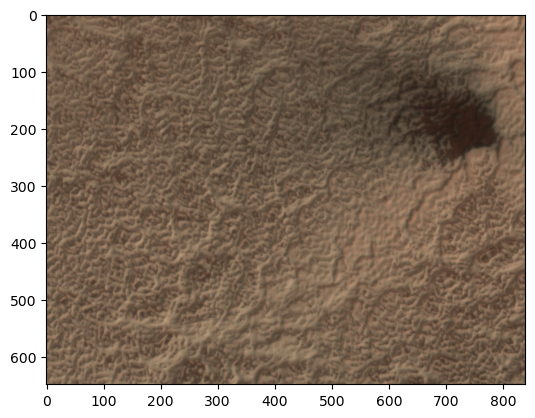

# IO module


<!-- WARNING: THIS FILE WAS AUTOGENERATED! DO NOT EDIT! -->

------------------------------------------------------------------------

<a
href="https://github.com/michaelaye/p4tools/blob/master/p4tools/io.py#L54"
target="_blank" style="float:right; font-size:smaller">source</a>

### fetch_zipped_file

>  fetch_zipped_file (key)

``` python
fetch_zipped_file("fans")
```

    '/Users/maye/Library/Caches/p4tools/16b1d24add716ae8996bbfa0172b60ec-P4_catalog_v1.1_L1C_cut_0.5_fan.csv.zip.unzip/P4_catalog_v1.1_L1C_cut_0.5_fan.csv'

------------------------------------------------------------------------

<a
href="https://github.com/michaelaye/p4tools/blob/master/p4tools/io.py#L87"
target="_blank" style="float:right; font-size:smaller">source</a>

### get_tile_urls

>  get_tile_urls ()

------------------------------------------------------------------------

<a
href="https://github.com/michaelaye/p4tools/blob/master/p4tools/io.py#L83"
target="_blank" style="float:right; font-size:smaller">source</a>

### get_region_names

>  get_region_names ()

------------------------------------------------------------------------

<a
href="https://github.com/michaelaye/p4tools/blob/master/p4tools/io.py#L79"
target="_blank" style="float:right; font-size:smaller">source</a>

### get_tile_coords

>  get_tile_coords ()

------------------------------------------------------------------------

<a
href="https://github.com/michaelaye/p4tools/blob/master/p4tools/io.py#L75"
target="_blank" style="float:right; font-size:smaller">source</a>

### get_meta_data

>  get_meta_data ()

------------------------------------------------------------------------

<a
href="https://github.com/michaelaye/p4tools/blob/master/p4tools/io.py#L71"
target="_blank" style="float:right; font-size:smaller">source</a>

### get_fan_catalog

>  get_fan_catalog ()

------------------------------------------------------------------------

<a
href="https://github.com/michaelaye/p4tools/blob/master/p4tools/io.py#L67"
target="_blank" style="float:right; font-size:smaller">source</a>

### get_blotch_catalog

>  get_blotch_catalog ()

``` python
fans = get_fan_catalog()
```

``` python
fans.head()
```

<div>
<style scoped>
    .dataframe tbody tr th:only-of-type {
        vertical-align: middle;
    }
&#10;    .dataframe tbody tr th {
        vertical-align: top;
    }
&#10;    .dataframe thead th {
        text-align: right;
    }
</style>

<table class="dataframe" data-quarto-postprocess="true" data-border="1">
<thead>
<tr style="text-align: right;">
<th data-quarto-table-cell-role="th"></th>
<th data-quarto-table-cell-role="th">marking_id</th>
<th data-quarto-table-cell-role="th">angle</th>
<th data-quarto-table-cell-role="th">distance</th>
<th data-quarto-table-cell-role="th">tile_id</th>
<th data-quarto-table-cell-role="th">image_x</th>
<th data-quarto-table-cell-role="th">image_y</th>
<th data-quarto-table-cell-role="th">n_votes</th>
<th data-quarto-table-cell-role="th">obsid</th>
<th data-quarto-table-cell-role="th">spread</th>
<th data-quarto-table-cell-role="th">version</th>
<th data-quarto-table-cell-role="th">...</th>
<th data-quarto-table-cell-role="th">y_angle</th>
<th data-quarto-table-cell-role="th">l_s</th>
<th data-quarto-table-cell-role="th">map_scale</th>
<th data-quarto-table-cell-role="th">north_azimuth</th>
<th data-quarto-table-cell-role="th">BodyFixedCoordinateX</th>
<th data-quarto-table-cell-role="th">BodyFixedCoordinateY</th>
<th data-quarto-table-cell-role="th">BodyFixedCoordinateZ</th>
<th data-quarto-table-cell-role="th">PlanetocentricLatitude</th>
<th data-quarto-table-cell-role="th">PlanetographicLatitude</th>
<th data-quarto-table-cell-role="th">Longitude</th>
</tr>
</thead>
<tbody>
<tr>
<td data-quarto-table-cell-role="th">0</td>
<td>F000000</td>
<td>205.56</td>
<td>179.71</td>
<td>APF0000ci9</td>
<td>2270.76</td>
<td>24336.16</td>
<td>35</td>
<td>ESP_012079_0945</td>
<td>88.03</td>
<td>1</td>
<td>...</td>
<td>-0.43</td>
<td>214.785</td>
<td>0.25</td>
<td>126.856883</td>
<td>-65.804336</td>
<td>261.407884</td>
<td>-3370.504345</td>
<td>-85.427383</td>
<td>-85.480829</td>
<td>104.129523</td>
</tr>
<tr>
<td data-quarto-table-cell-role="th">1</td>
<td>F000001</td>
<td>185.39</td>
<td>179.62</td>
<td>APF0000cia</td>
<td>3391.21</td>
<td>5640.60</td>
<td>15</td>
<td>ESP_012079_0945</td>
<td>21.35</td>
<td>1</td>
<td>...</td>
<td>-0.09</td>
<td>214.785</td>
<td>0.25</td>
<td>126.856883</td>
<td>-67.219114</td>
<td>257.011589</td>
<td>-3370.631413</td>
<td>-85.493546</td>
<td>-85.546226</td>
<td>104.656897</td>
</tr>
<tr>
<td data-quarto-table-cell-role="th">2</td>
<td>F000002</td>
<td>184.98</td>
<td>500.27</td>
<td>APF0000cia</td>
<td>3509.96</td>
<td>5876.70</td>
<td>10</td>
<td>ESP_012079_0945</td>
<td>18.91</td>
<td>1</td>
<td>...</td>
<td>-0.09</td>
<td>214.785</td>
<td>0.25</td>
<td>126.856883</td>
<td>-67.170611</td>
<td>257.055226</td>
<td>-3370.630794</td>
<td>-85.493039</td>
<td>-85.545725</td>
<td>104.644396</td>
</tr>
<tr>
<td data-quarto-table-cell-role="th">3</td>
<td>F000004</td>
<td>184.29</td>
<td>105.43</td>
<td>APF0000cia</td>
<td>3716.27</td>
<td>5824.50</td>
<td>6</td>
<td>ESP_012079_0945</td>
<td>26.41</td>
<td>1</td>
<td>...</td>
<td>-0.07</td>
<td>214.785</td>
<td>0.25</td>
<td>126.856883</td>
<td>-67.127761</td>
<td>257.024926</td>
<td>-3370.635002</td>
<td>-85.493723</td>
<td>-85.546401</td>
<td>104.637107</td>
</tr>
<tr>
<td data-quarto-table-cell-role="th">4</td>
<td>F000005</td>
<td>189.42</td>
<td>109.50</td>
<td>APF0000cia</td>
<td>3452.17</td>
<td>6033.00</td>
<td>3</td>
<td>ESP_012079_0945</td>
<td>22.58</td>
<td>1</td>
<td>...</td>
<td>-0.16</td>
<td>214.785</td>
<td>0.25</td>
<td>126.856883</td>
<td>-67.169940</td>
<td>257.096267</td>
<td>-3370.628302</td>
<td>-85.492368</td>
<td>-85.545061</td>
<td>104.642019</td>
</tr>
</tbody>
</table>

<p>5 rows × 24 columns</p>
</div>

``` python
get_region_names()
```

<div>
<style scoped>
    .dataframe tbody tr th:only-of-type {
        vertical-align: middle;
    }
&#10;    .dataframe tbody tr th {
        vertical-align: top;
    }
&#10;    .dataframe thead th {
        text-align: right;
    }
</style>

<table class="dataframe" data-quarto-postprocess="true" data-border="1">
<thead>
<tr style="text-align: right;">
<th data-quarto-table-cell-role="th"></th>
<th data-quarto-table-cell-role="th">obsid</th>
<th data-quarto-table-cell-role="th">lat_IND</th>
<th data-quarto-table-cell-role="th">lon_IND</th>
<th data-quarto-table-cell-role="th">roi_name</th>
<th data-quarto-table-cell-role="th">minimal_distance</th>
<th data-quarto-table-cell-role="th">lat_WORD</th>
<th data-quarto-table-cell-role="th">lon_WORD</th>
<th data-quarto-table-cell-role="th">time</th>
<th data-quarto-table-cell-role="th">MY</th>
</tr>
</thead>
<tbody>
<tr>
<td data-quarto-table-cell-role="th">0</td>
<td>ESP_012079_0945</td>
<td>-85.4074</td>
<td>103.970</td>
<td>Macclesfield</td>
<td>0.944588</td>
<td>-85.401</td>
<td>103.901</td>
<td>2009-02-22 16:32:19</td>
<td>29</td>
</tr>
<tr>
<td data-quarto-table-cell-role="th">1</td>
<td>ESP_021494_0945</td>
<td>-85.4041</td>
<td>103.943</td>
<td>Macclesfield</td>
<td>0.511133</td>
<td>-85.401</td>
<td>103.901</td>
<td>2011-02-26 07:30:27</td>
<td>30</td>
</tr>
<tr>
<td data-quarto-table-cell-role="th">2</td>
<td>ESP_011407_0945</td>
<td>-85.4065</td>
<td>103.983</td>
<td>Macclesfield</td>
<td>0.957066</td>
<td>-85.401</td>
<td>103.901</td>
<td>2009-01-01 07:49:15</td>
<td>29</td>
</tr>
<tr>
<td data-quarto-table-cell-role="th">3</td>
<td>ESP_020782_0945</td>
<td>-85.4071</td>
<td>103.967</td>
<td>Macclesfield</td>
<td>0.901696</td>
<td>-85.401</td>
<td>103.901</td>
<td>2011-01-01 19:57:51</td>
<td>30</td>
</tr>
<tr>
<td data-quarto-table-cell-role="th">4</td>
<td>ESP_020716_0945</td>
<td>-85.4086</td>
<td>103.979</td>
<td>Macclesfield</td>
<td>1.098928</td>
<td>-85.401</td>
<td>103.901</td>
<td>2010-12-27 16:32:24</td>
<td>30</td>
</tr>
<tr>
<td data-quarto-table-cell-role="th">...</td>
<td>...</td>
<td>...</td>
<td>...</td>
<td>...</td>
<td>...</td>
<td>...</td>
<td>...</td>
<td>...</td>
<td>...</td>
</tr>
<tr>
<td data-quarto-table-cell-role="th">449</td>
<td>ESP_029762_0940</td>
<td>-85.7567</td>
<td>106.026</td>
<td>Manhattan2</td>
<td>0.782410</td>
<td>-85.751</td>
<td>105.971</td>
<td>2012-12-01 13:16:26</td>
<td>31</td>
</tr>
<tr>
<td data-quarto-table-cell-role="th">450</td>
<td>ESP_037977_0940</td>
<td>-85.6793</td>
<td>105.614</td>
<td>Manhattan2</td>
<td>8.544184</td>
<td>-85.751</td>
<td>105.971</td>
<td>2014-09-02 16:34:56</td>
<td>32</td>
</tr>
<tr>
<td data-quarto-table-cell-role="th">451</td>
<td>ESP_037976_0940</td>
<td>-85.6694</td>
<td>105.903</td>
<td>Manhattan2</td>
<td>9.131402</td>
<td>-85.751</td>
<td>105.971</td>
<td>2014-09-02 14:43:05</td>
<td>32</td>
</tr>
<tr>
<td data-quarto-table-cell-role="th">452</td>
<td>ESP_040311_0940</td>
<td>-85.7806</td>
<td>106.025</td>
<td>Manhattan2</td>
<td>3.335817</td>
<td>-85.751</td>
<td>105.971</td>
<td>2015-03-03 12:35:10</td>
<td>32</td>
</tr>
<tr>
<td data-quarto-table-cell-role="th">453</td>
<td>ESP_040193_0940</td>
<td>-85.7860</td>
<td>106.143</td>
<td>Manhattan2</td>
<td>4.158145</td>
<td>-85.751</td>
<td>105.971</td>
<td>2015-02-22 07:54:37</td>
<td>32</td>
</tr>
</tbody>
</table>

<p>454 rows × 9 columns</p>
</div>

------------------------------------------------------------------------

<a
href="https://github.com/michaelaye/p4tools/blob/master/p4tools/io.py#L91"
target="_blank" style="float:right; font-size:smaller">source</a>

### normalize_tile_id

>  normalize_tile_id (tile_id:str)

*Normalize a tile ID by adding ‘APF’ prefix and leading zeros if
necessary.*

<table>
<colgroup>
<col style="width: 9%" />
<col style="width: 38%" />
<col style="width: 52%" />
</colgroup>
<thead>
<tr>
<th></th>
<th><strong>Type</strong></th>
<th><strong>Details</strong></th>
</tr>
</thead>
<tbody>
<tr>
<td>tile_id</td>
<td>str</td>
<td>Full or partial tile ID. If partial, it will be padded with ‘APF’
and leading zeros.</td>
</tr>
<tr>
<td><strong>Returns</strong></td>
<td><strong>str</strong></td>
<td><strong>Complete tile ID in format ‘APF0000xxx’ (always 9
characters)</strong></td>
</tr>
</tbody>
</table>

``` python
assert normalize_tile_id("ci9") == "APF0000ci9"
```

------------------------------------------------------------------------

<a
href="https://github.com/michaelaye/p4tools/blob/master/p4tools/io.py#L133"
target="_blank" style="float:right; font-size:smaller">source</a>

### get_subframe

>  get_subframe (url)

------------------------------------------------------------------------

<a
href="https://github.com/michaelaye/p4tools/blob/master/p4tools/io.py#L145"
target="_blank" style="float:right; font-size:smaller">source</a>

### get_url_for_tile

>  get_url_for_tile (tile_id)

------------------------------------------------------------------------

<a
href="https://github.com/michaelaye/p4tools/blob/master/p4tools/io.py#L141"
target="_blank" style="float:right; font-size:smaller">source</a>

### get_url_for_tile_id

>  get_url_for_tile_id (tile_id)

``` python
tile_id = "APF0000ci9"
```

``` python
get_url_for_tile(tile_id)
```

    'http://www.planetfour.org/subjects/standard/50e7429e5e2ed21240003f51.jpg'

``` python
get_url_for_tile_id("ci9")
```

    'http://www.planetfour.org/subjects/standard/50e7429e5e2ed21240003f51.jpg'

------------------------------------------------------------------------

<a
href="https://github.com/michaelaye/p4tools/blob/master/p4tools/io.py#L155"
target="_blank" style="float:right; font-size:smaller">source</a>

### get_subframe_for_tile

>  get_subframe_for_tile (tile_id)

------------------------------------------------------------------------

<a
href="https://github.com/michaelaye/p4tools/blob/master/p4tools/io.py#L150"
target="_blank" style="float:right; font-size:smaller">source</a>

### get_subframe_by_tile_id

>  get_subframe_by_tile_id (tile_id)

``` python
plt.imshow(get_subframe_for_tile(tile_id))
```



------------------------------------------------------------------------

<a
href="https://github.com/michaelaye/p4tools/blob/master/p4tools/io.py#L161"
target="_blank" style="float:right; font-size:smaller">source</a>

### get_fans_for_tile

>  get_fans_for_tile (tile_id)

``` python
get_fans_for_tile("cia")
```

<div>
<style scoped>
    .dataframe tbody tr th:only-of-type {
        vertical-align: middle;
    }
&#10;    .dataframe tbody tr th {
        vertical-align: top;
    }
&#10;    .dataframe thead th {
        text-align: right;
    }
</style>

<table class="dataframe" data-quarto-postprocess="true" data-border="1">
<thead>
<tr style="text-align: right;">
<th data-quarto-table-cell-role="th"></th>
<th data-quarto-table-cell-role="th">marking_id</th>
<th data-quarto-table-cell-role="th">angle</th>
<th data-quarto-table-cell-role="th">distance</th>
<th data-quarto-table-cell-role="th">tile_id</th>
<th data-quarto-table-cell-role="th">image_x</th>
<th data-quarto-table-cell-role="th">image_y</th>
<th data-quarto-table-cell-role="th">n_votes</th>
<th data-quarto-table-cell-role="th">obsid</th>
<th data-quarto-table-cell-role="th">spread</th>
<th data-quarto-table-cell-role="th">version</th>
<th data-quarto-table-cell-role="th">...</th>
<th data-quarto-table-cell-role="th">y_angle</th>
<th data-quarto-table-cell-role="th">l_s</th>
<th data-quarto-table-cell-role="th">map_scale</th>
<th data-quarto-table-cell-role="th">north_azimuth</th>
<th data-quarto-table-cell-role="th">BodyFixedCoordinateX</th>
<th data-quarto-table-cell-role="th">BodyFixedCoordinateY</th>
<th data-quarto-table-cell-role="th">BodyFixedCoordinateZ</th>
<th data-quarto-table-cell-role="th">PlanetocentricLatitude</th>
<th data-quarto-table-cell-role="th">PlanetographicLatitude</th>
<th data-quarto-table-cell-role="th">Longitude</th>
</tr>
</thead>
<tbody>
<tr>
<td data-quarto-table-cell-role="th">1</td>
<td>F000001</td>
<td>185.39</td>
<td>179.62</td>
<td>APF0000cia</td>
<td>3391.21</td>
<td>5640.6</td>
<td>15</td>
<td>ESP_012079_0945</td>
<td>21.35</td>
<td>1</td>
<td>...</td>
<td>-0.09</td>
<td>214.785</td>
<td>0.25</td>
<td>126.856883</td>
<td>-67.219114</td>
<td>257.011589</td>
<td>-3370.631413</td>
<td>-85.493546</td>
<td>-85.546226</td>
<td>104.656897</td>
</tr>
<tr>
<td data-quarto-table-cell-role="th">2</td>
<td>F000002</td>
<td>184.98</td>
<td>500.27</td>
<td>APF0000cia</td>
<td>3509.96</td>
<td>5876.7</td>
<td>10</td>
<td>ESP_012079_0945</td>
<td>18.91</td>
<td>1</td>
<td>...</td>
<td>-0.09</td>
<td>214.785</td>
<td>0.25</td>
<td>126.856883</td>
<td>-67.170611</td>
<td>257.055226</td>
<td>-3370.630794</td>
<td>-85.493039</td>
<td>-85.545725</td>
<td>104.644396</td>
</tr>
<tr>
<td data-quarto-table-cell-role="th">3</td>
<td>F000004</td>
<td>184.29</td>
<td>105.43</td>
<td>APF0000cia</td>
<td>3716.27</td>
<td>5824.5</td>
<td>6</td>
<td>ESP_012079_0945</td>
<td>26.41</td>
<td>1</td>
<td>...</td>
<td>-0.07</td>
<td>214.785</td>
<td>0.25</td>
<td>126.856883</td>
<td>-67.127761</td>
<td>257.024926</td>
<td>-3370.635002</td>
<td>-85.493723</td>
<td>-85.546401</td>
<td>104.637107</td>
</tr>
<tr>
<td data-quarto-table-cell-role="th">4</td>
<td>F000005</td>
<td>189.42</td>
<td>109.50</td>
<td>APF0000cia</td>
<td>3452.17</td>
<td>6033.0</td>
<td>3</td>
<td>ESP_012079_0945</td>
<td>22.58</td>
<td>1</td>
<td>...</td>
<td>-0.16</td>
<td>214.785</td>
<td>0.25</td>
<td>126.856883</td>
<td>-67.169940</td>
<td>257.096267</td>
<td>-3370.628302</td>
<td>-85.492368</td>
<td>-85.545061</td>
<td>104.642019</td>
</tr>
</tbody>
</table>

<p>4 rows × 24 columns</p>
</div>

------------------------------------------------------------------------

<a
href="https://github.com/michaelaye/p4tools/blob/master/p4tools/io.py#L167"
target="_blank" style="float:right; font-size:smaller">source</a>

### get_blotches_for_tile

>  get_blotches_for_tile (tile_id)

``` python
blotches = get_blotches_for_tile(tile_id)
```

``` python
blotches
```

<div>
<style scoped>
    .dataframe tbody tr th:only-of-type {
        vertical-align: middle;
    }
&#10;    .dataframe tbody tr th {
        vertical-align: top;
    }
&#10;    .dataframe thead th {
        text-align: right;
    }
</style>

<table class="dataframe" data-quarto-postprocess="true" data-border="1">
<thead>
<tr style="text-align: right;">
<th data-quarto-table-cell-role="th"></th>
<th data-quarto-table-cell-role="th">marking_id</th>
<th data-quarto-table-cell-role="th">angle</th>
<th data-quarto-table-cell-role="th">tile_id</th>
<th data-quarto-table-cell-role="th">image_x</th>
<th data-quarto-table-cell-role="th">image_y</th>
<th data-quarto-table-cell-role="th">n_votes</th>
<th data-quarto-table-cell-role="th">obsid</th>
<th data-quarto-table-cell-role="th">radius_1</th>
<th data-quarto-table-cell-role="th">radius_2</th>
<th data-quarto-table-cell-role="th">vote_ratio</th>
<th data-quarto-table-cell-role="th">...</th>
<th data-quarto-table-cell-role="th">y_angle</th>
<th data-quarto-table-cell-role="th">l_s</th>
<th data-quarto-table-cell-role="th">map_scale</th>
<th data-quarto-table-cell-role="th">north_azimuth</th>
<th data-quarto-table-cell-role="th">BodyFixedCoordinateX</th>
<th data-quarto-table-cell-role="th">BodyFixedCoordinateY</th>
<th data-quarto-table-cell-role="th">BodyFixedCoordinateZ</th>
<th data-quarto-table-cell-role="th">PlanetocentricLatitude</th>
<th data-quarto-table-cell-role="th">PlanetographicLatitude</th>
<th data-quarto-table-cell-role="th">Longitude</th>
</tr>
</thead>
<tbody>
</tbody>
</table>

<p>0 rows × 23 columns</p>
</div>

------------------------------------------------------------------------

<a
href="https://github.com/michaelaye/p4tools/blob/master/p4tools/io.py#L173"
target="_blank" style="float:right; font-size:smaller">source</a>

### get_hirise_id_for_tile

>  get_hirise_id_for_tile (tile_id)

``` python
get_hirise_id_for_tile(tile_id)
```

    'ESP_012079_0945'
