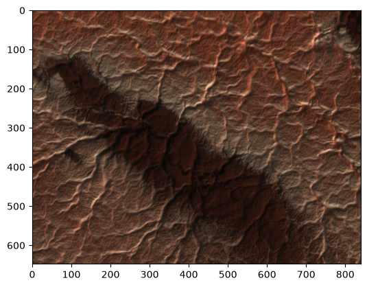

# IO & Data Access


<!-- WARNING: THIS FILE WAS AUTOGENERATED! DO NOT EDIT! -->

------------------------------------------------------------------------

<a
href="https://github.com/michaelaye/p4tools/blob/main/p4tools/io.py#L56"
target="_blank" style="float:right; font-size:smaller">source</a>

### postprocessor

``` python
def postprocessor(
    fname, # Full path of the zipped file in local storage
    action, # One of "download" (file doesn't exist and will download),
    # "update" (file is outdated and will download), and
    # "fetch" (file exists and is updated so no download).
    pup, # The instance of Pooch that called the processor function.
): # The full path to the unzipped file. (Return the same fname is your
processor doesn't modify the file).
```

*Post-processing hook to process the downloaded v1 catalog file.*

Postprocessing steps are: 1. unzip to CSV 2. load CSV into pandas 3.
save as parquet file.

This time, at the next read, the performance is much increased due to
reading the parquet file instead of loading the CSV file every time.

``` python
v1.fetch("fans", **kwargs)
```

    PosixPath('/Users/maye/Library/Caches/p4tools/v1/fans.unzip/P4_catalog_v1.1_L1C_cut_0.5_fan.parq')

``` python
v1.fetch("blotches", **kwargs)
```

    PosixPath('/Users/maye/Library/Caches/p4tools/v1/blotches.unzip/P4_catalog_v1.1_L1C_cut_0.5_blotch.parq')

``` python
pd.read_parquet(v1.fetch("metadata", **kwargs))
```

<div>
<style scoped>
    .dataframe tbody tr th:only-of-type {
        vertical-align: middle;
    }
&#10;    .dataframe tbody tr th {
        vertical-align: top;
    }
&#10;    .dataframe thead th {
        text-align: right;
    }
</style>

<table class="dataframe" data-quarto-postprocess="true" data-border="1">
<thead>
<tr style="text-align: right;">
<th data-quarto-table-cell-role="th"></th>
<th data-quarto-table-cell-role="th">OBSERVATION_ID</th>
<th data-quarto-table-cell-role="th">IMAGE_CENTER_LATITUDE</th>
<th data-quarto-table-cell-role="th">IMAGE_CENTER_LONGITUDE</th>
<th data-quarto-table-cell-role="th">SOLAR_LONGITUDE</th>
<th data-quarto-table-cell-role="th">START_TIME</th>
<th data-quarto-table-cell-role="th">map_scale</th>
<th data-quarto-table-cell-role="th">north_azimuth</th>
<th data-quarto-table-cell-role="th"># of tiles</th>
</tr>
</thead>
<tbody>
<tr>
<td data-quarto-table-cell-role="th">0</td>
<td>ESP_011296_0975</td>
<td>-82.1965</td>
<td>225.2530</td>
<td>178.833</td>
<td>2008-12-23 16:15:26</td>
<td>1.00</td>
<td>110.600107</td>
<td>91</td>
</tr>
<tr>
<td data-quarto-table-cell-role="th">1</td>
<td>ESP_011341_0980</td>
<td>-81.7969</td>
<td>76.1304</td>
<td>180.809</td>
<td>2008-12-27 04:25:02</td>
<td>0.50</td>
<td>110.208923</td>
<td>126</td>
</tr>
<tr>
<td data-quarto-table-cell-role="th">2</td>
<td>ESP_011348_0950</td>
<td>-85.0427</td>
<td>259.0940</td>
<td>181.117</td>
<td>2008-12-27 17:29:17</td>
<td>1.00</td>
<td>123.624057</td>
<td>91</td>
</tr>
<tr>
<td data-quarto-table-cell-role="th">3</td>
<td>ESP_011350_0945</td>
<td>-85.2160</td>
<td>181.4150</td>
<td>181.205</td>
<td>2008-12-27 21:14:01</td>
<td>0.50</td>
<td>99.672793</td>
<td>126</td>
</tr>
<tr>
<td data-quarto-table-cell-role="th">4</td>
<td>ESP_011351_0945</td>
<td>-85.2157</td>
<td>181.5480</td>
<td>181.249</td>
<td>2008-12-27 23:05:54</td>
<td>1.00</td>
<td>127.960688</td>
<td>91</td>
</tr>
<tr>
<td data-quarto-table-cell-role="th">...</td>
<td>...</td>
<td>...</td>
<td>...</td>
<td>...</td>
<td>...</td>
<td>...</td>
<td>...</td>
<td>...</td>
</tr>
<tr>
<td data-quarto-table-cell-role="th">216</td>
<td>ESP_022273_0950</td>
<td>-84.8184</td>
<td>65.7963</td>
<td>282.247</td>
<td>2011-04-28 00:21:01</td>
<td>0.25</td>
<td>117.236648</td>
<td>270</td>
</tr>
<tr>
<td data-quarto-table-cell-role="th">217</td>
<td>ESP_022339_0935</td>
<td>-86.2751</td>
<td>99.6123</td>
<td>285.423</td>
<td>2011-05-03 03:45:55</td>
<td>0.25</td>
<td>153.768164</td>
<td>315</td>
</tr>
<tr>
<td data-quarto-table-cell-role="th">218</td>
<td>ESP_022379_0930</td>
<td>-87.0045</td>
<td>86.5510</td>
<td>287.340</td>
<td>2011-05-06 06:34:07</td>
<td>0.25</td>
<td>153.003708</td>
<td>260</td>
</tr>
<tr>
<td data-quarto-table-cell-role="th">219</td>
<td>ESP_022510_0980</td>
<td>-81.6988</td>
<td>66.3188</td>
<td>293.572</td>
<td>2011-05-16 11:34:43</td>
<td>0.50</td>
<td>107.877998</td>
<td>72</td>
</tr>
<tr>
<td data-quarto-table-cell-role="th">220</td>
<td>ESP_022699_0985</td>
<td>-81.4043</td>
<td>295.7820</td>
<td>302.421</td>
<td>2011-05-31 05:01:48</td>
<td>0.50</td>
<td>96.757068</td>
<td>90</td>
</tr>
</tbody>
</table>

<p>221 rows × 8 columns</p>
</div>

``` python
v3.fetch("fans", **kwargs)
```

    PosixPath('/Users/maye/Library/Caches/p4tools/v3/fans.parq')

``` python
v3.fetch("blotches", **kwargs)
```

    PosixPath('/Users/maye/Library/Caches/p4tools/v3/blotches.parq')

``` python
v3.fetch("tile_coords")
```

    '/Users/maye/Library/Caches/p4tools/v3/tile_coords'

------------------------------------------------------------------------

<a
href="https://github.com/michaelaye/p4tools/blob/main/p4tools/io.py#L169"
target="_blank" style="float:right; font-size:smaller">source</a>

### catalog_version

``` python
def catalog_version(
    version:str, # Catalog version string, e.g. ``'v3.1'``, ``'v3'``, ``'v1'``.
):
```

*Context manager to temporarily use a different catalog version.*

------------------------------------------------------------------------

<a
href="https://github.com/michaelaye/p4tools/blob/main/p4tools/io.py#L152"
target="_blank" style="float:right; font-size:smaller">source</a>

### set_catalog_version

``` python
def set_catalog_version(
    version:str, # Catalog version string, e.g. ``'v3.1'``, ``'v3'``, ``'v1'``.
):
```

*Set the default catalog version for the current session/notebook.*

------------------------------------------------------------------------

<a
href="https://github.com/michaelaye/p4tools/blob/main/p4tools/io.py#L271"
target="_blank" style="float:right; font-size:smaller">source</a>

### define_martian_year

``` python
def define_martian_year(
    df, # DataFrame to modify
    time_col_name, # Name of the time column to use for MY calculation
): # DataFrame with added 'MY' column
```

*Add Martian Year (MY) column to dataframe based on time column.*

------------------------------------------------------------------------

<a
href="https://github.com/michaelaye/p4tools/blob/main/p4tools/io.py#L249"
target="_blank" style="float:right; font-size:smaller">source</a>

### get_tile_urls

``` python
def get_tile_urls()->DataFrame:
```

*only v1 exists*

------------------------------------------------------------------------

<a
href="https://github.com/michaelaye/p4tools/blob/main/p4tools/io.py#L231"
target="_blank" style="float:right; font-size:smaller">source</a>

### get_region_names

``` python
def get_region_names(
    version:NoneType=None
)->DataFrame:
```

*Per-obsid ROI assignments.*

v3.1 (default) includes the 11 MY-33 obsids that are missing from the v1
mapping (5 Manhattan_Classic + 6 Ithaca). v1 is kept available for
historical reproduction.

------------------------------------------------------------------------

<a
href="https://github.com/michaelaye/p4tools/blob/main/p4tools/io.py#L226"
target="_blank" style="float:right; font-size:smaller">source</a>

### get_meta_data

``` python
def get_meta_data(
    version:NoneType=None
)->DataFrame:
```

*Call self as a function.*

------------------------------------------------------------------------

<a
href="https://github.com/michaelaye/p4tools/blob/main/p4tools/io.py#L221"
target="_blank" style="float:right; font-size:smaller">source</a>

### get_tile_coords

``` python
def get_tile_coords(
    version:NoneType=None
)->DataFrame:
```

*Call self as a function.*

------------------------------------------------------------------------

<a
href="https://github.com/michaelaye/p4tools/blob/main/p4tools/io.py#L214"
target="_blank" style="float:right; font-size:smaller">source</a>

### get_fan_catalog

``` python
def get_fan_catalog(
    version:NoneType=None
)->DataFrame:
```

*Call self as a function.*

------------------------------------------------------------------------

<a
href="https://github.com/michaelaye/p4tools/blob/main/p4tools/io.py#L207"
target="_blank" style="float:right; font-size:smaller">source</a>

### get_blotch_catalog

``` python
def get_blotch_catalog(
    version:NoneType=None
)->DataFrame:
```

*Call self as a function.*

------------------------------------------------------------------------

<a
href="https://github.com/michaelaye/p4tools/blob/main/p4tools/io.py#L199"
target="_blank" style="float:right; font-size:smaller">source</a>

### get_metafull

``` python
def get_metafull(
    version:NoneType=None
)->DataFrame:
```

*only v3 and v3.1 exist*

``` python
fans = get_fan_catalog()
```

``` python
fans["MY"].value_counts().sort_index()
```

    MY
    28     84431
    29    100795
    30     50941
    31     15525
    32      7470
    33      6227
    Name: count, dtype: int64

``` python
meta = get_metafull()
[col for col in meta.columns if "TIME" in col]
```

    ['OBSERVATION_START_TIME',
     'START_TIME',
     'STOP_TIME',
     'DELTA_LINE_TIME_COUNT',
     'LOCAL_TIME']

``` python
meta.columns
```

    Index(['OBSERVATION_ID', 'VOLUME_ID', 'FILE_NAME_SPECIFICATION',
           'INSTRUMENT_HOST_ID', 'INSTRUMENT_ID', 'PRODUCT_ID',
           'PRODUCT_VERSION_ID', 'HICAL_VERSION', 'TARGET_NAME', 'ORBIT_NUMBER',
           'MISSION_PHASE_NAME', 'RATIONALE_DESC', 'OBSERVATION_START_TIME',
           'OBSERVATION_START_COUNT', 'START_TIME', 'SPACECRAFT_CLOCK_START_COUNT',
           'STOP_TIME', 'SPACECRAFT_CLOCK_STOP_COUNT', 'CCD_NAME',
           'CHANNEL_NUMBER', 'FILTER_NAME', 'SCAN_EXPOSURE_DURATION',
           'DELTA_LINE_TIME_COUNT', 'BINNING', 'TDI', 'TRIM_LINES',
           'FOCUS_POSITION_COUNT', 'FELICS_COMPRESSION_FLAG',
           'STIMULATION_LAMP_FLAG_RED', 'STIMULATION_LAMP_FLAG_BLUEGREEN',
           'STIMULATION_LAMP_FLAG_NEARINFRARED', 'LOOKUP_TABLE_TYPE',
           'LOOKUP_TABLE_MINIMUM', 'LOOKUP_TABLE_MAXIMUM', 'LOOKUP_TABLE_MEDIAN',
           'LOOKUP_TABLE_K_VALUE', 'LOOKUP_TABLE_NUMBER',
           'ADC_CONVERSION_SETTINGS_1', 'ADC_CONVERSION_SETTINGS_2',
           'FPA_POSITIVE_Y_TEMPERATURE', 'FPA_NEGATIVE_Y_TEMPERATURE',
           'FPE_TEMPERATURE', 'IEA_TEMPERATURE', 'IEA_PWS_BOARD_TEMPERATURE',
           'CPMM_PWS_BOARD_TEMPERATURE', 'IMAGE_LINES', 'LINE_SAMPLES',
           'SAMPLE_BITS', 'SCALED_PIXEL_WIDTH', 'EMISSION_ANGLE',
           'INCIDENCE_ANGLE', 'PHASE_ANGLE', 'IMAGE_CENTER_LATITUDE',
           'IMAGE_CENTER_LONGITUDE', 'MINIMUM_LATITUDE', 'MAXIMUM_LATITUDE',
           'MINIMUM_LONGITUDE', 'MAXIMUM_LONGITUDE', 'SPACECRAFT_ALTITUDE',
           'TARGET_CENTER_DISTANCE', 'SLANT_DISTANCE', 'NORTH_AZIMUTH',
           'SUB_SOLAR_AZIMUTH', 'SUB_SOLAR_LATITUDE', 'SUB_SOLAR_LONGITUDE',
           'SUB_SPACECRAFT_LATITUDE', 'SUB_SPACECRAFT_LONGITUDE', 'SOLAR_DISTANCE',
           'SOLAR_LONGITUDE', 'LOCAL_TIME', 'STEREO_FLAG', 'north_azimuth',
           '# of tiles', 'map_scale', 'MY'],
          dtype='str')

``` python
get_blotch_catalog("v1").tail()
```

<div>
<style scoped>
    .dataframe tbody tr th:only-of-type {
        vertical-align: middle;
    }
&#10;    .dataframe tbody tr th {
        vertical-align: top;
    }
&#10;    .dataframe thead th {
        text-align: right;
    }
</style>

<table class="dataframe" data-quarto-postprocess="true" data-border="1">
<thead>
<tr style="text-align: right;">
<th data-quarto-table-cell-role="th"></th>
<th data-quarto-table-cell-role="th">obsid</th>
<th data-quarto-table-cell-role="th">marking_id</th>
<th data-quarto-table-cell-role="th">angle</th>
<th data-quarto-table-cell-role="th">tile_id</th>
<th data-quarto-table-cell-role="th">image_x</th>
<th data-quarto-table-cell-role="th">image_y</th>
<th data-quarto-table-cell-role="th">n_votes</th>
<th data-quarto-table-cell-role="th">radius_1</th>
<th data-quarto-table-cell-role="th">radius_2</th>
<th data-quarto-table-cell-role="th">vote_ratio</th>
<th data-quarto-table-cell-role="th">...</th>
<th data-quarto-table-cell-role="th">l_s</th>
<th data-quarto-table-cell-role="th">map_scale</th>
<th data-quarto-table-cell-role="th">north_azimuth</th>
<th data-quarto-table-cell-role="th">BodyFixedCoordinateX</th>
<th data-quarto-table-cell-role="th">BodyFixedCoordinateY</th>
<th data-quarto-table-cell-role="th">BodyFixedCoordinateZ</th>
<th data-quarto-table-cell-role="th">PlanetocentricLatitude</th>
<th data-quarto-table-cell-role="th">PlanetographicLatitude</th>
<th data-quarto-table-cell-role="th">Longitude</th>
<th data-quarto-table-cell-role="th">MY</th>
</tr>
</thead>
<tbody>
<tr>
<td data-quarto-table-cell-role="th">249796</td>
<td>ESP_022699_0985</td>
<td>B044be7</td>
<td>0.00</td>
<td>APF0000idg</td>
<td>1276.20</td>
<td>14257.20</td>
<td>5</td>
<td>10.00</td>
<td>10.0</td>
<td>1.0</td>
<td>...</td>
<td>302.421</td>
<td>0.5</td>
<td>96.757068</td>
<td>219.906430</td>
<td>-455.912914</td>
<td>-3342.551722</td>
<td>-81.388876</td>
<td>-81.488458</td>
<td>295.750015</td>
<td>30</td>
</tr>
<tr>
<td data-quarto-table-cell-role="th">249797</td>
<td>ESP_022699_0985</td>
<td>B044be8</td>
<td>0.00</td>
<td>APF0000idg</td>
<td>1311.25</td>
<td>14345.75</td>
<td>4</td>
<td>10.00</td>
<td>10.0</td>
<td>1.0</td>
<td>...</td>
<td>302.421</td>
<td>0.5</td>
<td>96.757068</td>
<td>219.897692</td>
<td>-455.963924</td>
<td>-3342.536671</td>
<td>-81.388131</td>
<td>-81.487722</td>
<td>295.746616</td>
<td>30</td>
</tr>
<tr>
<td data-quarto-table-cell-role="th">249798</td>
<td>ESP_022699_0985</td>
<td>B044be9</td>
<td>0.00</td>
<td>APF0000idg</td>
<td>1266.00</td>
<td>14355.25</td>
<td>4</td>
<td>10.00</td>
<td>10.0</td>
<td>1.0</td>
<td>...</td>
<td>302.421</td>
<td>0.5</td>
<td>96.757068</td>
<td>219.925196</td>
<td>-455.960274</td>
<td>-3342.537242</td>
<td>-81.387987</td>
<td>-81.487580</td>
<td>295.749599</td>
<td>30</td>
</tr>
<tr>
<td data-quarto-table-cell-role="th">249799</td>
<td>ESP_022699_0985</td>
<td>B044bea</td>
<td>168.67</td>
<td>APF0000idh</td>
<td>74.07</td>
<td>148.86</td>
<td>7</td>
<td>16.84</td>
<td>14.1</td>
<td>1.0</td>
<td>...</td>
<td>302.421</td>
<td>0.5</td>
<td>96.757068</td>
<td>218.194755</td>
<td>-448.614747</td>
<td>-3343.589608</td>
<td>-81.514080</td>
<td>-81.612257</td>
<td>295.937105</td>
<td>30</td>
</tr>
<tr>
<td data-quarto-table-cell-role="th">249800</td>
<td>ESP_022699_0985</td>
<td>B044beb</td>
<td>172.85</td>
<td>APF0000idh</td>
<td>265.00</td>
<td>98.33</td>
<td>3</td>
<td>40.55</td>
<td>25.6</td>
<td>1.0</td>
<td>...</td>
<td>302.421</td>
<td>0.5</td>
<td>96.757068</td>
<td>218.086509</td>
<td>-448.624657</td>
<td>-3343.607336</td>
<td>-81.514768</td>
<td>-81.612938</td>
<td>295.925426</td>
<td>30</td>
</tr>
</tbody>
</table>

<p>5 rows × 24 columns</p>
</div>

``` python
get_region_names()
```

<div>
<style scoped>
    .dataframe tbody tr th:only-of-type {
        vertical-align: middle;
    }
&#10;    .dataframe tbody tr th {
        vertical-align: top;
    }
&#10;    .dataframe thead th {
        text-align: right;
    }
</style>

<table class="dataframe" data-quarto-postprocess="true" data-border="1">
<thead>
<tr style="text-align: right;">
<th data-quarto-table-cell-role="th"></th>
<th data-quarto-table-cell-role="th">obsid</th>
<th data-quarto-table-cell-role="th">lat_IND</th>
<th data-quarto-table-cell-role="th">lon_IND</th>
<th data-quarto-table-cell-role="th">roi_name</th>
<th data-quarto-table-cell-role="th">minimal_distance</th>
<th data-quarto-table-cell-role="th">lat_WORD</th>
<th data-quarto-table-cell-role="th">lon_WORD</th>
<th data-quarto-table-cell-role="th">time</th>
<th data-quarto-table-cell-role="th">MY</th>
</tr>
</thead>
<tbody>
<tr>
<td data-quarto-table-cell-role="th">0</td>
<td>ESP_012079_0945</td>
<td>-85.4074</td>
<td>103.9700</td>
<td>Macclesfield</td>
<td>0.944588</td>
<td>-85.401</td>
<td>103.901</td>
<td>2009-02-22 16:32:19</td>
<td>29</td>
</tr>
<tr>
<td data-quarto-table-cell-role="th">1</td>
<td>ESP_021494_0945</td>
<td>-85.4041</td>
<td>103.9430</td>
<td>Macclesfield</td>
<td>0.511133</td>
<td>-85.401</td>
<td>103.901</td>
<td>2011-02-26 07:30:27</td>
<td>30</td>
</tr>
<tr>
<td data-quarto-table-cell-role="th">2</td>
<td>ESP_011407_0945</td>
<td>-85.4065</td>
<td>103.9830</td>
<td>Macclesfield</td>
<td>0.957066</td>
<td>-85.401</td>
<td>103.901</td>
<td>2009-01-01 07:49:15</td>
<td>29</td>
</tr>
<tr>
<td data-quarto-table-cell-role="th">3</td>
<td>ESP_020782_0945</td>
<td>-85.4071</td>
<td>103.9670</td>
<td>Macclesfield</td>
<td>0.901696</td>
<td>-85.401</td>
<td>103.901</td>
<td>2011-01-01 19:57:51</td>
<td>30</td>
</tr>
<tr>
<td data-quarto-table-cell-role="th">4</td>
<td>ESP_020716_0945</td>
<td>-85.4086</td>
<td>103.9790</td>
<td>Macclesfield</td>
<td>1.098928</td>
<td>-85.401</td>
<td>103.901</td>
<td>2010-12-27 16:32:24</td>
<td>30</td>
</tr>
<tr>
<td data-quarto-table-cell-role="th">...</td>
<td>...</td>
<td>...</td>
<td>...</td>
<td>...</td>
<td>...</td>
<td>...</td>
<td>...</td>
<td>...</td>
<td>...</td>
</tr>
<tr>
<td data-quarto-table-cell-role="th">462</td>
<td>ESP_047653_0950</td>
<td>-85.0542</td>
<td>180.2900</td>
<td>Ithaca</td>
<td>0.416589</td>
<td>-85.128</td>
<td>180.700</td>
<td>2016-09-25 14:35:20</td>
<td>33</td>
</tr>
<tr>
<td data-quarto-table-cell-role="th">463</td>
<td>ESP_047696_0935</td>
<td>-86.3881</td>
<td>99.0205</td>
<td>Manhattan_Classic</td>
<td>0.020588</td>
<td>-86.390</td>
<td>99.000</td>
<td>2016-09-28 23:00:27</td>
<td>33</td>
</tr>
<tr>
<td data-quarto-table-cell-role="th">464</td>
<td>ESP_048431_0950</td>
<td>-85.0536</td>
<td>180.2880</td>
<td>Ithaca</td>
<td>0.418664</td>
<td>-85.128</td>
<td>180.700</td>
<td>2016-11-25 05:46:04</td>
<td>33</td>
</tr>
<tr>
<td data-quarto-table-cell-role="th">465</td>
<td>ESP_048576_0950</td>
<td>-85.0559</td>
<td>180.3070</td>
<td>Ithaca</td>
<td>0.399559</td>
<td>-85.128</td>
<td>180.700</td>
<td>2016-12-06 12:58:38</td>
<td>33</td>
</tr>
<tr>
<td data-quarto-table-cell-role="th">466</td>
<td>ESP_049209_0950</td>
<td>-85.1548</td>
<td>180.7940</td>
<td>Ithaca</td>
<td>0.097746</td>
<td>-85.128</td>
<td>180.700</td>
<td>2017-01-24 20:49:23</td>
<td>33</td>
</tr>
</tbody>
</table>

<p>467 rows × 9 columns</p>
</div>

``` python
get_tile_urls()
```

<div>
<style scoped>
    .dataframe tbody tr th:only-of-type {
        vertical-align: middle;
    }
&#10;    .dataframe tbody tr th {
        vertical-align: top;
    }
&#10;    .dataframe thead th {
        text-align: right;
    }
</style>

<table class="dataframe" data-quarto-postprocess="true" data-border="1">
<thead>
<tr style="text-align: right;">
<th data-quarto-table-cell-role="th"></th>
<th data-quarto-table-cell-role="th">tile_id</th>
<th data-quarto-table-cell-role="th">tile_url</th>
</tr>
</thead>
<tbody>
<tr>
<td data-quarto-table-cell-role="th">0</td>
<td>APF0000coq</td>
<td>http://www.planetfour.org/subjects/standard/50...</td>
</tr>
<tr>
<td data-quarto-table-cell-role="th">1</td>
<td>APF0000cro</td>
<td>http://www.planetfour.org/subjects/standard/50...</td>
</tr>
<tr>
<td data-quarto-table-cell-role="th">2</td>
<td>APF0000cs6</td>
<td>http://www.planetfour.org/subjects/standard/50...</td>
</tr>
<tr>
<td data-quarto-table-cell-role="th">3</td>
<td>APF0000co1</td>
<td>http://www.planetfour.org/subjects/standard/50...</td>
</tr>
<tr>
<td data-quarto-table-cell-role="th">4</td>
<td>APF0000cpd</td>
<td>http://www.planetfour.org/subjects/standard/50...</td>
</tr>
<tr>
<td data-quarto-table-cell-role="th">...</td>
<td>...</td>
<td>...</td>
</tr>
<tr>
<td data-quarto-table-cell-role="th">114866</td>
<td>APF0002eep</td>
<td>https://www.planetfour.org/subjects/standard/5...</td>
</tr>
<tr>
<td data-quarto-table-cell-role="th">114867</td>
<td>APF0002ee9</td>
<td>https://www.planetfour.org/subjects/standard/5...</td>
</tr>
<tr>
<td data-quarto-table-cell-role="th">114868</td>
<td>APF0002eej</td>
<td>https://www.planetfour.org/subjects/standard/5...</td>
</tr>
<tr>
<td data-quarto-table-cell-role="th">114869</td>
<td>APF0002ee0</td>
<td>https://www.planetfour.org/subjects/standard/5...</td>
</tr>
<tr>
<td data-quarto-table-cell-role="th">114870</td>
<td>APF0002edl</td>
<td>https://www.planetfour.org/subjects/standard/5...</td>
</tr>
</tbody>
</table>

<p>114871 rows × 2 columns</p>
</div>

------------------------------------------------------------------------

<a
href="https://github.com/michaelaye/p4tools/blob/main/p4tools/io.py#L299"
target="_blank" style="float:right; font-size:smaller">source</a>

### normalize_tile_id

``` python
def normalize_tile_id(
    tile_id:str, # Full or partial tile ID. If partial, it will be padded with 'APF' and leading zeros.
)->str: # Complete tile ID in format 'APF0000xxx' (always 9 characters)
```

*Normalize a tile ID by adding ‘APF’ prefix and leading zeros if
necessary.*

``` python
assert normalize_tile_id("ci9") == "APF0000ci9"
```

------------------------------------------------------------------------

<a
href="https://github.com/michaelaye/p4tools/blob/main/p4tools/io.py#L358"
target="_blank" style="float:right; font-size:smaller">source</a>

### get_subframe

``` python
def get_subframe(
    url, # Full subframe image URL.
    download:bool=True, # If False and the image is not already cached, raise instead of
    # attempting a network download (the origin host is offline).
):
```

*Load a subframe image for `url` from the local pooch cache.*

------------------------------------------------------------------------

<a
href="https://github.com/michaelaye/p4tools/blob/main/p4tools/io.py#L399"
target="_blank" style="float:right; font-size:smaller">source</a>

### is_tile_cached

``` python
def is_tile_cached(
    tile_id
):
```

*True if the subframe image for `tile_id` is already in the local
cache.*

------------------------------------------------------------------------

<a
href="https://github.com/michaelaye/p4tools/blob/main/p4tools/io.py#L389"
target="_blank" style="float:right; font-size:smaller">source</a>

### get_url_for_tile

``` python
def get_url_for_tile(
    tile_id
):
```

*Deprecated alias for
[`get_url_for_tile_id`](https://michaelaye.github.io/p4tools/io.html#get_url_for_tile_id).*

------------------------------------------------------------------------

<a
href="https://github.com/michaelaye/p4tools/blob/main/p4tools/io.py#L378"
target="_blank" style="float:right; font-size:smaller">source</a>

### get_url_for_tile_id

``` python
def get_url_for_tile_id(
    tile_id
):
```

*Return the subframe image URL for `tile_id`.*

``` python
tile_id = "APF0000ci9"
tile_id = "1xbr"
```

``` python
get_url_for_tile(tile_id)
```

    /var/folders/y_/4r7grswx4x3dy3s2c0z3h8180000gn/T/ipykernel_15719/2038497295.py:1: DeprecationWarning: get_url_for_tile is deprecated; use get_url_for_tile_id.
      get_url_for_tile(tile_id)

    'http://www.planetfour.org/subjects/standard/5143480fea305267e900b75e.jpg'

``` python
get_url_for_tile_id("ci9")
```

    'http://www.planetfour.org/subjects/standard/50e7429e5e2ed21240003f51.jpg'

------------------------------------------------------------------------

<a
href="https://github.com/michaelaye/p4tools/blob/main/p4tools/io.py#L410"
target="_blank" style="float:right; font-size:smaller">source</a>

### get_subframe_for_tile

``` python
def get_subframe_for_tile(
    tile_id
):
```

*Deprecated alias for
[`get_subframe_by_tile_id`](https://michaelaye.github.io/p4tools/io.html#get_subframe_by_tile_id).*

------------------------------------------------------------------------

<a
href="https://github.com/michaelaye/p4tools/blob/main/p4tools/io.py#L404"
target="_blank" style="float:right; font-size:smaller">source</a>

### get_subframe_by_tile_id

``` python
def get_subframe_by_tile_id(
    tile_id, download:bool=True
):
```

*Load the subframe image for `tile_id` from the local cache.*

------------------------------------------------------------------------

<a
href="https://github.com/michaelaye/p4tools/blob/main/p4tools/io.py#L420"
target="_blank" style="float:right; font-size:smaller">source</a>

### get_cached_tile_ids

``` python
def get_cached_tile_ids(): # Sorted tile_ids whose subframe image is present in the local cache.
```

*Reverse-map the local subframe cache to the tile_ids available
offline.*

Scans the pooch tiles cache (`pooch.os_cache("p4tools/tiles")`), where
each file is named `<md5(url)>-<subject>.jpg`, and maps it back to its
tile_id via
[`get_tile_urls`](https://michaelaye.github.io/p4tools/io.html#get_tile_urls).
Only files whose name matches `pooch.utils.unique_file_name` of the
looked-up URL are counted, so stray files are ignored.

------------------------------------------------------------------------

<a
href="https://github.com/michaelaye/p4tools/blob/main/p4tools/io.py#L449"
target="_blank" style="float:right; font-size:smaller">source</a>

### cached_tile_ids_with_markings

``` python
def cached_tile_ids_with_markings(
    kind:str='any', # "fan"/"blotch": tiles with at least one fan / blotch.
    # "any": tiles with at least one fan OR blotch (default).
    # "both": tiles with at least one fan AND at least one blotch.
    version:NoneType=None, # Catalog version to check against (defaults to the session version).
): # Sorted cached tile_ids that satisfy `kind`.
```

*Cached tile_ids that have fan and/or blotch markings in the catalog.*

------------------------------------------------------------------------

<a
href="https://github.com/michaelaye/p4tools/blob/main/p4tools/io.py#L480"
target="_blank" style="float:right; font-size:smaller">source</a>

### sample_cached_tile_ids

``` python
def sample_cached_tile_ids(
    n:int=1, # Number of tile_ids to draw (without replacement).
    kind:NoneType=None, # If given, restrict to cached tiles that have those markings (see
    # `cached_tile_ids_with_markings`). None (default) samples any cached tile.
    seed:NoneType=None, # Seed for reproducible sampling.
    version:NoneType=None, # Catalog version for the `kind` filter (defaults to the session version).
): # `n` tile_ids randomly drawn from the (optionally filtered) cached set.
```

*Random sample of tile_ids whose subframe image is locally cached.*

``` python
plt.imshow(get_subframe_by_tile_id(tile_id))
```



------------------------------------------------------------------------

<a
href="https://github.com/michaelaye/p4tools/blob/main/p4tools/io.py#L514"
target="_blank" style="float:right; font-size:smaller">source</a>

### get_fans_for_tile

``` python
def get_fans_for_tile(
    tile_id, version:NoneType=None
):
```

*Call self as a function.*

``` python
get_fans_for_tile("1xbr").sort_values(by="angle")
```

<div>
<style scoped>
    .dataframe tbody tr th:only-of-type {
        vertical-align: middle;
    }
&#10;    .dataframe tbody tr th {
        vertical-align: top;
    }
&#10;    .dataframe thead th {
        text-align: right;
    }
</style>

<table class="dataframe" data-quarto-postprocess="true" data-border="1">
<thead>
<tr style="text-align: right;">
<th data-quarto-table-cell-role="th"></th>
<th data-quarto-table-cell-role="th">obsid</th>
<th data-quarto-table-cell-role="th">marking_id</th>
<th data-quarto-table-cell-role="th">angle</th>
<th data-quarto-table-cell-role="th">distance</th>
<th data-quarto-table-cell-role="th">tile_id</th>
<th data-quarto-table-cell-role="th">image_x</th>
<th data-quarto-table-cell-role="th">image_y</th>
<th data-quarto-table-cell-role="th">n_votes</th>
<th data-quarto-table-cell-role="th">spread</th>
<th data-quarto-table-cell-role="th">version</th>
<th data-quarto-table-cell-role="th">...</th>
<th data-quarto-table-cell-role="th">l_s</th>
<th data-quarto-table-cell-role="th">map_scale</th>
<th data-quarto-table-cell-role="th">north_azimuth</th>
<th data-quarto-table-cell-role="th">BodyFixedCoordinateX</th>
<th data-quarto-table-cell-role="th">BodyFixedCoordinateY</th>
<th data-quarto-table-cell-role="th">BodyFixedCoordinateZ</th>
<th data-quarto-table-cell-role="th">PlanetocentricLatitude</th>
<th data-quarto-table-cell-role="th">PlanetographicLatitude</th>
<th data-quarto-table-cell-role="th">Longitude</th>
<th data-quarto-table-cell-role="th">MY</th>
</tr>
</thead>
<tbody>
<tr>
<td data-quarto-table-cell-role="th">193772</td>
<td>PSP_002942_0935</td>
<td>F02f4ec</td>
<td>36.81</td>
<td>798.87</td>
<td>APF0001xbr</td>
<td>31.62</td>
<td>28633.00</td>
<td>4.0</td>
<td>25.29</td>
<td>1</td>
<td>...</td>
<td>199.642</td>
<td>0.5</td>
<td>135.831931</td>
<td>-30.228735</td>
<td>215.484939</td>
<td>-3374.391494</td>
<td>-86.310437</td>
<td>-86.353625</td>
<td>97.985477</td>
<td>28</td>
</tr>
<tr>
<td data-quarto-table-cell-role="th">193771</td>
<td>PSP_002942_0935</td>
<td>F02f4eb</td>
<td>37.85</td>
<td>776.30</td>
<td>APF0001xbr</td>
<td>50.80</td>
<td>28635.33</td>
<td>3.0</td>
<td>14.58</td>
<td>1</td>
<td>...</td>
<td>199.642</td>
<td>0.5</td>
<td>135.831931</td>
<td>-30.220416</td>
<td>215.480259</td>
<td>-3374.391442</td>
<td>-86.310535</td>
<td>-86.353722</td>
<td>97.983479</td>
<td>28</td>
</tr>
<tr>
<td data-quarto-table-cell-role="th">193769</td>
<td>PSP_002942_0935</td>
<td>F02f4e9</td>
<td>40.44</td>
<td>597.17</td>
<td>APF0001xbr</td>
<td>64.76</td>
<td>28626.95</td>
<td>6.0</td>
<td>22.23</td>
<td>1</td>
<td>...</td>
<td>199.642</td>
<td>0.5</td>
<td>135.831931</td>
<td>-30.217288</td>
<td>215.472891</td>
<td>-3374.391918</td>
<td>-86.310666</td>
<td>-86.353851</td>
<td>97.982932</td>
<td>28</td>
</tr>
<tr>
<td data-quarto-table-cell-role="th">193770</td>
<td>PSP_002942_0935</td>
<td>F02f4ea</td>
<td>40.83</td>
<td>314.90</td>
<td>APF0001xbr</td>
<td>275.16</td>
<td>28732.00</td>
<td>3.0</td>
<td>18.79</td>
<td>1</td>
<td>...</td>
<td>199.642</td>
<td>0.5</td>
<td>135.831931</td>
<td>-30.103163</td>
<td>215.453344</td>
<td>-3374.393449</td>
<td>-86.311262</td>
<td>-86.354441</td>
<td>97.953881</td>
<td>28</td>
</tr>
</tbody>
</table>

<p>4 rows × 25 columns</p>
</div>

``` python
get_fans_for_tile("1xbr", version="v1").sort_values(by="angle")
```

    /var/folders/y_/4r7grswx4x3dy3s2c0z3h8180000gn/T/ipykernel_15719/1519352468.py:1: UserWarning: Tile APF0001xbr is not in the v1 catalog — its observation was not included in this release. Try a different version.
      get_fans_for_tile("1xbr", version="v1").sort_values(by="angle")

<div>
<style scoped>
    .dataframe tbody tr th:only-of-type {
        vertical-align: middle;
    }
&#10;    .dataframe tbody tr th {
        vertical-align: top;
    }
&#10;    .dataframe thead th {
        text-align: right;
    }
</style>

<table class="dataframe" data-quarto-postprocess="true" data-border="1">
<thead>
<tr style="text-align: right;">
<th data-quarto-table-cell-role="th"></th>
<th data-quarto-table-cell-role="th">obsid</th>
<th data-quarto-table-cell-role="th">marking_id</th>
<th data-quarto-table-cell-role="th">angle</th>
<th data-quarto-table-cell-role="th">distance</th>
<th data-quarto-table-cell-role="th">tile_id</th>
<th data-quarto-table-cell-role="th">image_x</th>
<th data-quarto-table-cell-role="th">image_y</th>
<th data-quarto-table-cell-role="th">n_votes</th>
<th data-quarto-table-cell-role="th">spread</th>
<th data-quarto-table-cell-role="th">version</th>
<th data-quarto-table-cell-role="th">...</th>
<th data-quarto-table-cell-role="th">l_s</th>
<th data-quarto-table-cell-role="th">map_scale</th>
<th data-quarto-table-cell-role="th">north_azimuth</th>
<th data-quarto-table-cell-role="th">BodyFixedCoordinateX</th>
<th data-quarto-table-cell-role="th">BodyFixedCoordinateY</th>
<th data-quarto-table-cell-role="th">BodyFixedCoordinateZ</th>
<th data-quarto-table-cell-role="th">PlanetocentricLatitude</th>
<th data-quarto-table-cell-role="th">PlanetographicLatitude</th>
<th data-quarto-table-cell-role="th">Longitude</th>
<th data-quarto-table-cell-role="th">MY</th>
</tr>
</thead>
<tbody>
</tbody>
</table>

<p>0 rows × 25 columns</p>
</div>

------------------------------------------------------------------------

<a
href="https://github.com/michaelaye/p4tools/blob/main/p4tools/io.py#L530"
target="_blank" style="float:right; font-size:smaller">source</a>

### get_blotches_for_tile

``` python
def get_blotches_for_tile(
    tile_id, version:NoneType=None
):
```

*Call self as a function.*

``` python
get_blotches_for_tile(tile_id, version="v3")
```

<div>
<style scoped>
    .dataframe tbody tr th:only-of-type {
        vertical-align: middle;
    }
&#10;    .dataframe tbody tr th {
        vertical-align: top;
    }
&#10;    .dataframe thead th {
        text-align: right;
    }
</style>

<table class="dataframe" data-quarto-postprocess="true" data-border="1">
<thead>
<tr style="text-align: right;">
<th data-quarto-table-cell-role="th"></th>
<th data-quarto-table-cell-role="th">obsid</th>
<th data-quarto-table-cell-role="th">marking_id</th>
<th data-quarto-table-cell-role="th">angle</th>
<th data-quarto-table-cell-role="th">tile_id</th>
<th data-quarto-table-cell-role="th">image_x</th>
<th data-quarto-table-cell-role="th">image_y</th>
<th data-quarto-table-cell-role="th">n_votes</th>
<th data-quarto-table-cell-role="th">radius_1</th>
<th data-quarto-table-cell-role="th">radius_2</th>
<th data-quarto-table-cell-role="th">vote_ratio</th>
<th data-quarto-table-cell-role="th">...</th>
<th data-quarto-table-cell-role="th">l_s</th>
<th data-quarto-table-cell-role="th">map_scale</th>
<th data-quarto-table-cell-role="th">north_azimuth</th>
<th data-quarto-table-cell-role="th">BodyFixedCoordinateX</th>
<th data-quarto-table-cell-role="th">BodyFixedCoordinateY</th>
<th data-quarto-table-cell-role="th">BodyFixedCoordinateZ</th>
<th data-quarto-table-cell-role="th">PlanetocentricLatitude</th>
<th data-quarto-table-cell-role="th">PlanetographicLatitude</th>
<th data-quarto-table-cell-role="th">Longitude</th>
<th data-quarto-table-cell-role="th">MY</th>
</tr>
</thead>
<tbody>
<tr>
<td data-quarto-table-cell-role="th">323107</td>
<td>PSP_002942_0935</td>
<td>B04ee23</td>
<td>43.15</td>
<td>APF0001xbr</td>
<td>101.57</td>
<td>28868.46</td>
<td>7.0</td>
<td>29.92</td>
<td>16.73</td>
<td>0.69</td>
<td>...</td>
<td>199.642</td>
<td>0.5</td>
<td>135.831931</td>
<td>-30.132724</td>
<td>215.557621</td>
<td>-3374.38611</td>
<td>-86.309439</td>
<td>-86.352639</td>
<td>97.95779</td>
<td>28</td>
</tr>
</tbody>
</table>

<p>1 rows × 24 columns</p>
</div>

``` python
get_blotches_for_tile(tile_id, version="v1")
```

    /var/folders/y_/4r7grswx4x3dy3s2c0z3h8180000gn/T/ipykernel_15719/27976457.py:1: UserWarning: Tile APF0001xbr is not in the v1 catalog — its observation was not included in this release. Try a different version.
      get_blotches_for_tile(tile_id, version="v1")

<div>
<style scoped>
    .dataframe tbody tr th:only-of-type {
        vertical-align: middle;
    }
&#10;    .dataframe tbody tr th {
        vertical-align: top;
    }
&#10;    .dataframe thead th {
        text-align: right;
    }
</style>

<table class="dataframe" data-quarto-postprocess="true" data-border="1">
<thead>
<tr style="text-align: right;">
<th data-quarto-table-cell-role="th"></th>
<th data-quarto-table-cell-role="th">obsid</th>
<th data-quarto-table-cell-role="th">marking_id</th>
<th data-quarto-table-cell-role="th">angle</th>
<th data-quarto-table-cell-role="th">tile_id</th>
<th data-quarto-table-cell-role="th">image_x</th>
<th data-quarto-table-cell-role="th">image_y</th>
<th data-quarto-table-cell-role="th">n_votes</th>
<th data-quarto-table-cell-role="th">radius_1</th>
<th data-quarto-table-cell-role="th">radius_2</th>
<th data-quarto-table-cell-role="th">vote_ratio</th>
<th data-quarto-table-cell-role="th">...</th>
<th data-quarto-table-cell-role="th">l_s</th>
<th data-quarto-table-cell-role="th">map_scale</th>
<th data-quarto-table-cell-role="th">north_azimuth</th>
<th data-quarto-table-cell-role="th">BodyFixedCoordinateX</th>
<th data-quarto-table-cell-role="th">BodyFixedCoordinateY</th>
<th data-quarto-table-cell-role="th">BodyFixedCoordinateZ</th>
<th data-quarto-table-cell-role="th">PlanetocentricLatitude</th>
<th data-quarto-table-cell-role="th">PlanetographicLatitude</th>
<th data-quarto-table-cell-role="th">Longitude</th>
<th data-quarto-table-cell-role="th">MY</th>
</tr>
</thead>
<tbody>
</tbody>
</table>

<p>0 rows × 24 columns</p>
</div>

------------------------------------------------------------------------

<a
href="https://github.com/michaelaye/p4tools/blob/main/p4tools/io.py#L546"
target="_blank" style="float:right; font-size:smaller">source</a>

### get_hirise_id_for_tile

``` python
def get_hirise_id_for_tile(
    tile_id, version:NoneType=None
):
```

*Call self as a function.*

``` python
get_hirise_id_for_tile(tile_id)
```

    'PSP_002942_0935'

``` python
# set_catalog_version changes the module default
assert _DEFAULT_VERSION == "v3.1"
set_catalog_version("v3")
assert _DEFAULT_VERSION == "v3"
set_catalog_version("v3.1")  # restore
assert _DEFAULT_VERSION == "v3.1"
```

``` python
# catalog_version context manager temporarily overrides and restores the default
assert _DEFAULT_VERSION == "v3.1"
with catalog_version("v1"):
    assert _DEFAULT_VERSION == "v1"
assert _DEFAULT_VERSION == "v3.1"  # restored after context exit
```

``` python
# catalog_version context manager restores even on exception
try:
    with catalog_version("v3"):
        assert _DEFAULT_VERSION == "v3"
        raise RuntimeError("simulated error")
except RuntimeError:
    pass
assert _DEFAULT_VERSION == "v3.1"  # restored despite exception
```

``` python
# _resolve_version returns explicit version when given, default otherwise, and normalises .0 suffixes
assert _resolve_version("v1") == "v1"
assert _resolve_version("v1.0") == "v1"
assert _resolve_version("v3.0") == "v3"
assert _resolve_version("v3.1") == "v3.1"
assert _resolve_version(None) == "v3.1"
```

## Convenience joiners

Tiny helpers that left-join an obsid-keyed dataframe with metafull (MY,
L_s) or
[`get_region_names`](https://michaelaye.github.io/p4tools/io.html#get_region_names)
(`roi_name`).

------------------------------------------------------------------------

<a
href="https://github.com/michaelaye/p4tools/blob/main/p4tools/io.py#L573"
target="_blank" style="float:right; font-size:smaller">source</a>

### attach_roi

``` python
def attach_roi(
    df, obsid_col:str='obsid', version:str='v3.1'
):
```

*Left-join `df` with `get_region_names(version=...)[obsid, roi_name]`.*

------------------------------------------------------------------------

<a
href="https://github.com/michaelaye/p4tools/blob/main/p4tools/io.py#L561"
target="_blank" style="float:right; font-size:smaller">source</a>

### attach_my

``` python
def attach_my(
    df, obsid_col:str='obsid', version:str='v3.1'
):
```

*Left-join `df` with metafull\[OBSERVATION_ID, MY, SOLAR_LONGITUDE\].*

The metafull columns are renamed to `obsid`, `MY`, `l_s`.
