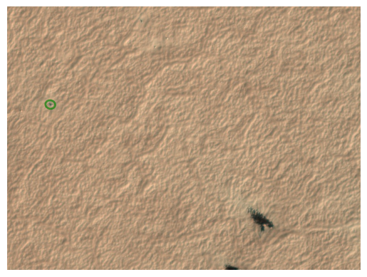
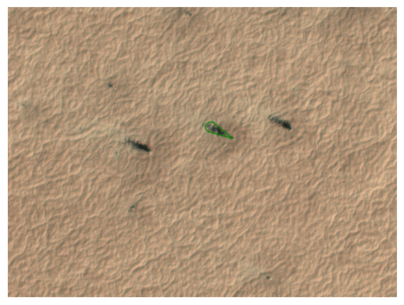

# markings


<!-- WARNING: THIS FILE WAS AUTOGENERATED! DO NOT EDIT! -->

------------------------------------------------------------------------

<a
href="https://github.com/michaelaye/p4tools/blob/master/p4tools/markings.py#L33"
target="_blank" style="float:right; font-size:smaller">source</a>

### show_subframe

>  show_subframe (tile_id, ax=None, aspect='auto')

------------------------------------------------------------------------

<a
href="https://github.com/michaelaye/p4tools/blob/master/p4tools/markings.py#L42"
target="_blank" style="float:right; font-size:smaller">source</a>

### set_subframe_size

>  set_subframe_size (ax)

*Set plot view limit on Planet 4 subframe size.*

------------------------------------------------------------------------

<a
href="https://github.com/michaelaye/p4tools/blob/master/p4tools/markings.py#L48"
target="_blank" style="float:right; font-size:smaller">source</a>

### calc_fig_size

>  calc_fig_size (width)

*Calc figure height in ratio of subframes.*

------------------------------------------------------------------------

<a
href="https://github.com/michaelaye/p4tools/blob/master/p4tools/markings.py#L60"
target="_blank" style="float:right; font-size:smaller">source</a>

### Blotch

>  Blotch (data, scope='planet4', with_center=False, url_db='', **kwargs)

*A scale-free ellipse.*

<table>
<colgroup>
<col style="width: 6%" />
<col style="width: 25%" />
<col style="width: 34%" />
<col style="width: 34%" />
</colgroup>
<thead>
<tr>
<th></th>
<th><strong>Type</strong></th>
<th><strong>Default</strong></th>
<th><strong>Details</strong></th>
</tr>
</thead>
<tbody>
<tr>
<td>data</td>
<td></td>
<td></td>
<td>object with blotch data attributes: x, y, radius_1, radius_2,
angle</td>
</tr>
<tr>
<td>scope</td>
<td>str</td>
<td>planet4</td>
<td>“planet4” or “hirise”</td>
</tr>
<tr>
<td>with_center</td>
<td>bool</td>
<td>False</td>
<td>if True, plot the center of the blotch</td>
</tr>
<tr>
<td>url_db</td>
<td>str</td>
<td></td>
<td>path to the url database</td>
</tr>
<tr>
<td>kwargs</td>
<td>VAR_KEYWORD</td>
<td></td>
<td></td>
</tr>
</tbody>
</table>

``` python
tile_with_blotches = "APF0000004"
```

``` python
b = Blotch.from_tile_id(tile_with_blotches)
```

``` python
b.plot()
```



------------------------------------------------------------------------

<a
href="https://github.com/michaelaye/p4tools/blob/master/p4tools/markings.py#L248"
target="_blank" style="float:right; font-size:smaller">source</a>

### TileBlotches

>  TileBlotches (tile_id, with_center=False, color='green')

*Container for all blotches of a tile.*

<table>
<thead>
<tr>
<th></th>
<th><strong>Type</strong></th>
<th><strong>Default</strong></th>
<th><strong>Details</strong></th>
</tr>
</thead>
<tbody>
<tr>
<td>tile_id</td>
<td>str</td>
<td></td>
<td>planetfour tile_id</td>
</tr>
<tr>
<td>with_center</td>
<td>bool</td>
<td>False</td>
<td></td>
</tr>
<tr>
<td>color</td>
<td>str</td>
<td>green</td>
<td></td>
</tr>
</tbody>
</table>

``` python
tb = TileBlotches(tile_with_blotches)
```

``` python
tb.plot()
```


------------------------------------------------------------------------

<a
href="https://github.com/michaelaye/p4tools/blob/master/p4tools/markings.py#L274"
target="_blank" style="float:right; font-size:smaller">source</a>

### rotate_vector

>  rotate_vector (v, angle)

*Rotate vector by angle given in degrees.*

<table>
<thead>
<tr>
<th></th>
<th><strong>Type</strong></th>
<th><strong>Details</strong></th>
</tr>
</thead>
<tbody>
<tr>
<td>v</td>
<td>np.array</td>
<td>Vector to be rotated</td>
</tr>
<tr>
<td>angle</td>
<td>float</td>
<td>Angle in degrees</td>
</tr>
</tbody>
</table>

------------------------------------------------------------------------

<a
href="https://github.com/michaelaye/p4tools/blob/master/p4tools/markings.py#L289"
target="_blank" style="float:right; font-size:smaller">source</a>

### Fan

>  Fan (data, scope='planet4', with_center=False, **kwargs)

*A line - the line can have both a solid linestyle connecting all the
vertices, and a marker at each vertex. Additionally, the drawing of the
solid line is influenced by the drawstyle, e.g., one can create
“stepped” lines in various styles.*

<table>
<colgroup>
<col style="width: 6%" />
<col style="width: 25%" />
<col style="width: 34%" />
<col style="width: 34%" />
</colgroup>
<thead>
<tr>
<th></th>
<th><strong>Type</strong></th>
<th><strong>Default</strong></th>
<th><strong>Details</strong></th>
</tr>
</thead>
<tbody>
<tr>
<td>data</td>
<td></td>
<td></td>
<td>object with fan data attributes: x, y, angle, spread, distance</td>
</tr>
<tr>
<td>scope</td>
<td>str</td>
<td>planet4</td>
<td>“planet4” or “hirise”</td>
</tr>
<tr>
<td>with_center</td>
<td>bool</td>
<td>False</td>
<td>if True, plot the center of the fan</td>
</tr>
<tr>
<td>kwargs</td>
<td>VAR_KEYWORD</td>
<td></td>
<td></td>
</tr>
</tbody>
</table>

``` python
tile_with_fans = "APF000000c"
```

``` python
f = Fan.from_tile_id(tile_with_fans, 1)
```

``` python
f.plot()
```


