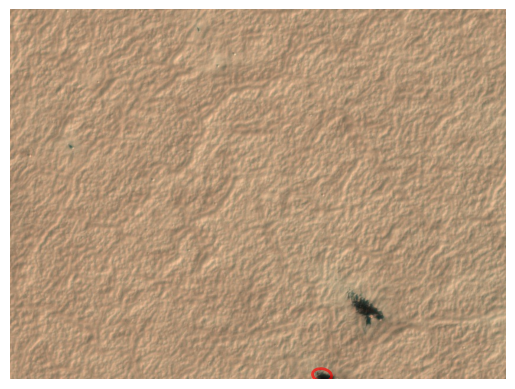
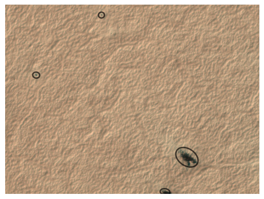
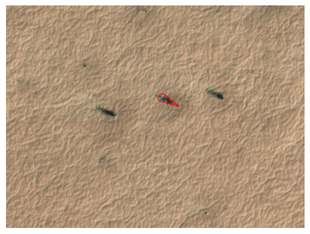
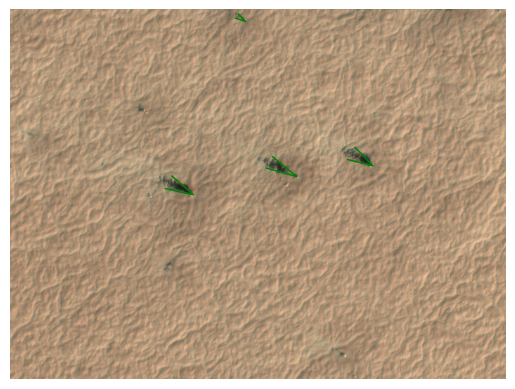

# Markings


<!-- WARNING: THIS FILE WAS AUTOGENERATED! DO NOT EDIT! -->

------------------------------------------------------------------------

<a
href="https://github.com/michaelaye/p4tools/blob/main/p4tools/markings.py#L33"
target="_blank" style="float:right; font-size:smaller">source</a>

### calc_fig_size

``` python
def calc_fig_size(
    width
):
```

*Calc figure height in ratio of subframes.*

------------------------------------------------------------------------

<a
href="https://github.com/michaelaye/p4tools/blob/main/p4tools/markings.py#L39"
target="_blank" style="float:right; font-size:smaller">source</a>

### show_subframe

``` python
def show_subframe(
    tile_id, ax:NoneType=None, aspect:str='auto'
):
```

*Call self as a function.*

------------------------------------------------------------------------

<a
href="https://github.com/michaelaye/p4tools/blob/main/p4tools/markings.py#L48"
target="_blank" style="float:right; font-size:smaller">source</a>

### set_subframe_size

``` python
def set_subframe_size(
    ax
):
```

*Set plot view limit on Planet 4 subframe size.*

------------------------------------------------------------------------

<a
href="https://github.com/michaelaye/p4tools/blob/main/p4tools/markings.py#L68"
target="_blank" style="float:right; font-size:smaller">source</a>

### MarkingMixin

``` python
def MarkingMixin(
    *args, **kwargs
):
```

*Shared behavior for Blotch and Fan single-marking classes.*

Subclasses must define: - `to_average`: list of field names -
`_catalog_getter`: staticmethod returning catalog DataFrame - `data`:
backing pandas Series

------------------------------------------------------------------------

<a
href="https://github.com/michaelaye/p4tools/blob/main/p4tools/markings.py#L146"
target="_blank" style="float:right; font-size:smaller">source</a>

### Blotch

``` python
def Blotch(
    data, # object with blotch data attributes: x, y, radius_1, radius_2, angle
    scope:str='planet4', # "planet4" or "hirise",
    with_center:bool=False, # if True, plot the center of the blotch,
    url_db:str='', # path to the url database,
    **kwargs
):
```

*Shared behavior for Blotch and Fan single-marking classes.*

Subclasses must define: - `to_average`: list of field names -
`_catalog_getter`: staticmethod returning catalog DataFrame - `data`:
backing pandas Series

``` python
tile_with_blotches = "APF0000004"
```

``` python
b = Blotch.from_tile_id(tile_with_blotches)
```

``` python
b
```

    Blotch.from_marking_id('B010c77')  # tile_id='APF0000004', area=571.2238541501484

``` python
b.plot()
```



------------------------------------------------------------------------

<a
href="https://github.com/michaelaye/p4tools/blob/main/p4tools/markings.py#L331"
target="_blank" style="float:right; font-size:smaller">source</a>

### MarkingCollection

``` python
def MarkingCollection(
    df, color:str='green', **build_kwargs
):
```

*Base class for Blotches and Fans containers.*

------------------------------------------------------------------------

<a
href="https://github.com/michaelaye/p4tools/blob/main/p4tools/markings.py#L366"
target="_blank" style="float:right; font-size:smaller">source</a>

### Blotches

``` python
def Blotches(
    df, with_center:bool=False, color:str='red'
):
```

*Container for Blotch objects with idempotent plotting.*

``` python
tb = Blotches.from_tile_id(tile_with_blotches)
```

``` python
tb.plot()
```



------------------------------------------------------------------------

<a
href="https://github.com/michaelaye/p4tools/blob/main/p4tools/markings.py#L404"
target="_blank" style="float:right; font-size:smaller">source</a>

### rotate_vector

``` python
def rotate_vector(
    v, # Vector to be rotated
    angle, # Angle in degrees
):
```

*Rotate vector by angle given in degrees.*

------------------------------------------------------------------------

<a
href="https://github.com/michaelaye/p4tools/blob/main/p4tools/markings.py#L423"
target="_blank" style="float:right; font-size:smaller">source</a>

### Fan

``` python
def Fan(
    data, # object with fan data attributes: x, y, angle, spread, distance
    scope:str='planet4', # "planet4" or "hirise",
    with_center:bool=False, # accepted for API symmetry with Blotch; fans have no center, so ignored
    **kwargs
):
```

*Shared behavior for Blotch and Fan single-marking classes.*

Subclasses must define: - `to_average`: list of field names -
`_catalog_getter`: staticmethod returning catalog DataFrame - `data`:
backing pandas Series

``` python
tile_with_fans = "APF000000c"
```

``` python
f = Fan.from_tile_id(tile_with_fans, 1)
```

``` python
f
```

    Fan.from_marking_id('F00b604')  # tile_id='APF000000c', area=834.5280047852875

``` python
f.plot('red')
```



------------------------------------------------------------------------

<a
href="https://github.com/michaelaye/p4tools/blob/main/p4tools/markings.py#L660"
target="_blank" style="float:right; font-size:smaller">source</a>

### Fans

``` python
def Fans(
    df, scope:str='planet4', color:str='green', **kwargs
):
```

*Container for Fan objects backed by a LineCollection for plotting.*

``` python
fans = io.get_fans_for_tile('c')
```

``` python
fans = Fans(io.get_fans_for_tile('c'))
```

``` python
fans.plot()
```



``` python
Fans.from_tile_id('c').plot()
```

------------------------------------------------------------------------

<a
href="https://github.com/michaelaye/p4tools/blob/main/p4tools/markings.py#L747"
target="_blank" style="float:right; font-size:smaller">source</a>

### markings_to_geoseries

``` python
def markings_to_geoseries(
    df, kind, crs:NoneType=None, body:str='mars', system:str='ocentric', n_arc:int=16, n_ell:int=48
):
```

*Approximate ground outlines for many markings as a GeoSeries.*

Fast, vectorized per marking (sector for fans, ellipse for blotches).
Pass `crs` = a projected image’s CRS to overlay on that raster, else
lon/lat. For the exact outline of a single marking use
`Fan/Blotch.to_shapely_ground`.
