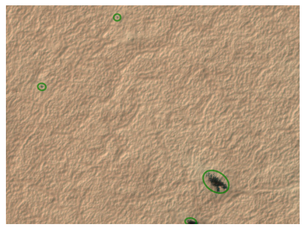
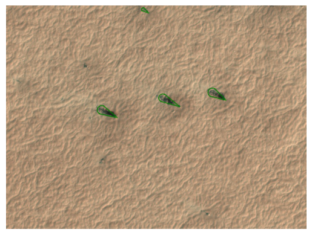
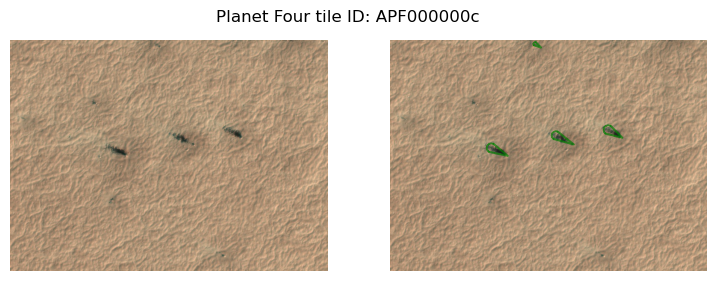
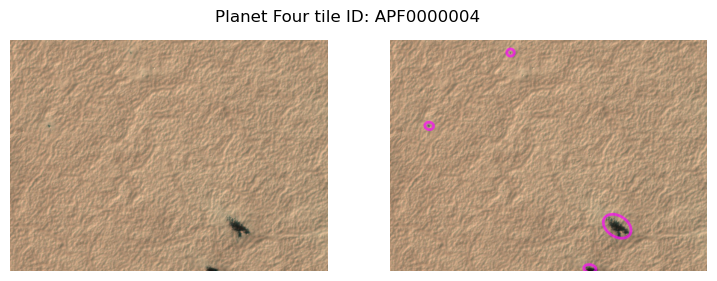
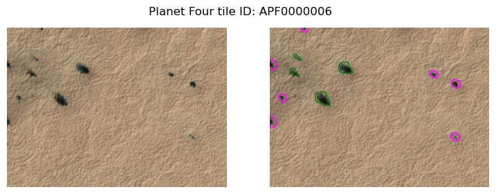
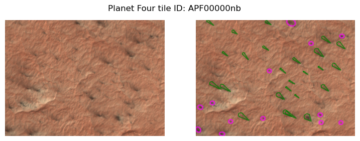
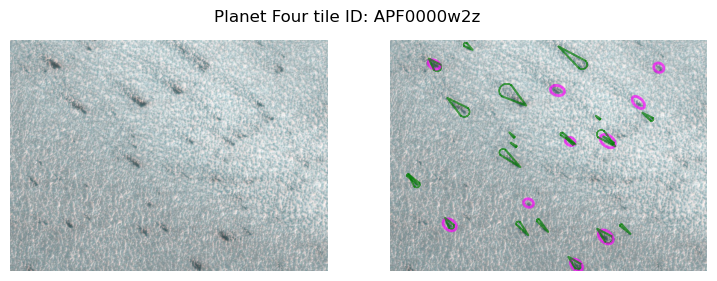

# plotting


<!-- WARNING: THIS FILE WAS AUTOGENERATED! DO NOT EDIT! -->

------------------------------------------------------------------------

<a
href="https://github.com/michaelaye/p4tools/blob/master/p4tools/plotting.py#L15"
target="_blank" style="float:right; font-size:smaller">source</a>

### plot_blotches_for_tile

>  plot_blotches_for_tile (tile_id, ax=None, **plot_kwargs)

``` python
tile_with_blotches = "APF0000004"
```

``` python
plot_blotches_for_tile(tile_with_blotches)
```



------------------------------------------------------------------------

<a
href="https://github.com/michaelaye/p4tools/blob/master/p4tools/plotting.py#L26"
target="_blank" style="float:right; font-size:smaller">source</a>

### plot_fans_for_tile

>  plot_fans_for_tile (tile_id, ax=None, **plot_kwargs)

``` python
tile_with_fans = "APF000000c"
```

``` python
plot_fans_for_tile(tile_with_fans)
```



------------------------------------------------------------------------

<a
href="https://github.com/michaelaye/p4tools/blob/master/p4tools/plotting.py#L37"
target="_blank" style="float:right; font-size:smaller">source</a>

### plot_original_tile

>  plot_original_tile (tileID, ax=None)

``` python
plot_original_tile(tile_with_blotches)
```


------------------------------------------------------------------------

<a
href="https://github.com/michaelaye/p4tools/blob/master/p4tools/plotting.py#L44"
target="_blank" style="float:right; font-size:smaller">source</a>

### plot_original_and_fans

>  plot_original_and_fans (tileID)

``` python
plot_original_and_fans(tile_with_fans)
```



------------------------------------------------------------------------

<a
href="https://github.com/michaelaye/p4tools/blob/master/p4tools/plotting.py#L51"
target="_blank" style="float:right; font-size:smaller">source</a>

### plot_original_and_blotches

>  plot_original_and_blotches (tileID)

``` python
plot_original_and_blotches(tile_with_blotches)
```



------------------------------------------------------------------------

<a
href="https://github.com/michaelaye/p4tools/blob/master/p4tools/plotting.py#L58"
target="_blank" style="float:right; font-size:smaller">source</a>

### plot_original_fans_blotches

>  plot_original_fans_blotches (tileID, save=False)

``` python
tile_with_both = "APF0000006"
```

``` python
plot_original_fans_blotches(tile_with_both)
```



------------------------------------------------------------------------

<a
href="https://github.com/michaelaye/p4tools/blob/master/p4tools/plotting.py#L68"
target="_blank" style="float:right; font-size:smaller">source</a>

### plot_x_random_tiles_with_n_fans

>  plot_x_random_tiles_with_n_fans (x:int=3, n:int=15, save:bool=False,
>                                       random_state:int=None)

<table>
<colgroup>
<col style="width: 6%" />
<col style="width: 25%" />
<col style="width: 34%" />
<col style="width: 34%" />
</colgroup>
<thead>
<tr>
<th></th>
<th><strong>Type</strong></th>
<th><strong>Default</strong></th>
<th><strong>Details</strong></th>
</tr>
</thead>
<tbody>
<tr>
<td>x</td>
<td>int</td>
<td>3</td>
<td>how many of 2 col original+p4 data plots to receive</td>
</tr>
<tr>
<td>n</td>
<td>int</td>
<td>15</td>
<td>whats the minimum number of fans to contain</td>
</tr>
<tr>
<td>save</td>
<td>bool</td>
<td>False</td>
<td>if True, saves a PNG with the plot for each tile_id separately</td>
</tr>
<tr>
<td>random_state</td>
<td>int</td>
<td>None</td>
<td>can be set to recreate the exact same set</td>
</tr>
</tbody>
</table>

``` python
plot_x_random_tiles_with_n_fans(2)
```

    100%|████████████████████████████████████████| 190k/190k [00:00<00:00, 413MB/s]
    100%|████████████████████████████████████████| 259k/259k [00:00<00:00, 339MB/s]




