# Plotting


<!-- WARNING: THIS FILE WAS AUTOGENERATED! DO NOT EDIT! -->

------------------------------------------------------------------------

<a
href="https://github.com/michaelaye/p4tools/blob/main/p4tools/plotting.py#L23"
target="_blank" style="float:right; font-size:smaller">source</a>

### plot_blotches_for_tile

``` python
def plot_blotches_for_tile(
    tile_id, ax:NoneType=None, **plot_kwargs
):
```

*Call self as a function.*

``` python
tile_with_blotches = "APF0000004"
```

``` python
plot_blotches_for_tile(tile_with_blotches, color="green", with_center=True)
```

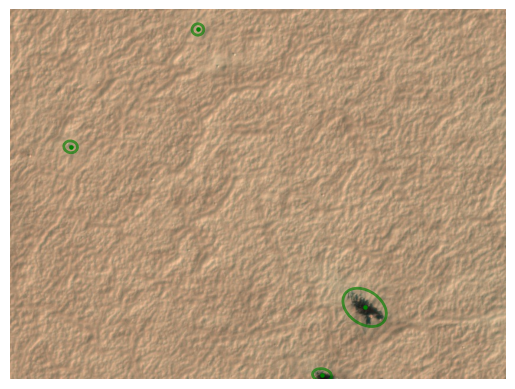

## Raw marking plots

These functions plot the **raw citizen science markings** (before
clustering) for a given tile. They require access to the Planet Four
classifications database via
[`DBManager`](https://michaelaye.github.io/p4tools/production.io.html#dbmanager)
(configured in `~/.p4tools.ini`).

------------------------------------------------------------------------

<a
href="https://github.com/michaelaye/p4tools/blob/main/p4tools/plotting.py#L58"
target="_blank" style="float:right; font-size:smaller">source</a>

### plot_raw_blotches

``` python
def plot_raw_blotches(
    tile_id, # Planet Four tile ID (full or short form).
    ax:NoneType=None, # Axes to plot on. If None, a new figure is created.
    dbname:NoneType=None, # Path to database file. If None, uses ``[planet4_db] dbname`` from config.
    **kwargs
):
```

*Plot all raw blotch markings from the classifications database for a
tile.*

------------------------------------------------------------------------

<a
href="https://github.com/michaelaye/p4tools/blob/main/p4tools/plotting.py#L39"
target="_blank" style="float:right; font-size:smaller">source</a>

### plot_raw_fans

``` python
def plot_raw_fans(
    tile_id, # Planet Four tile ID (full or short form).
    ax:NoneType=None, # Axes to plot on. If None, a new figure is created.
    dbname:NoneType=None, # Path to database file. If None, uses ``[planet4_db] dbname`` from config.
    **kwargs
):
```

*Plot all raw fan markings from the classifications database for a
tile.*

------------------------------------------------------------------------

<a
href="https://github.com/michaelaye/p4tools/blob/main/p4tools/plotting.py#L77"
target="_blank" style="float:right; font-size:smaller">source</a>

### plot_fans_for_tile

``` python
def plot_fans_for_tile(
    tile_id, ax:NoneType=None, **plot_kwargs
):
```

*Call self as a function.*

``` python
tile_with_fans = "APF000000c"
```

------------------------------------------------------------------------

<a
href="https://github.com/michaelaye/p4tools/blob/main/p4tools/plotting.py#L89"
target="_blank" style="float:right; font-size:smaller">source</a>

### plot_original_tile

``` python
def plot_original_tile(
    tileID, ax:NoneType=None
):
```

*Call self as a function.*

``` python
plot_original_tile(tile_with_blotches)
```


------------------------------------------------------------------------

<a
href="https://github.com/michaelaye/p4tools/blob/main/p4tools/plotting.py#L96"
target="_blank" style="float:right; font-size:smaller">source</a>

### plot_original_and_fans

``` python
def plot_original_and_fans(
    tileID
):
```

*Call self as a function.*

``` python
plot_original_and_fans(tile_with_fans)
```

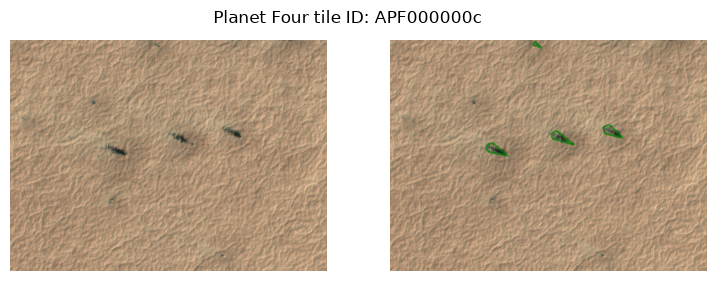

------------------------------------------------------------------------

<a
href="https://github.com/michaelaye/p4tools/blob/main/p4tools/plotting.py#L103"
target="_blank" style="float:right; font-size:smaller">source</a>

### plot_original_and_blotches

``` python
def plot_original_and_blotches(
    tileID
):
```

*Call self as a function.*

``` python
plot_original_and_blotches(tile_with_blotches)
```

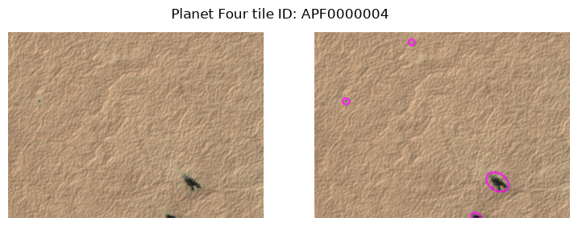

------------------------------------------------------------------------

<a
href="https://github.com/michaelaye/p4tools/blob/main/p4tools/plotting.py#L110"
target="_blank" style="float:right; font-size:smaller">source</a>

### plot_original_fans_blotches

``` python
def plot_original_fans_blotches(
    tileID, save:bool=False
):
```

*Call self as a function.*

``` python
tile_with_both = "APF0000006"
```

``` python
plot_original_fans_blotches(tile_with_both)
```

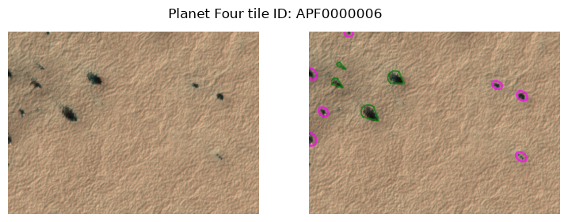

------------------------------------------------------------------------

<a
href="https://github.com/michaelaye/p4tools/blob/main/p4tools/plotting.py#L155"
target="_blank" style="float:right; font-size:smaller">source</a>

### plot_random_tiles_with_min_fans

``` python
def plot_random_tiles_with_min_fans(
    x:int=3, # how many tiles (original + fan overlay plots) to show
    n:int=15, # minimum number of fans a tile must contain
    cached_only:bool=False, # if True, only sample tiles whose image is locally cached
    exclude_blotches:bool=False, # if True, only sample tiles that have no blotches
    save:bool=False, # if True, saves a PNG with the plot for each tile_id separately
    random_state:int=None, # can be set to recreate the exact same set
):
```

*Plot `x` random tiles containing at least `n` fans: original image next
to fan overlay.*

------------------------------------------------------------------------

<a
href="https://github.com/michaelaye/p4tools/blob/main/p4tools/plotting.py#L178"
target="_blank" style="float:right; font-size:smaller">source</a>

### plot_random_tiles_with_min_blotches

``` python
def plot_random_tiles_with_min_blotches(
    x:int=3, # how many tiles (original + blotch overlay plots) to show
    n:int=15, # minimum number of blotches a tile must contain
    cached_only:bool=False, # if True, only sample tiles whose image is locally cached
    exclude_fans:bool=False, # if True, only sample tiles that have no fans
    save:bool=False, # if True, saves a PNG with the plot for each tile_id separately
    random_state:int=None, # can be set to recreate the exact same set
):
```

*Plot `x` random tiles containing at least `n` blotches: original image
next to blotch overlay.*

``` python
plot_random_tiles_with_min_fans(2, cached_only=True, random_state=42)
plot_random_tiles_with_min_blotches(2, cached_only=True, random_state=42)
```

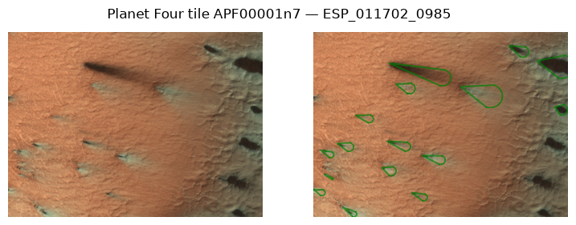

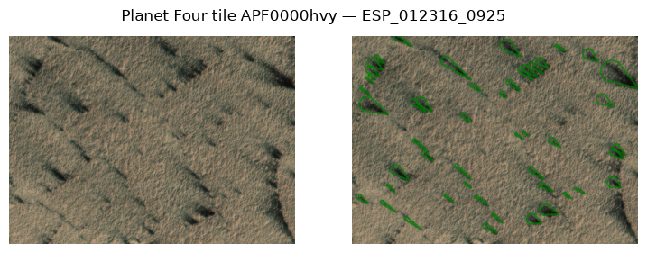

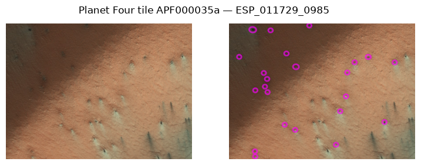

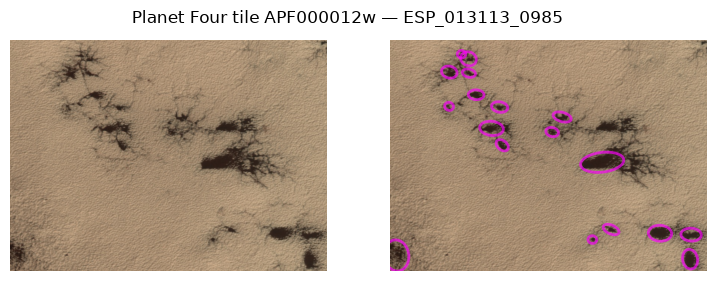

``` python
plot_random_tiles_with_min_blotches(x=10, n=10, cached_only=True, exclude_fans=True)
```

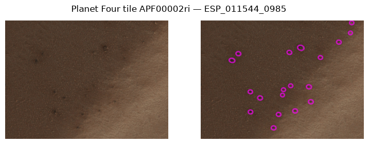

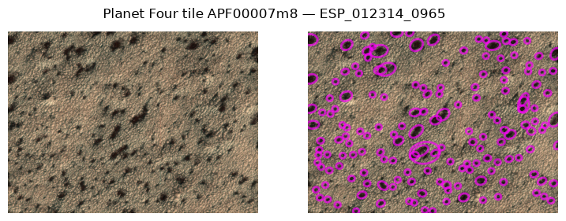

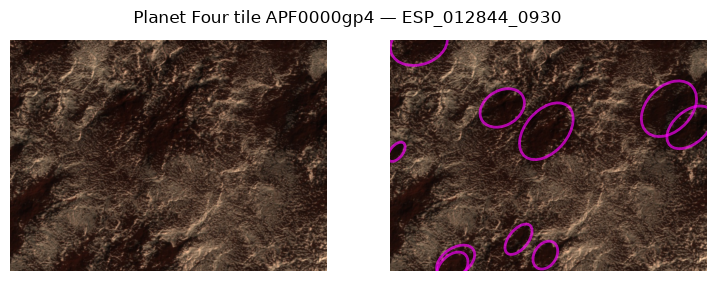

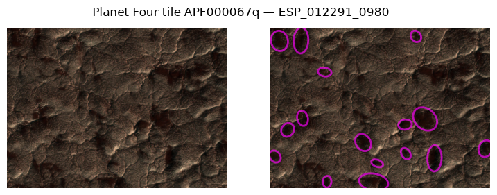

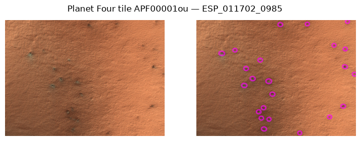

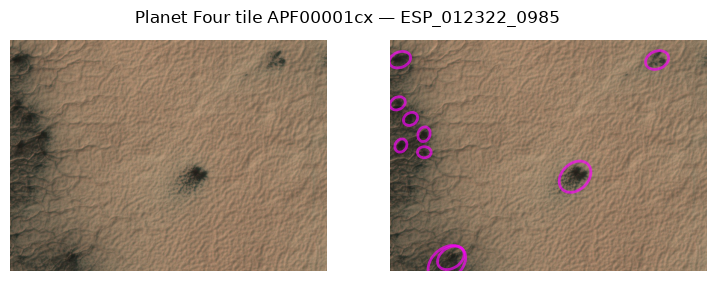

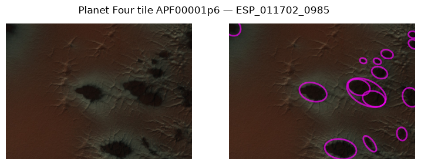

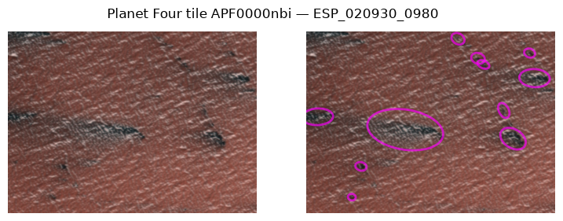

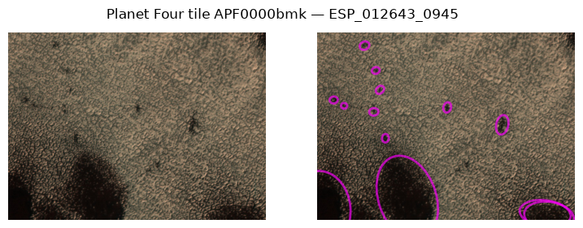

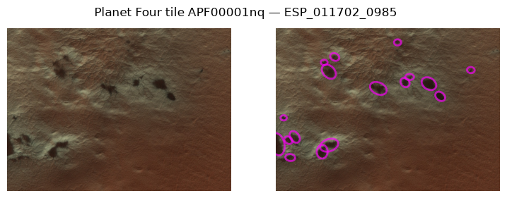

``` python
blotch_ids = ["ESP_012248_0965"]
```

------------------------------------------------------------------------

<a
href="https://github.com/michaelaye/p4tools/blob/main/p4tools/plotting.py#L201"
target="_blank" style="float:right; font-size:smaller">source</a>

### plot_x_random_tiles_with_n_fans

``` python
def plot_x_random_tiles_with_n_fans(
    x:int=3, # how many of 2 col original+p4 data plots to receive
    n:int=15, # whats the minimum number of fans to contain
    save:bool=False, # if True, saves a PNG with the plot for each tile_id separately
    random_state:int=None, # can be set to recreate the exact same set
):
```

*Deprecated: use
[`plot_random_tiles_with_min_fans`](https://michaelaye.github.io/p4tools/plotting.html#plot_random_tiles_with_min_fans)
(or `..._min_blotches`) instead.*

Note this old version only considered fan tiles that also contain
blotches and overlays both marking kinds; the replacements treat fans
and blotches separately.

``` python
plot_x_random_tiles_with_n_fans(2)
```

    100%|████████████████████████████████████████| 170k/170k [00:00<00:00, 345MB/s]
    100%|████████████████████████████████████████| 171k/171k [00:00<00:00, 240MB/s]

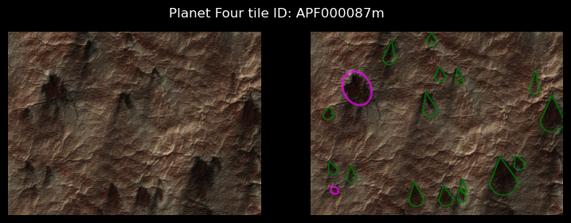

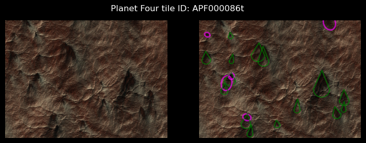

------------------------------------------------------------------------

<a
href="https://github.com/michaelaye/p4tools/blob/main/p4tools/plotting.py#L482"
target="_blank" style="float:right; font-size:smaller">source</a>

### histogram_cartesian

``` python
def histogram_cartesian(
    df, # The data to be plotted.
    ls_bin:int=4, # The number of bins or an array-like object defining the bin edges. (default is 4).
    segmentsize:float=3.6, # The size of the segments in the histogram (default is 3.6).
    alpha:float=0.5, # The transparency level of the histogram bars (default is 0.5).
    degrees:bool=True, # Whether to use degrees for the histogram (default is True).
): # The axes object with the plotted histogram.
```

*Plots a histogram of the wind directions on Cartesian coordinates.*

------------------------------------------------------------------------

<a
href="https://github.com/michaelaye/p4tools/blob/main/p4tools/plotting.py#L434"
target="_blank" style="float:right; font-size:smaller">source</a>

### histogram_polar

``` python
def histogram_polar(
    df, # The input data frame containing the data to be plotted.
    ls_bin:int=4, # The number of bins or an array-like object defining the bin edges. Default is 4.
    per_obsid:bool=False, # If True, the histogram is plotted per observation ID. Default is False.
    segmentsize:float=3.6, # The size of each segment in degrees. Default is 3.6.
    alpha:float=0.5, # The transparency level of the histogram bars. Default is 0.5.
    cutoff:NoneType=None, # A cutoff value to filter the data. Default is None.
): # The polar axes with the plotted histogram.
```

*Plots a histogram in polar coordinates. These are the inverse windrose
plots.*

------------------------------------------------------------------------

<a
href="https://github.com/michaelaye/p4tools/blob/main/p4tools/plotting.py#L291"
target="_blank" style="float:right; font-size:smaller">source</a>

### get_colorscale

``` python
def get_colorscale(
    nr:int, # The number of colors to generate in the color scale.
): # An array of colors corresponding to the specified number of colors.
```

*Generate a color scale with a specified number of colors.*

------------------------------------------------------------------------

<a
href="https://github.com/michaelaye/p4tools/blob/main/p4tools/plotting.py#L276"
target="_blank" style="float:right; font-size:smaller">source</a>

### initialize_polar_axes

``` python
def initialize_polar_axes(
    ax:PolarAxes, # An Matplotlib polar Axis
):
```

*Initializes the Polar Axes to Wind Directions, counted in clockwise
direction from N*

------------------------------------------------------------------------

<a
href="https://github.com/michaelaye/p4tools/blob/main/p4tools/plotting.py#L230"
target="_blank" style="float:right; font-size:smaller">source</a>

### compute_direction_histogram

``` python
def compute_direction_histogram(
    df, # DataFrame containing 'angle' and 'north_azimuth' columns.
    segmentsize, # Size of the segments (bins) for the histogram in degrees.
    density:bool=True, # If True, the result is the value of the probability density function at the bin,
    # normalized such that the integral over the range is 1. Default is True.
    degrees:bool=False, # If True, the bin edges are returned in degrees. If False, they are returned in radians. Default is False.
): # The bin edges in radians or degrees, depending on the `degrees` parameter.
```

*Compute a histogram of direction angles adjusted by north azimuth.*

We can create an Inverse Windrose for a given region by filtering the
dataframe for a number of obsids within the region. Here the example
shows the lists of the obsids within the Potsdam region.

``` python
obsid_potsdam = [
    'ESP_011526_0980',
    'ESP_012805_0980',
    'ESP_021508_0980',
    'ESP_021521_0980',
    'ESP_012515_0980',
    'ESP_012594_0980',
    'ESP_020374_0980',
    'ESP_020875_0980',
    'ESP_011460_0980',
    'ESP_021574_0980',
    'ESP_020941_0980',
    'ESP_011737_0980',
    'ESP_012871_0980',
    'ESP_021587_0980',
    'ESP_022510_0980',
    'ESP_020163_0980',
    'PSP_004775_0980']

## Point the read_csv to your file location.
fpath = "../../../../Data/P4_catalog_Full_Release_v3.0/P4_catalog_Full_Release_v3.0_L1C_cut_0.5_fan_meta_merged.csv"
Data = pd.read_csv(fpath)
Data = Data[Data.obsid.isin(obsid_potsdam)]

histogram_polar(Data,ls_bin=5,cutoff=60)
```

``` python
Data.marking_id != False
```

``` python
histogram_cartesian(Data)
```

------------------------------------------------------------------------

<a
href="https://github.com/michaelaye/p4tools/blob/main/p4tools/plotting.py#L522"
target="_blank" style="float:right; font-size:smaller">source</a>

### show_stamps

``` python
def show_stamps(
    df_stamps:GeoDataFrame, # A GeoDataFrame containing the geospatial HiRISE stamps to be plotted.
    mark_stamp:Union=None, # The ID(s) of the stamp(s) to be highlighted in red. If None, no stamps are highlighted.
    ax:NoneType=None, # The axes on which to plot. If None, a new figure and axes are created.
): # The axes with the plotted stamps.
```

*Plot the geospatial stamps of the HiRISE images on a map.*

``` python
Stamps = gpd.read_file("../../../../Data/Obsid_stamps.gpkg")
ithaca_full = Stamps[Stamps.Region == "Ithaca"]

show_stamps(ithaca_full)
```

``` python
show_stamps(ithaca_full,mark_stamp="ESP_012854_0945")
```

``` python
show_stamps(ithaca_full,mark_stamp=["ESP_012854_0945","ESP_012858_0855"])
```

## Slide-deck and distribution plotting helpers

Generic helpers (talk-context rcParams, histogram+KDE, per-group KDE
overlay, small-multiples grid) used by `p4tools.egu26` and any other
talk/paper module.

------------------------------------------------------------------------

<a
href="https://github.com/michaelaye/p4tools/blob/main/p4tools/plotting.py#L667"
target="_blank" style="float:right; font-size:smaller">source</a>

### smallmult_highlight_grid

``` python
def smallmult_highlight_grid(
    df, panel_col:str, x_col:str, y_col:str, yerr:NoneType=None, ncols:int=3, x_lim:NoneType=None,
    palette:str='viridis', figsize:NoneType=None, title_fmt:str='{panel_col} {value}  (N={n})'
):
```

*Small-multiples grid; one panel per `panel_col` value highlights its
own subset* on a faint grey background of all other panels’ points.

`yerr` may be a tuple of column names (low, high) for asymmetric
IQR-style error bars, or None. Returns the matplotlib Figure.

------------------------------------------------------------------------

<a
href="https://github.com/michaelaye/p4tools/blob/main/p4tools/plotting.py#L626"
target="_blank" style="float:right; font-size:smaller">source</a>

### kde_per_group

``` python
def kde_per_group(
    df, group_col:str, value_col:str, ax:NoneType=None, palette:str='viridis', upper_quantile:float=0.995,
    show_background:bool=True, label_fn:NoneType=None
):
```

*One KDE per `group_col` value of `df[value_col]`, optional shared faint
hist background.*

------------------------------------------------------------------------

<a
href="https://github.com/michaelaye/p4tools/blob/main/p4tools/plotting.py#L584"
target="_blank" style="float:right; font-size:smaller">source</a>

### histogram_kde

``` python
def histogram_kde(
    values, ax:NoneType=None, bins:int=60, upper_quantile:float=0.995, color:str='#1f77b4', kde:bool=True,
    show_median:bool=True, show_mean:bool=True, label:str | None=None
):
```

*Histogram + optional KDE overlay + optional median/mean reference
lines.*

Returns the axes used. Caller is responsible for figure creation,
titles, axis labels, and saving. Uses seaborn for the histogram so the
KDE is rendered consistently with the binned data.

------------------------------------------------------------------------

<a
href="https://github.com/michaelaye/p4tools/blob/main/p4tools/plotting.py#L573"
target="_blank" style="float:right; font-size:smaller">source</a>

### apply_talk_context

``` python
def apply_talk_context(
    min_pt:int=24
)->None:
```

*Apply seaborn’s “talk” context, scaled so the smallest text element is*
at least `min_pt` (default 24 — the EGU26 slide-deck guideline).

Thin wrapper over :func:`seaborn.set_context` — we delegate all element
proportions (titles vs axis labels vs ticks vs legend) to seaborn and
only choose the overall scaling factor.

------------------------------------------------------------------------

<a
href="https://github.com/michaelaye/p4tools/blob/main/p4tools/plotting.py#L743"
target="_blank" style="float:right; font-size:smaller">source</a>

### overlay_obsid

``` python
def overlay_obsid(
    obsid, image_path, ax:NoneType=None, version:NoneType=None, fan_kw:NoneType=None, blotch_kw:NoneType=None
):
```

*Show a map-projected raster and overlay that obsid’s fans + blotches in
its CRS.*

`image_path` is any rasterio-readable map-projected image (ISIS cube /
GeoTIFF); markings are reprojected into its CRS so the overlay is
pixel-aligned.

------------------------------------------------------------------------

<a
href="https://github.com/michaelaye/p4tools/blob/main/p4tools/plotting.py#L735"
target="_blank" style="float:right; font-size:smaller">source</a>

### add_blotches

``` python
def add_blotches(
    ax, blotches, src_crs:NoneType=None, target_crs:NoneType=None, n_ell:int=48, facecolor:str='none',
    edgecolor:str='deepskyblue', linewidth:float=0.6, **kw
):
```

*Overlay blotches on a cartopy axis (`src_crs`) or a projected raster
(`target_crs`).*

------------------------------------------------------------------------

<a
href="https://github.com/michaelaye/p4tools/blob/main/p4tools/plotting.py#L727"
target="_blank" style="float:right; font-size:smaller">source</a>

### add_fans

``` python
def add_fans(
    ax, fans, src_crs:NoneType=None, target_crs:NoneType=None, n_arc:int=16, facecolor:str='none',
    edgecolor:str='red', linewidth:float=0.6, **kw
):
```

*Overlay fans on a cartopy axis (`src_crs`) or a projected raster
(`target_crs`).*
