# Plotting examples


<!-- WARNING: THIS FILE WAS AUTOGENERATED! DO NOT EDIT! -->

``` python
from p4tools import io
from p4tools import markings as m
from p4tools import plotting
```

``` python
from planet4 import markings
from planet4 import plotting as p4plot
```

    ModuleNotFoundError: No module named 'planet4'
    ---------------------------------------------------------------------------
    ModuleNotFoundError                       Traceback (most recent call last)
    Cell In[2], line 1
    ----> 1 from planet4 import markings
          2 from planet4 import plotting as p4plot

    ModuleNotFoundError: No module named 'planet4'

``` python
ids = "APF00006tp APF0000tld APF000018t".split()
```

``` python
plotting.plot_original_tile(ids[0])
```

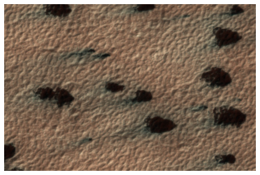

``` python
plotting.plot_original_and_fans(ids[1])
```

    HBox(children=(FloatProgress(value=0.0, description='50e7455f5e2ed211dc003926.jpg', max=276545.0, style=Progre…


    Downloading catalog catalogs/fans.csv

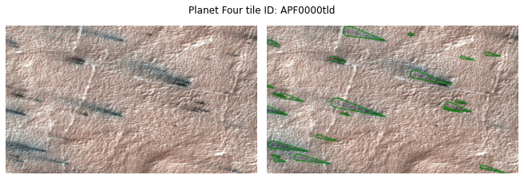

``` python
tileblotches = m.TileBlotches(ids[2])
```

    Downloading catalog catalogs/blotches.csv

``` python
tileblotches.plot()
```

    HBox(children=(FloatProgress(value=0.0, description='50e73c0c5e2ed2124000064d.jpg', max=137552.0, style=Progre…

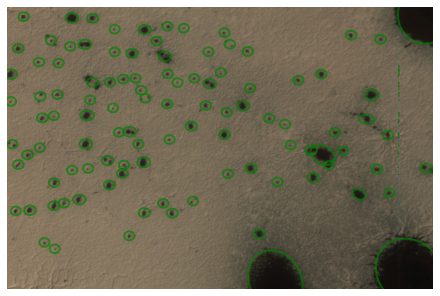

``` python
fans = io.get_fans_for_tile(ids[1])
```

``` python
fans.shape
```

    (22, 24)

``` python
fan = m.Fan(fans.iloc[0])
```

``` python
fan
```

    markings.Fan object. Input data:
    base: [396.65  67.23]
    armlength: 130.9202339705439
    arm1: [267.57461777  45.32900995]
    arm2: [281.23716847   5.42396484]

``` python
fan.plot()
```

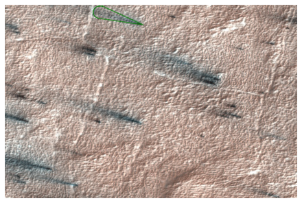

``` python
plotting.plot_fans_for_tile(ids[1])
```

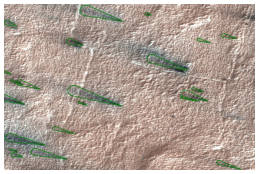

## find good combo images

``` python
plotting.plot_original_fans_blotches('APF000018t', save=True)
```

    Warning: No fans found.

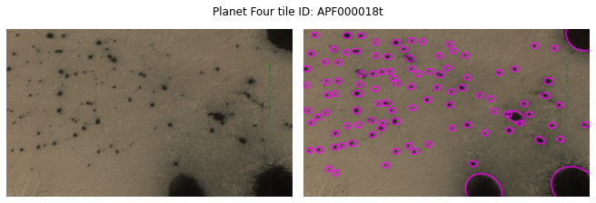

``` python
fans.head()
```

<div>
<style scoped>
    .dataframe tbody tr th:only-of-type {
        vertical-align: middle;
    }
&#10;    .dataframe tbody tr th {
        vertical-align: top;
    }
&#10;    .dataframe thead th {
        text-align: right;
    }
</style>

<table class="dataframe" data-quarto-postprocess="true" data-border="1">
<thead>
<tr style="text-align: right;">
<th data-quarto-table-cell-role="th"></th>
<th data-quarto-table-cell-role="th">marking_id</th>
<th data-quarto-table-cell-role="th">angle</th>
<th data-quarto-table-cell-role="th">distance</th>
<th data-quarto-table-cell-role="th">tile_id</th>
<th data-quarto-table-cell-role="th">image_x</th>
<th data-quarto-table-cell-role="th">image_y</th>
<th data-quarto-table-cell-role="th">n_votes</th>
<th data-quarto-table-cell-role="th">obsid</th>
<th data-quarto-table-cell-role="th">spread</th>
<th data-quarto-table-cell-role="th">version</th>
<th data-quarto-table-cell-role="th">...</th>
<th data-quarto-table-cell-role="th">y_angle</th>
<th data-quarto-table-cell-role="th">l_s</th>
<th data-quarto-table-cell-role="th">map_scale</th>
<th data-quarto-table-cell-role="th">north_azimuth</th>
<th data-quarto-table-cell-role="th">BodyFixedCoordinateX</th>
<th data-quarto-table-cell-role="th">BodyFixedCoordinateY</th>
<th data-quarto-table-cell-role="th">BodyFixedCoordinateZ</th>
<th data-quarto-table-cell-role="th">PlanetocentricLatitude</th>
<th data-quarto-table-cell-role="th">PlanetographicLatitude</th>
<th data-quarto-table-cell-role="th">Longitude</th>
</tr>
</thead>
<tbody>
<tr>
<td data-quarto-table-cell-role="th">0</td>
<td>F000000</td>
<td>205.56</td>
<td>179.71</td>
<td>APF0000ci9</td>
<td>2270.76</td>
<td>24336.16</td>
<td>35</td>
<td>ESP_012079_0945</td>
<td>88.03</td>
<td>1</td>
<td>...</td>
<td>-0.43</td>
<td>214.785</td>
<td>0.25</td>
<td>126.856883</td>
<td>-65.804336</td>
<td>261.407884</td>
<td>-3370.504345</td>
<td>-85.427383</td>
<td>-85.480829</td>
<td>104.129523</td>
</tr>
<tr>
<td data-quarto-table-cell-role="th">1</td>
<td>F000001</td>
<td>185.39</td>
<td>179.62</td>
<td>APF0000cia</td>
<td>3391.21</td>
<td>5640.60</td>
<td>15</td>
<td>ESP_012079_0945</td>
<td>21.35</td>
<td>1</td>
<td>...</td>
<td>-0.09</td>
<td>214.785</td>
<td>0.25</td>
<td>126.856883</td>
<td>-67.219114</td>
<td>257.011589</td>
<td>-3370.631413</td>
<td>-85.493546</td>
<td>-85.546226</td>
<td>104.656897</td>
</tr>
<tr>
<td data-quarto-table-cell-role="th">2</td>
<td>F000002</td>
<td>184.98</td>
<td>500.27</td>
<td>APF0000cia</td>
<td>3509.96</td>
<td>5876.70</td>
<td>10</td>
<td>ESP_012079_0945</td>
<td>18.91</td>
<td>1</td>
<td>...</td>
<td>-0.09</td>
<td>214.785</td>
<td>0.25</td>
<td>126.856883</td>
<td>-67.170611</td>
<td>257.055226</td>
<td>-3370.630794</td>
<td>-85.493039</td>
<td>-85.545725</td>
<td>104.644396</td>
</tr>
<tr>
<td data-quarto-table-cell-role="th">3</td>
<td>F000004</td>
<td>184.29</td>
<td>105.43</td>
<td>APF0000cia</td>
<td>3716.27</td>
<td>5824.50</td>
<td>6</td>
<td>ESP_012079_0945</td>
<td>26.41</td>
<td>1</td>
<td>...</td>
<td>-0.07</td>
<td>214.785</td>
<td>0.25</td>
<td>126.856883</td>
<td>-67.127761</td>
<td>257.024926</td>
<td>-3370.635002</td>
<td>-85.493723</td>
<td>-85.546401</td>
<td>104.637107</td>
</tr>
<tr>
<td data-quarto-table-cell-role="th">4</td>
<td>F000005</td>
<td>189.42</td>
<td>109.50</td>
<td>APF0000cia</td>
<td>3452.17</td>
<td>6033.00</td>
<td>3</td>
<td>ESP_012079_0945</td>
<td>22.58</td>
<td>1</td>
<td>...</td>
<td>-0.16</td>
<td>214.785</td>
<td>0.25</td>
<td>126.856883</td>
<td>-67.169940</td>
<td>257.096267</td>
<td>-3370.628302</td>
<td>-85.492368</td>
<td>-85.545061</td>
<td>104.642019</td>
</tr>
</tbody>
</table>

<p>5 rows × 24 columns</p>
</div>

``` python
plotting.plot_x_random_tiles_with_n_fans(3, 15, save=True)
```

    HBox(children=(FloatProgress(value=0.0, description='50e745845e2ed2124000570a.jpg', max=196796.0, style=Progre…

    HBox(children=(FloatProgress(value=0.0, description='50e741585e2ed2124000343e.jpg', max=138326.0, style=Progre…

    HBox(children=(FloatProgress(value=0.0, description='50e741505e2ed211dc002329.jpg', max=172822.0, style=Progre…

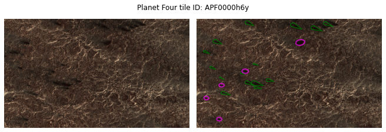

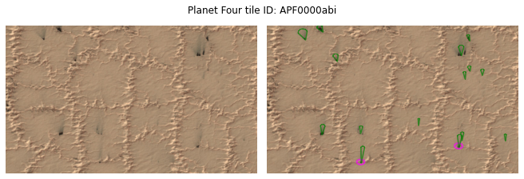

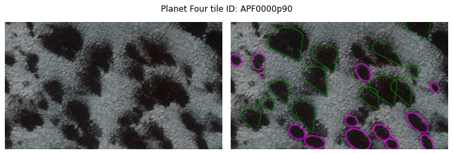

``` python
io.get_hirise_id_for_tile('APF0000wfo')
```

    'ESP_020953_0925'

``` python
plotting.plot_original_and_fans("APF000003x")
```

    HBox(children=(FloatProgress(value=0.0, description='50e73b4d5e2ed2124000008d.jpg', max=165672.0, style=Progre…

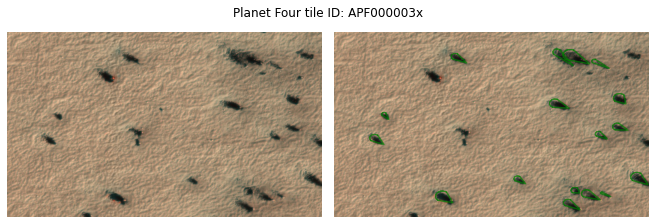

``` python
plotting.plot_original_and_blotches("APF000003x")
```

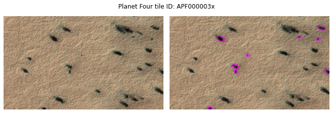

``` python
plotting.plot_original_fans_blotches("APF000003x")
```

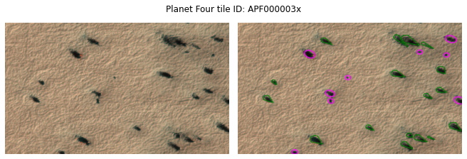

``` python
plotting.plot_original_fans_blotches("APF00000cl")
```

    HBox(children=(FloatProgress(value=0.0, description='50e73b795e2ed212400001c5.jpg', max=168308.0, style=Progre…

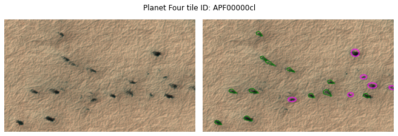
