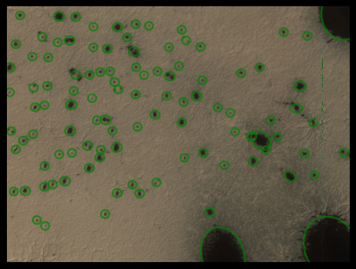
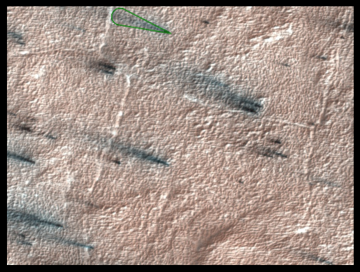
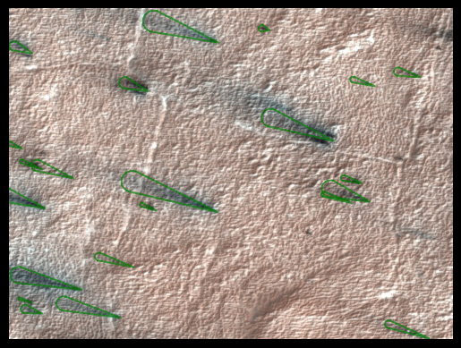

# Plotting examples


<!-- WARNING: THIS FILE WAS AUTOGENERATED! DO NOT EDIT! -->

``` python
from p4tools import io
from p4tools import markings as m
from p4tools import plotting
```

Defining three tile_ids for later use:

``` python
tid1, tid2, tid3 = "APF00006tp APF0000tld APF000018t".split()
```

## Plot original tile

Plot the HiRISE tile used as input for the Citizen scientist:

``` python
plotting.plot_original_tile(tid1)
```

## Plot original and fans

Plot the HiRISE tile without and with the fans for a given `tile_id`:

``` python
plotting.plot_original_and_fans(tid2)
```

## Plot blotches for tile

Simply plot all blotches for a given `tile_id` on top of the HiRISE
tile:

``` python
plotting.plot_blotches_for_tile(tid3)
```



## Get fans for tile

get a dataframe with all fans for a given `tile_id`:

``` python
fans = io.get_fans_for_tile(tid2)
```

``` python
fans.head()
```

<div>
<style scoped>
    .dataframe tbody tr th:only-of-type {
        vertical-align: middle;
    }
&#10;    .dataframe tbody tr th {
        vertical-align: top;
    }
&#10;    .dataframe thead th {
        text-align: right;
    }
</style>

<table class="dataframe" data-quarto-postprocess="true" data-border="1">
<thead>
<tr style="text-align: right;">
<th data-quarto-table-cell-role="th"></th>
<th data-quarto-table-cell-role="th">marking_id</th>
<th data-quarto-table-cell-role="th">angle</th>
<th data-quarto-table-cell-role="th">distance</th>
<th data-quarto-table-cell-role="th">tile_id</th>
<th data-quarto-table-cell-role="th">image_x</th>
<th data-quarto-table-cell-role="th">image_y</th>
<th data-quarto-table-cell-role="th">n_votes</th>
<th data-quarto-table-cell-role="th">obsid</th>
<th data-quarto-table-cell-role="th">spread</th>
<th data-quarto-table-cell-role="th">version</th>
<th data-quarto-table-cell-role="th">...</th>
<th data-quarto-table-cell-role="th">y_angle</th>
<th data-quarto-table-cell-role="th">l_s</th>
<th data-quarto-table-cell-role="th">map_scale</th>
<th data-quarto-table-cell-role="th">north_azimuth</th>
<th data-quarto-table-cell-role="th">BodyFixedCoordinateX</th>
<th data-quarto-table-cell-role="th">BodyFixedCoordinateY</th>
<th data-quarto-table-cell-role="th">BodyFixedCoordinateZ</th>
<th data-quarto-table-cell-role="th">PlanetocentricLatitude</th>
<th data-quarto-table-cell-role="th">PlanetographicLatitude</th>
<th data-quarto-table-cell-role="th">Longitude</th>
</tr>
</thead>
<tbody>
<tr>
<td data-quarto-table-cell-role="th">92197</td>
<td>F019802</td>
<td>198.90</td>
<td>150.30</td>
<td>APF0000tld</td>
<td>1136.65</td>
<td>19247.23</td>
<td>15</td>
<td>ESP_020780_0930</td>
<td>18.54</td>
<td>1</td>
<td>...</td>
<td>-0.32</td>
<td>209.289</td>
<td>0.5</td>
<td>147.656314</td>
<td>-188.190090</td>
<td>9.138895</td>
<td>-3375.683769</td>
<td>-86.805383</td>
<td>-86.842804</td>
<td>177.219784</td>
</tr>
<tr>
<td data-quarto-table-cell-role="th">92198</td>
<td>F019803</td>
<td>200.62</td>
<td>57.30</td>
<td>APF0000tld</td>
<td>1002.62</td>
<td>19342.12</td>
<td>18</td>
<td>ESP_020780_0930</td>
<td>27.78</td>
<td>1</td>
<td>...</td>
<td>-0.35</td>
<td>209.289</td>
<td>0.5</td>
<td>147.656314</td>
<td>-188.271026</td>
<td>9.144102</td>
<td>-3375.677338</td>
<td>-86.804005</td>
<td>-86.841441</td>
<td>177.219397</td>
</tr>
<tr>
<td data-quarto-table-cell-role="th">92199</td>
<td>F019804</td>
<td>200.83</td>
<td>144.01</td>
<td>APF0000tld</td>
<td>1353.63</td>
<td>19439.44</td>
<td>24</td>
<td>ESP_020780_0930</td>
<td>15.73</td>
<td>1</td>
<td>...</td>
<td>-0.35</td>
<td>209.289</td>
<td>0.5</td>
<td>147.656314</td>
<td>-188.148590</td>
<td>9.276155</td>
<td>-3375.698357</td>
<td>-86.805985</td>
<td>-86.843398</td>
<td>177.177473</td>
</tr>
<tr>
<td data-quarto-table-cell-role="th">92200</td>
<td>F019805</td>
<td>196.52</td>
<td>40.93</td>
<td>APF0000tld</td>
<td>1407.57</td>
<td>19522.45</td>
<td>8</td>
<td>ESP_020780_0930</td>
<td>18.18</td>
<td>1</td>
<td>...</td>
<td>-0.28</td>
<td>209.289</td>
<td>0.5</td>
<td>147.656314</td>
<td>-188.147319</td>
<td>9.325112</td>
<td>-3375.700971</td>
<td>-86.805968</td>
<td>-86.843381</td>
<td>177.162581</td>
</tr>
<tr>
<td data-quarto-table-cell-role="th">92201</td>
<td>F019806</td>
<td>199.04</td>
<td>94.72</td>
<td>APF0000tld</td>
<td>1422.20</td>
<td>19558.77</td>
<td>14</td>
<td>ESP_020780_0930</td>
<td>24.17</td>
<td>1</td>
<td>...</td>
<td>-0.33</td>
<td>209.289</td>
<td>0.5</td>
<td>147.656314</td>
<td>-188.150649</td>
<td>9.344215</td>
<td>-3375.703740</td>
<td>-86.805898</td>
<td>-86.843312</td>
<td>177.156828</td>
</tr>
</tbody>
</table>

<p>5 rows × 24 columns</p>
</div>

## Plot longest fan of a tile

use `distance` to find the longest fan in this dataframe:

``` python
fans.columns
```

    Index(['marking_id', 'angle', 'distance', 'tile_id', 'image_x', 'image_y',
           'n_votes', 'obsid', 'spread', 'version', 'vote_ratio', 'x', 'y',
           'x_angle', 'y_angle', 'l_s', 'map_scale', 'north_azimuth',
           'BodyFixedCoordinateX', 'BodyFixedCoordinateY', 'BodyFixedCoordinateZ',
           'PlanetocentricLatitude', 'PlanetographicLatitude', 'Longitude'],
          dtype='object')

``` python
maxrow = fans.loc[fans.distance.idxmax()]
```

``` python
maxrow
```

    marking_id                        F019808
    angle                              200.42
    distance                            192.6
    tile_id                        APF0000tld
    image_x                           1134.45
    image_y                          19579.06
    n_votes                                14
    obsid                     ESP_020780_0930
    spread                              13.76
    version                                 1
    vote_ratio                            1.0
    x                                  394.45
    y                                  399.06
    x_angle                             -0.94
    y_angle                             -0.35
    l_s                               209.289
    map_scale                             0.5
    north_azimuth                  147.656314
    BodyFixedCoordinateX          -188.276868
    BodyFixedCoordinateY             9.278102
    BodyFixedCoordinateZ         -3375.687042
    PlanetocentricLatitude         -86.803805
    PlanetographicLatitude         -86.841243
    Longitude                      177.178801
    Name: 92203, dtype: object

use the
[`Fans`](https://michaelaye.github.io/p4tools/markings.html#fans) (or
[`Blotch`](https://michaelaye.github.io/p4tools/markings.html#blotch))
objects of the `marking` module (here abbreviated to `m` during import
above):

``` python
fan = m.Fan(fans.iloc[0])
fan
```

    markings.Fan object. Input data:
    base: [396.65  67.23]
    armlength: 130.9202339705439
    arm1: [267.57461777  45.32900995]
    arm2: [281.23716847   5.42396484]

and then let the fan object plot itself:

``` python
fan.plot()
```



or, as above, use the plotting module function to plot all of the tile:

``` python
plotting.plot_fans_for_tile(tid2)
```



## find good combo images

below call saves the plot under the tile_id name in the current working
directory:

``` python
plotting.plot_original_fans_blotches("APF000018t", save=True)
```

## Plot x random tiles with at least n fans

Below functions is fancy: Find `x` random tiles with at least `n` fans
and plot them:

``` python
plotting.plot_x_random_tiles_with_n_fans?
```

    Signature:
    plotting.plot_x_random_tiles_with_n_fans(
        x: int = 3,
        n: int = 15,
        save: bool = False,
        random_state: int = None,
    )
    Docstring: <no docstring>
    File:      ~/Dropbox/src/p4tools/p4tools/plotting.py
    Type:      function

``` python
plotting.plot_x_random_tiles_with_n_fans(3, 15, save=False, random_state=42)
```

## get some meta data

get the HiRISE obsid for a given tile_id:

``` python
io.get_hirise_id_for_tile("APF0000wfo")
```

    'ESP_020953_0925'

## Once more: plotting blotches and fans beside the original tile

note that there’s often both kinds of markings existing in the same
tile, so you can plot them both alone or together:

``` python
plotting.plot_original_and_fans("APF000003x")
```

``` python
plotting.plot_original_and_blotches("APF000003x")
```

``` python
plotting.plot_original_fans_blotches("APF000003x")
```
